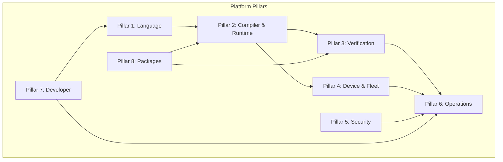
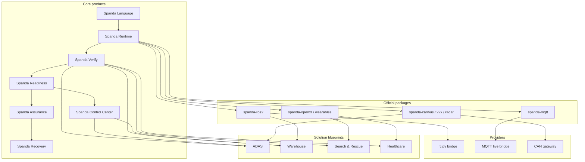
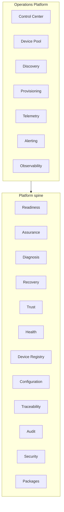

# Spanda Product Roadmap

**The Autonomous Systems Platform** — organized by **Platform Pillars** and **Official Solution Blueprints**.

| | |
|---|---|
| **Current release** | v0.4.0 (tagged 2026-06-22) |
| **Next** | v0.5 beta (Q4 2026) |
| **Last audited** | 2026-06-28 — [docs/roadmap-codebase-audit-2026-06.md](docs/roadmap-codebase-audit-2026-06.md) |
| **Feature truth table** | [docs/feature-status.md](docs/feature-status.md) |
| **Platform overview** | [docs/platform-overview.md](docs/platform-overview.md) |

**Tiers:** **Stable** (CI-backed, documented) · **Experimental** (usable with caveats) · **Future** (planned, not shipped)

**Timeline (maturity, not dates):** **Now** · **Next** · **Later** · **Long Term** · **Research**

**Ownership:** **Core** · **Package** · **Provider** · **Solution Blueprint** · **Control Center** · **Optional** · **Experimental** · **Future**

---

## Product ecosystem

Spanda is a **product ecosystem**, not a single repository. Platform components are named products that compose into industry solutions:

```text
Spanda Language
        │
Spanda Runtime
        │
Spanda Verify ───── Spanda Safety
        │
Spanda Readiness ── Spanda Assurance ── Spanda Diagnosis
        │
Spanda Recovery ─── Spanda Trust
        │
Spanda Control Center
        │
Spanda Registry ─── Spanda SDKs
        │
Unified Entity Model (all platform objects)
```

**Lifecycle:** **Build · Verify · Simulate · Deploy · Operate · Observe · Recover · Govern · Audit · Continuously Improve**

**Lean-core identity:** contracts in workspace crates; vendor SDKs and heavy UI in optional packages.

---

## Quick navigation

| Section | Jump |
|---------|------|
| [Platform Pillars](#platform-pillars) | 8 pillars — language through ecosystem |
| [Official Solution Blueprints](#official-solution-blueprints) | 15 industry reference architectures |
| [Feature ownership model](#feature-ownership-model) | Core vs package vs blueprint |
| [Dependency map](#dependency-map) | Pillars → packages → providers → blueprints |
| [Roadmap timeline](#roadmap-timeline) | Now / Next / Later / Long Term / Research |
| [Release milestones](#release-milestones) | v0.4 → v1.0 |
| [Repository organization](#repository-organization) | Docs and code layout recommendations |
| [Documentation index](#documentation-index) | Topic guides by pillar |
| [Migration notes](#migration-notes) | From `docs/roadmap.md` |

---

## Platform Pillars

### Pillar 0 — Unified Entity Model

**Purpose:** Represent every platform object — robots, fleets, humans, devices, providers, packages, missions, facilities — as a typed **Entity** with shared health, readiness, trust, security, lifecycle, relationships, and graph semantics.

| Area | Items | Tier | Timeline | Ownership |
|------|-------|------|----------|-----------|
| **Entity taxonomy** | Extensible `EntityKind` (human, robot, fleet, wearable, provider, package, …) | **Stable** | Now | Core |
| **Entity record** | Common properties (identity, capabilities, location, metadata) | **Stable** | Now | Core |
| **Entity registry** | `build_entity_registry`, `ResolvedSystemConfig::entity_registry` | **Stable** | Now | Core |
| **Entity graph** | Traversal, impact analysis, dependency chain | **Stable** | Now | Core |
| **Entity relationships** | 18 relationship kinds (`contains`, `depends_on`, `assigned_to`, …) | **Stable** | Now | Core |
| **Entity query language** | GET filters + `POST /v1/entities/query` | **Stable** | Now | Core |
| **Entity REST API** | `/v1/entities/*` (health, readiness, trust, verify, relationships, graph) | **Stable** | Now | Core |
| **Control Center Entities tab** | Browse, search, graph neighborhood, mutations | **Stable** | Now | Control Center |
| **Runtime mission entities** | Project active missions into registry | **Stable** | Now | Core |
| **Graph unification** | Align `spanda-graph` + digital thread with entity IDs; `GET /v1/entities/traceability` | **Stable** | Now | Core |
| **Industry extensions** | Facility/building/zone TOML, ADAS/medical compliance metadata, package entity kinds | **Stable** | Now | Core |
| **Entity mutation API** | Register, tag, relate, sync overlay to TOML with audit | **Stable** | Now | Core |
| **Entity stabilization** | CI `entity_model_smoke.sh` (REST + TS + Python + Rust SDK), SDK **0.4.1** published | **Stable** | Now | Core + Control Center |

**Design rule:** Before introducing a new top-level platform abstraction, determine whether it should be a new **Entity kind** instead.

**Cross-references:** Device Registry (Pillar 4) · Human entity model (Pillar 4) · Provider registry (Pillar 2) · Digital thread (Pillar 6) · Trust (Pillar 5)

**Topic guides:** [docs/entity-model.md](docs/entity-model.md) · [docs/entity-registry.md](docs/entity-registry.md) · [docs/entity-graph.md](docs/entity-graph.md) · [docs/entity-relationships.md](docs/entity-relationships.md) · [docs/entity-query-language.md](docs/entity-query-language.md)

---

### Pillar 1 — Spanda Language

**Purpose:** Safety-first `.sd` source — syntax, types, robot primitives, units, triggers, tasks, concurrency, and developer ergonomics.

| Area | Items | Tier | Timeline | Ownership |
|------|-------|------|----------|-----------|
| **Syntax** | Lexer, parser, AST | **Stable** | Now | Core |
| **Types** | Physical units, structs, enums, typed handler I/O | **Stable** | Now | Core |
| **Generics** | Generic modules and functions | **Stable** / polish **Next** | Now | Core |
| **Traits** | `module`/`import`, traits | **Stable** | Now | Core |
| **Contracts** | Mission contracts (`spanda contract verify`) | **Stable** | Now | Core |
| **Concurrency** | `spawn`, `join`, `select`, cooperative tasks | **Stable** | Now | Core |
| **Triggers** | `on`, `every`, `when`, `while` | **Stable** | Now | Core |
| **Tasks** | Task scheduler, real-time contracts (`deadline`, `jitter`, `priority`) | **Stable** | Now | Core |
| **Scheduler** | Trigger-driven scheduler + telemetry flags | **Stable** | Now | Core |
| **Regex** | Regex literals and validation rules | **Stable** | Now | Core |
| **Debugger** | DAP debugger (`spanda-dap`) | **Experimental** | Next | Core |
| **Testing** | `expect_compile_error`, `spanda test --json` | **Stable** | Now | Core |
| **Documentation** | mdBook GitHub Pages, API reference | **Stable** | Now | Core |
| **LSP** | Hover, SafeAction quick-fix | **Stable** | Now | Core |
| **Formatter** | `spanda fmt` | **Stable** | Now | Core |
| **Linter** | `spanda lint` | **Stable** | Now | Core |
| **Robot primitives** | `robot`, `sensor`, `actuator`, `task`, `agent` | **Stable** | Now | Core |
| **Safety types** | `ActionProposal` → `SafeAction` compile-time gate | **Stable** | Now | Core |
| **Self-hosting subset** | Compiler subset in Spanda | **Future** | Long Term | Core |
| **VS Code** | Snippets, VSIX CI; Marketplace listing **Partial** (`VSCE_PAT`) | **Stable** / **Partial** | Now | Optional |

**Foundation:** Phases 1–35 complete — [docs/lean-core-roadmap.md](docs/lean-core-roadmap.md)

**Topic guides:** [docs/spanda-language.md](docs/spanda-language.md) · [docs/language-reference/](docs/language-reference/README.md) · [docs/triggers.md](docs/triggers.md) · [docs/concurrency.md](docs/concurrency.md) · [docs/regex.md](docs/regex.md) · [docs/testing.md](docs/testing.md) · [docs/debugging.md](docs/debugging.md)

---

### Pillar 2 — Compiler & Runtime

**Purpose:** Parse, typecheck, execute, and optionally codegen programs; load packages and dispatch providers.

| Area | Items | Tier | Timeline | Ownership |
|------|-------|------|----------|-----------|
| **Lexer** | Tokenization | **Stable** | Now | Core |
| **Parser** | AST construction | **Stable** | Now | Core |
| **AST** | `spanda-ast` | **Stable** | Now | Core |
| **Type Checker** | Units, safety, hardware | **Stable** | Now | Core |
| **LLVM** | Native codegen (`spanda deploy --target native`) | **Experimental** | Next | Core |
| **WASM** | `spanda-wasm`, web playground | **Experimental** | Next | Core |
| **Interpreter** | Tree-walking runtime (primary path) | **Stable** | Now | Core |
| **Runtime** | HAL, reliability, watchdogs, `recover from` | **Stable** | Now | Core |
| **Package Loader** | `spanda install` / `update` / `publish` | **Stable** | Now | Core |
| **Provider Registry** | Trait dispatch, `--trace-providers` | **Stable** | Now | Core |
| **World model / fusion** | Belief hook | **Experimental** | Next | Core |
| **`spanda-certify`** | Runtime certification gate | **Stable** | Now | Core |
| **Node bindings** | `spanda-node` N-API | **Stable** | Now | Core |

**Topic guides:** [docs/platform-architecture.md](docs/platform-architecture.md) · [docs/architecture.md](docs/architecture.md) · [docs/compiler-backend-roadmap.md](docs/compiler-backend-roadmap.md) · [docs/native-deploy.md](docs/native-deploy.md) · [docs/how-packages-work.md](docs/how-packages-work.md) · [docs/how-providers-work.md](docs/how-providers-work.md) · [docs/how-runtime-resolution-works.md](docs/how-runtime-resolution-works.md)

---

### Pillar 3 — Verification Platform

**Purpose:** Prove hardware fit, mission safety, operational readiness, assurance, diagnosis, recovery, trust, and explainability before and during deployment.

| Area | Items | Tier | Timeline | Ownership |
|------|-------|------|----------|-----------|
| **Hardware Verification** | `spanda verify`, deploy profiles, `--simulate`, `--json` | **Stable** | Now | Core |
| **Capability Verification** | Traceability matrices, `requires_hardware` | **Stable** | Now | Core |
| **Mission Verification** | Mission achievability, approval verification | **Stable** | Now | Core |
| **Behavioral verify** | `verify { }` assertions | **Stable** | Now | Core |
| **Readiness** | Operational go/no-go scoring (`spanda readiness`) | **Stable** | Now | Core |
| **Assurance** | Knowledge models, anomaly, prognostics, mitigation | **Stable** / learned **Experimental** | Now | Core |
| **Diagnosis** | Root-cause analysis (`spanda diagnose`) | **Stable** | Now | Core |
| **Recovery** | `recovery_policy`, `RecoveryPlanner`, fleet mesh relay | **Stable** | Now | Core |
| **Mission Contracts** | Static contract verification | **Stable** | Now | Core |
| **Trust** | Composite program trust, secure-boot attestation | **Experimental** → **Planned** hardening | Next | Core |
| **Explainability** | `spanda explain`, decision traces | **Stable** | Now | Core |
| **Traceability** | Hardware-to-code mapping, audit trail | **Stable** | Now | Core |
| **Replay** | Mission trace record, deterministic playback | **Stable** | Now | Core |
| **Simulation** | `spanda sim`, physics-lite, fault injection | **Stable** | Now | Core |
| **Digital Twin** | `twin`, mirror fields, replay buffer | **Stable** | Now | Core |
| **Coverage Reports** | Safety coverage, recovery coverage CLIs | **Stable** | Now | Core |
| **Risk Analysis** | Mission risk, what-if analysis | **Experimental** | Next | Core |
| **Safety engine** | `safety { }` zones, kill switch, `remote_signed` | **Stable** | Now | Core |
| **Certification** | `spanda certify prove`, certification metadata | **Experimental** | Next | Core |
| **Minimum-hardware safety** | Compile-time analysis | **Stable** | Now | Core |
| **Production verify (5+ profiles)** | Field hardware profiles | **Future** | Long Term | Core |
| **Hardware adapter codegen** | Trait codegen | **Future** | Long Term | Core |
| **Twin cloud SaaS** | Hosted twin service | **Future** | Long Term | Optional |
| **Full physics** | Gazebo/Isaac class | **Out of scope** — package bridges | — | Package |

#### Platform maturity (adoption & trust)

Cross-cutting verification and operations capabilities — full analysis: [docs/platform-maturity-roadmap.md](docs/platform-maturity-roadmap.md)

| # | Area | Phase | Priority | Tier | Timeline | Ownership |
|---|------|-------|----------|------|----------|-----------|
| 1 | AI-assisted development (`generate`, `explain`, `suggest`) | Build, Operate | P0.3 / P3.3 | **Experimental** | Next | Core |
| 2 | Dependency graph visualization | Build, Operate | P0.1 | **Experimental** | Now | Core |
| 3 | Threat modeling | Verify, Deploy | P1.2 | **Experimental** | Next | Core |
| 4 | Configuration drift detection | Deploy, Operate | P1.1 | **Experimental** | Next | Core |
| 5 | Policy engine | Verify, Operate | P1.5 | **Experimental** | Next | Core |
| 6 | Compliance profiles | Verify, Deploy | P2.4 | **Experimental** | Later | Core |
| 7 | Explainability reports | Operate, Recover | P0.3 / P3.2 | **Experimental** | Now | Core |
| 8 | Chaos engineering | Simulate, Recover | P2.1 | **Experimental** | Later | Core |
| 9 | Mission resource estimation | Simulate, Deploy | P2.3 | **Experimental** | Later | Core |
| 10 | Readiness trend analysis | Operate | P2.2 | **Experimental** | Later | Core |
| 11 | Package trust framework | Verify, Build | P0.4 | **Experimental** | Now | Core |
| 12 | Architecture decision records | Build | P2.5 | **Experimental** | Later | Core |
| 13 | Mission differencing | Build, Verify | P1.3 | **Experimental** | Next | Core |
| 14 | Deployment gates | Deploy | P0.2 | **Experimental** | Now | Core |
| 15 | Autonomous systems scorecard | Operate | P1.4 | **Experimental** | Next | Core |
| 16 | Hack / tamper detection | Verify, Operate, Recover | P3.1 | **Experimental** (verify-time) | Now | Core |

#### Differentiation & signature capabilities

Full analysis: [docs/differentiation-roadmap.md](docs/differentiation-roadmap.md)

| Capability | Tier | Timeline | Ownership |
|------------|------|----------|-----------|
| Safety-Typed AI | **Stable** | Now | Core |
| Readiness Engine | **Stable** | Now | Core |
| Continuity & Takeover | **Stable** | Now | Core |
| Mission Contracts | **Stable** | Now | Core |
| Trust Framework | **Planned** hardening | Next | Core |
| Explainability & Audit Trail | **Stable** | Now | Core |
| What-If Analysis | **Experimental** | Next | Core |
| Mission Risk Analysis | **Experimental** | Next | Core |
| Readiness Forecasting | **Experimental** | Next | Core |
| Trust Graph | **Experimental** | Next | Core |
| Scorecards | **Experimental** | Next | Core |
| Digital Mission Twin | **Future** | Later | Core |
| Certification Packs | **Future** | Later | Core |
| Mission Time Travel | **Future** | Later | Core |
| Human/Robot Teaming | **Future** | Later | Solution Blueprint |
| Autonomous Governance | **Future** | Long Term | Core |

**NOW deliverables (v0.5+):** `spanda-contract`, `spanda-explain`, `spanda-decision`, safety/recovery coverage — **Stable**. Exit: `spanda demo differentiation` + `scripts/differentiation_smoke.sh`.

**Topic guides:** [docs/mission-assurance.md](docs/mission-assurance.md) · [docs/self-healing.md](docs/self-healing.md) · [docs/mission-continuity.md](docs/mission-continuity.md) · [docs/readiness.md](docs/readiness.md) · [docs/replay.md](docs/replay.md) · [docs/mission-contracts.md](docs/mission-contracts.md) · [docs/explainability.md](docs/explainability.md) · [docs/tamper-detection.md](docs/tamper-detection.md)

---

### Pillar 4 — Device & Fleet Platform

**Purpose:** Map logical programs to physical devices, provision fleets, coordinate swarms, and manage continuity.

| Area | Items | Tier | Timeline | Ownership |
|------|-------|------|----------|-----------|
| **Device Tree** | Logical ↔ physical mapping | **Stable** | Now | Core |
| **Device Registry** | Device identity in TOML | **Stable** | Now | Core |
| **Unified Entity Model** | Projects registry + fleet + humans into entity graph — [entity-model.md](docs/entity-model.md) | **Stable** | Now | Core |
| **Device Pool** | Central inventory, lifecycle, assign/trust/quarantine | **Experimental** | Now | Core |
| **Provisioning** | Discover → ready workflow (`POST /v1/provision`) | **Experimental** | Now | Core |
| **Discovery** | Subnet, mDNS/BLE/USB/CAN/MQTT/ROS2 + pool ingest | **Experimental** | Now | Package + Core |
| **Configuration** | Cascading TOML, `ConfigResolver`, snapshots | **Experimental** | Now | Core |
| **Cascading TOML** | base → environment → deployment → robot | **Stable** | Now | Core |
| **Health** | `health_check`, `health_policy`, fleet `require` | **Stable** | Now | Core |
| **Continuity** | `MissionContinuityManager`, checkpoints | **Stable** | Now | Core |
| **Delegation** | Succession planner, delegate CLI | **Stable** | Now | Core |
| **Takeover** | Resume, restart, partial, shadow, hot, cold, human modes | **Stable** | Now | Core |
| **Swarm** | Quorum, mesh health, `spanda swarm coordinate` | **Experimental** | Next | Core |
| **Fleet** | In-process + HTTP agents + mesh telemetry | **Stable** / distributed **Experimental** | Now | Core |
| **OTA** | Deploy plan, rollout, rollback, canary | **Stable** local / remote **Experimental** | Now | Core |
| **Human entity model** | Roles, identity, certifications (HRI) | **Experimental** | Next | Core |
| **Operator capabilities** | Capability verification for humans | **Experimental** | Next | Core |
| **ROS2 golden path** | rclpy bridge, `spanda ros2 check` | **Stable** / **Experimental** | Now | Package |

**Mission continuity detail:**

| Item | Tier |
|------|------|
| Continuity framework, takeover modes, state transfer | **Stable** |
| CLI (`continuity`, `takeover`, `delegate`, `succession`) | **Stable** |
| Durable checkpoint store | **Stable** |
| Runtime takeover dispatch (interpreter + fleet agents) | **Stable** |
| Auto-trigger on health faults | **Stable** |
| Package `spanda-mission-continuity` | **Stable** |
| `spanda demo continuity` | **Stable** |

**Self-healing detail:**

| Item | Tier |
|------|------|
| `recovery_policy` + `RecoveryPlanner` | **Stable** |
| CLI (`heal`, `recover`, `recovery-report`, `sim --inject-failure`) | **Stable** |
| Runtime dispatch + auto-trigger | **Stable** |
| Operator approval + fleet mesh recovery | **Stable** |
| `spanda demo self-healing` | **Stable** |

**Topic guides:** [docs/device-tree.md](docs/device-tree.md) · [docs/device-pool.md](docs/device-pool.md) · [docs/entity-model.md](docs/entity-model.md) · [docs/configuration.md](docs/configuration.md) · [docs/health-checks.md](docs/health-checks.md) · [docs/fleet-distributed.md](docs/fleet-distributed.md) · [docs/swarm-health.md](docs/swarm-health.md) · [docs/human-interaction.md](docs/human-interaction.md)

---

### Pillar 5 — Security Platform

**Purpose:** Identity, encryption, policy, compliance, and tamper resistance across deploy and operate.

| Area | Items | Tier | Timeline | Ownership |
|------|-------|------|----------|-----------|
| **Encryption** | AES-GCM wire frames, TLS sessions | **Stable** | Now | Core |
| **Identity** | Device and operator identity contracts | **Stable** | Now | Core |
| **Certificates** | Signed messages, secure-boot attestation | **Stable** / **Experimental** | Now | Core |
| **RBAC** | Roles + permissions, `SPANDA_API_KEY` | **Experimental** | Now | Core |
| **Secrets** | `ManagedSecretVault`, rotation, audit | **Experimental** | Now | Core |
| **Tamper Detection** | Verify-time and runtime tamper checks | **Experimental** | Now | Core |
| **Trust** | Composite trust scoring, package trust API | **Experimental** | Now | Core |
| **Threat Modeling** | Pre-deploy threat modeling | **Experimental** | Next | Core |
| **Policy Engine** | Declarative operational policies | **Experimental** | Next | Core |
| **Compliance** | Evidence packs, signed profile catalog | **Experimental** | Later | Core |
| **Governance** | Audit, provenance, digital thread | **Experimental** | Later | Core |
| **Spoofing detection** | GPS/sensor spoofing | **Experimental** | Next | Package |
| **Kill switch** | `remote_signed`, `on kill_switch` | **Stable** | Now | Core |

**Topic guides:** [docs/security-architecture.md](docs/security-architecture.md) · [docs/secrets.md](docs/secrets.md) · [docs/trust-framework.md](docs/trust-framework.md) · [docs/threat-modeling.md](docs/threat-modeling.md) · [docs/compliance-profiles.md](docs/compliance-profiles.md) · [docs/policy-engine.md](docs/policy-engine.md)

---

### Pillar 6 — Operations Platform

**Purpose:** Observe, alert, report, and operate fleets in production — **Spanda Control Center** and enterprise operations.

| Area | Items | Tier | Timeline | Ownership |
|------|-------|------|----------|-----------|
| **Control Center** | `spanda control-center serve`, React UI, Tauri desktop | **Experimental** | Now | Control Center |
| **Telemetry** | Time-series store, OTLP, WebSocket, fleet-push | **Stable** / **Experimental** | Now | Core |
| **Metrics** | Runtime metrics JSON, scheduler traces | **Stable** | Now | Core |
| **Logging** | Trace log, correlation IDs | **Experimental** | Now | Core |
| **Alerting** | Multi-channel (`spanda-ops`, webhook/email) | **Experimental** | Now | Package |
| **Dashboards** | Operations view, Grafana templates | **Experimental** | Now | Control Center |
| **Reports** | Markdown/PDF/JSON exports, scheduled webhooks | **Experimental** | Later | Core |
| **Readiness Trends** | Trend analysis and forecasting | **Experimental** | Later | Core |
| **Observability** | OTel traces, `spanda-otel-collector` | **Experimental** | Next | Package |
| **Incident Reports** | SRE incident workflow API | **Experimental** | Next | Core |
| **SRE** | SLO, MTTR, `/v1/sre/summary` | **Experimental** | Next | Core |
| **Configuration Drift** | 7-dimension operational drift | **Experimental** | Next | Core |
| **OTA & Rollback** | Canary, blue/green dry-run | **Experimental** | Next | Core |
| **Operator Workflows** | Approve, takeover, quarantine | **Experimental** | Next | Control Center |
| **Digital Thread** | Requirement → retirement lifecycle | **Experimental** | Later | Core |
| **Operations dashboard** | `packages/web` Operations view | **Experimental** | Now | Control Center |

Full enterprise analysis: [docs/enterprise-operations-roadmap.md](docs/enterprise-operations-roadmap.md) · Stable promotion: [docs/stable-hardening-enterprise-ops.md](docs/stable-hardening-enterprise-ops.md)

**Remaining for Stable (operational gates only):**

| Gate | Status |
|------|--------|
| Code + docs checklist | **Shipped** |
| 30-day field soak | **Pending** — [docs/field-soak-gate.md](docs/field-soak-gate.md) |
| Third-party security audit | **Pending** — [docs/security-audit-third-party.md](docs/security-audit-third-party.md) |
| Production releases | **Pending** — PyPI, npm, desktop signing |
| Tier promotion | **Pending** — update `feature-status.md` after gates |

**Phased delivery (E1–E4):** all **shipped (experimental)**. Exit: `scripts/enterprise_ops_smoke.sh`.

**Topic guides:** [docs/control-center.md](docs/control-center.md) · [docs/telemetry-store.md](docs/telemetry-store.md) · [docs/readiness-trends.md](docs/readiness-trends.md) · [docs/drift-detection.md](docs/drift-detection.md)

---

### Pillar 7 — Developer Platform

**Purpose:** CLI, APIs, SDKs, editor integration, CI/CD, and onboarding.

| Area | Items | Tier | Timeline | Ownership |
|------|-------|------|----------|-----------|
| **CLI** | `check`, `verify`, `run`, `sim`, `fleet`, `fmt`, `lint`, … | **Stable** | Now | Core |
| **REST API** | `spanda-api` REST v1, OpenAPI | **Experimental** | Now | Core |
| **gRPC** | tonic gRPC (83 RPCs), program-level SDK parity | **Experimental** | Now | Core |
| **SDKs** | Rust (`spanda-sdk`), Python (`sdk/python`), TypeScript (`@davalgi-spanda/sdk`), WebSocket telemetry | **Experimental** — **published** to crates.io, PyPI, npm (v0.4.x) | Now | Core |
| **GitHub Pages** | mdBook docs site | **Stable** | Now | Core |
| **Examples** | 9 bundled demos, showcase library | **Stable** | Now | Core |
| **Templates** | `spanda init`, project scaffolds | **Stable** | Now | Core |
| **Documentation** | Guides, man pages, Spanda 101, For Dummies | **Stable** | Now | Core |
| **VS Code** | Extension, LSP, snippets | **Stable** / Marketplace **Partial** | Now | Optional |
| **CI/CD** | Golden paths, `ci-verify.md`, smoke scripts | **Stable** | Now | Core |
| **WASM playground** | Killer demo preset, Check/Run sim | **Experimental** | Next | Optional |
| **AI-assisted dev** | `generate`, `suggest` | **Experimental** | Next | Core |

**Bundled demos:** `rover`, `safety`, `verify`, `fleet`, `health`, `readiness`, `assurance`, `self-healing`, `continuity`, `differentiation`, `adas`

**Topic guides:** [docs/getting-started.md](docs/getting-started.md) · [docs/ci-verify.md](docs/ci-verify.md) · [docs/adoption-path.md](docs/adoption-path.md) · [docs/product-strategy.md](docs/product-strategy.md)

---

### Pillar 8 — Packages & Ecosystem

**Purpose:** Extensibility without bloating core — registry, official packages, provider traits, marketplace growth.

| Area | Items | Tier | Timeline | Ownership |
|------|-------|------|----------|-----------|
| **Official Packages** | 38 registry packages (ROS2, MQTT, GPS, vision, …) | **Stable** scaffolds / live **Experimental** | Now | Package |
| **Community Packages** | Publish mirror, community adapters | **Future** | Later | Package |
| **Provider Packages** | Trait implementations per protocol | **Stable** / **Experimental** | Now | Provider |
| **Protocol Packages** | CAN, V2X, OPC-UA, Matter, BLE, … | **Experimental** | Now | Provider |
| **Registry** | Hosted index, `spanda publish` mirror | **Stable** | Now | Core |
| **Marketplace** | Curated remote registry growth | **Next** | Next | Optional |
| **Package Trust** | Scoring, `spanda trust` | **Experimental** | Now | Core |
| **Live AI providers** | OpenAI, Anthropic, ONNX | **Experimental** | Now | Provider |
| **Live IoT / MQTT** | Bridge packages | **Experimental** | Now | Provider |
| **Blockchain / ledger** | Community packages only | **Future** | Out of scope | Package |
| **Weighted fusion** | `spanda-fusion`, `assurance.fusion` | **Experimental** | Now | Package |
| **Learned anomaly** | `spanda-anomaly`, ONNX backend | **Experimental** | Next | Package |
| **Sim bridges** | Gazebo, Webots scaffolds | **Experimental** | Later | Package |

**Topic guides:** [docs/packages.md](docs/packages.md) · [docs/registry.md](docs/registry.md) · [docs/official-packages.md](docs/official-packages.md) · [docs/provider-interfaces.md](docs/provider-interfaces.md) · [docs/live-ai-provider.md](docs/live-ai-provider.md)

---

## Official Solution Blueprints

**Not platform features.** Industry reference architectures that **compose** platform pillars, packages, and providers. No duplicate implementations — each blueprint links to pillars it uses.

| Blueprint | Status | Timeline | Primary pillars |
|-----------|--------|----------|-----------------|
| [Warehouse Automation](#warehouse-automation) | **Experimental** | Now | Device & Fleet, Verification, Operations |
| [Search & Rescue](#search--rescue) | **Experimental** | Next | Verification, Operations, Device & Fleet |
| [Connected Healthcare](#connected-healthcare) | **Experimental** (wearable-health scaffold) | Next | Verification, Security, Device & Fleet |
| [ADAS & Autonomous Driving](#adas--autonomous-driving) | **Experimental** | Now | Verification, Device & Fleet, Security |
| [Smart Factory](#smart-factory) | **Experimental** | Now | Verification, Device & Fleet, Operations |
| [Agriculture](#agriculture) | **Experimental** (scaffold) | Later | Device & Fleet, Verification, Packages |
| [Critical Infrastructure](#critical-infrastructure) | **Experimental** | Next | Security, Verification, Operations |
| [Environmental Monitoring](#environmental-monitoring) | **Experimental** (scaffold) | Later | Device & Fleet, Operations, Packages |
| [Maritime](#maritime) | **Experimental** (scaffold) | Later | Device & Fleet, Verification, Security |
| [Transportation](#transportation) | **Experimental** | Now | Verification, Device & Fleet, Security |
| [Space](#space) | **Research** | Long Term | Verification, Device & Fleet, Assurance |
| [Defense](#defense) | **Experimental** | Next | Security, Verification, Operations |
| [Research & Education](#research--education) | **Stable** | Now | Developer Platform, Language |
| [Spatial Computing & HRI](#spatial-computing--human-robot-collaboration) | **Experimental** | Next | Device & Fleet, Operations, Developer |
| [Smart Spaces & Ambient Intelligence](#smart-spaces--ambient-intelligence) | **Experimental** (scaffold) | Next | Verification, Device & Fleet, Operations, Security |

**Index:** [docs/solutions/README.md](docs/solutions/README.md) · **Website:** [website/solutions.html](website/solutions.html)

---

### Warehouse Automation

| Section | Reference |
|---------|-----------|
| **Purpose** | Autonomous mobile robots, pick-and-place, fleet coordination in logistics |
| **Reference Architecture** | [examples/end_to_end/warehouse_delivery/](examples/end_to_end/warehouse_delivery/) · [examples/end_to_end/pick_and_place_cell/](examples/end_to_end/pick_and_place_cell/) |
| **Device Tree** | [docs/device-tree.md](docs/device-tree.md) · warehouse TOML fixtures in `spanda-config/tests/fixtures/warehouse/` |
| **Packages** | `spanda-nav`, `spanda-fleet`, `spanda-mqtt`, `spanda-opencv` |
| **Providers** | MQTT, ROS2 Nav2, vision |
| **Mission Examples** | [examples/showcase/continuity/warehouse.sd](examples/showcase/continuity/warehouse.sd) · [examples/warehouse_robot.sd](examples/warehouse_robot.sd) |
| **Health Policies** | [docs/health-checks.md](docs/health-checks.md) · fleet `require` |
| **Readiness** | [docs/readiness.md](docs/readiness.md) |
| **Assurance** | [docs/mission-assurance.md](docs/mission-assurance.md) |
| **Recovery** | [docs/self-healing.md](docs/self-healing.md) |
| **Control Center** | [docs/control-center.md](docs/control-center.md) |
| **Example Projects** | `examples/end_to_end/warehouse_delivery/` |
| **Documentation** | [solutions/warehouse.md](docs/solutions/warehouse.md) · [tutorials/continuity-walkthrough.md](docs/tutorials/continuity-walkthrough.md) |
| **Simulation** | `spanda sim` · digital twin |
| **Replay** | [docs/replay.md](docs/replay.md) |

**Uses pillars:** Device & Fleet Platform · Verification Platform · Operations Platform · Developer Platform · Packages & Ecosystem

---

### Search & Rescue

| Section | Reference |
|---------|-----------|
| **Purpose** | Human-robot teams, AR-guided rescue, operator readiness, continuity under failure |
| **Reference Architecture** | [examples/solutions/spatial-computing/search-and-rescue-ar/](examples/solutions/spatial-computing/search-and-rescue-ar/) |
| **Device Tree** | Human, wearable, drone, ground robot nodes — [docs/human-interaction.md](docs/human-interaction.md) |
| **Packages** | `spanda-gps`, `spanda-bodycam`, `spanda-openxr`, `spanda-mission-continuity` |
| **Providers** | GPS, BLE, ROS2, MQTT |
| **Mission Examples** | `sar_mission.sd` |
| **Health Policies** | Operator + team readiness — [docs/human-readiness.md](docs/human-readiness.md) |
| **Readiness** | [docs/readiness.md](docs/readiness.md) · human readiness gates |
| **Assurance** | Anomaly + prognostics for field degradation |
| **Recovery** | Fleet mesh recovery, takeover to backup agent |
| **Control Center** | Mission approve, remote expert — [docs/remote-expert.md](docs/remote-expert.md) |
| **Example Projects** | [examples/solutions/spatial-computing/](examples/solutions/spatial-computing/) |
| **Documentation** | [docs/solutions/spatial-computing.md](docs/solutions/spatial-computing.md) |
| **Simulation** | Scenario fixtures + fault injection |
| **Replay** | Mission trace for post-incident analysis |

**Uses pillars:** Verification Platform · Operations Platform · Security Platform · Device & Fleet Platform · Developer Platform

---

### Connected Healthcare

| Section | Reference |
|---------|-----------|
| **Purpose** | Wearable monitoring, privacy-controlled health signals, medical responder workflows |
| **Reference Architecture** | [examples/solutions/spatial-computing/wearable-health/](examples/solutions/spatial-computing/wearable-health/) |
| **Device Tree** | Wearable, patient zone, responder nodes |
| **Packages** | `spanda-smartwatch`, `spanda-industrial-wearables`, `spanda-ble` |
| **Providers** | BLE, MQTT, HIPAA-oriented compliance hooks |
| **Mission Examples** | Medical responder capability grants — [docs/operator-capabilities.md](docs/operator-capabilities.md) |
| **Health Policies** | Opt-in human health monitoring |
| **Readiness** | Operator certification verification |
| **Assurance** | Medical compliance profile — `crates/spanda-compliance/templates/medical.json` |
| **Recovery** | Delegation to backup responder |
| **Control Center** | Human dashboards (H4) |
| **Example Projects** | `wearable-health/` |
| **Documentation** | [docs/wearables.md](docs/wearables.md) |
| **Simulation** | Privacy-safe synthetic vitals |
| **Replay** | Audit trail for clinical review |

**Uses pillars:** Verification Platform · Security Platform · Device & Fleet Platform · Operations Platform

**Status:** **Experimental** — `wearable-health/` scaffold; CI via `scripts/spatial_computing_smoke.sh`

---

### ADAS & Autonomous Driving

| Section | Reference |
|---------|-----------|
| **Purpose** | Lane keeping, adaptive cruise, AEB, sensor recovery, driver takeover, highway pilot |
| **Reference Architecture** | [docs/solutions/adas.md](docs/solutions/adas.md) · [examples/solutions/adas/](examples/solutions/adas/) |
| **Device Tree** | [docs/automotive-device-tree.md](docs/automotive-device-tree.md) — nine application variants |
| **Packages** | Seven automotive registry stubs (CAN, radar, V2X, UDS, …) |
| **Providers** | ROS 2 automotive bridge, CAN gateway |
| **Mission Examples** | Lane keeping, AEB, driver takeover, highway pilot |
| **Health Policies** | [docs/adas-readiness.md](docs/adas-readiness.md) |
| **Readiness** | Pre-drive gates, ISO 26262 alignment |
| **Assurance** | [docs/adas-assurance.md](docs/adas-assurance.md) |
| **Recovery** | Sensor recovery policies |
| **Control Center** | ADAS tab, Grafana dashboard |
| **Example Projects** | `spanda demo adas` · `./scripts/adas_smoke.sh` |
| **Documentation** | [docs/demo-plan-adas.md](docs/demo-plan-adas.md) · [docs/adas-security.md](docs/adas-security.md) |
| **Simulation** | Scenario fixtures + sim-recorded golden traces |
| **Replay** | [docs/adas-replay.md](docs/adas-replay.md) |

**Uses pillars:** Verification Platform · Device & Fleet Platform · Security Platform · Operations Platform · Packages & Ecosystem

**Stable promotion:** [docs/stable-hardening-adas.md](docs/stable-hardening-adas.md)

---

### Smart Factory

| Section | Reference |
|---------|-----------|
| **Purpose** | Industrial arms, pick-and-place cells, OPC-UA/Matter integration, predictive maintenance |
| **Reference Architecture** | [examples/end_to_end/pick_and_place_cell/](examples/end_to_end/pick_and_place_cell/) |
| **Device Tree** | Cell, arm, conveyor, safety zone nodes |
| **Packages** | `spanda-opcua`, `spanda-matter`, `spanda-moveit`, `spanda-prognostics` |
| **Providers** | OPC-UA, ROS2, industrial protocols |
| **Mission Examples** | [examples/robotics/predictive_maintenance.sd](examples/robotics/predictive_maintenance.sd) |
| **Health Policies** | Machine health + fleet require |
| **Readiness** | Pre-shift go/no-go |
| **Assurance** | Prognostics, anomaly on vibration/temperature |
| **Recovery** | Mode degradation, cell pause |
| **Control Center** | Executive scorecard, drift detection |
| **Example Projects** | `pick_and_place_cell/` |
| **Documentation** | [solutions/smart-factory.md](docs/solutions/smart-factory.md) · [robotics-platform.md](docs/robotics-platform.md) |
| **Simulation** | Digital twin of cell |
| **Replay** | Trace for root-cause — [docs/root-cause-analysis.md](docs/root-cause-analysis.md) |

**Uses pillars:** Verification Platform · Device & Fleet Platform · Operations Platform · Security Platform

---

### Agriculture

| Section | Reference |
|---------|-----------|
| **Purpose** | Autonomous field robots, precision spraying, crop monitoring, offline connectivity |
| **Reference Architecture** | Compose GPS, vision, cellular failover — [docs/connectivity.md](docs/connectivity.md) |
| **Device Tree** | Tractor, implement, drone, base station |
| **Packages** | `spanda-gps`, `spanda-cellular`, `spanda-lora`, `spanda-opencv` |
| **Providers** | GPS, LTE, LoRa |
| **Mission Examples** | `field_patrol.sd`, `spray_mission.sd`, `harvest_convoy.sd` |
| **Health Policies** | Connectivity + battery require |
| **Readiness** | Weather and connectivity gates |
| **Assurance** | Crop anomaly detection |
| **Recovery** | Return-to-base on link loss |
| **Control Center** | Fleet map, readiness trends |
| **Example Projects** | [examples/solutions/agriculture/](examples/solutions/agriculture/) (`field_patrol.sd` scaffold) |
| **Documentation** | [solutions/agriculture.md](docs/solutions/agriculture.md) |
| **Simulation** | Terrain + weather fault injection |
| **Replay** | Season trace archive |

**Uses pillars:** Device & Fleet Platform · Verification Platform · Packages & Ecosystem · Operations Platform

**Status:** **Experimental** (scaffold) — CI `scripts/solution_blueprints_smoke.sh`

---

### Critical Infrastructure

| Section | Reference |
|---------|-----------|
| **Purpose** | Power, water, telecom — high-assurance monitoring, tamper detection, compliance evidence |
| **Reference Architecture** | [examples/showcase/compliance/](examples/showcase/compliance/) |
| **Device Tree** | Site, sensor mesh, gateway |
| **Packages** | `spanda-opcua`, `spanda-mqtt`, `spanda-tamper` |
| **Providers** | OPC-UA, MQTT, TLS discovery |
| **Mission Examples** | Integrity verification — [docs/integrity-verification.md](docs/integrity-verification.md) |
| **Health Policies** | Redundant sensor quorum |
| **Readiness** | Pre-maintenance windows |
| **Assurance** | IEC 61508 profile — `crates/spanda-compliance/templates/iec61508.json` |
| **Recovery** | Failover chains in Device Pool |
| **Control Center** | Compliance export, digital thread |
| **Example Projects** | `examples/showcase/compliance/` |
| **Documentation** | [docs/compliance-profiles.md](docs/compliance-profiles.md) |
| **Simulation** | Chaos engineering — [docs/chaos-engineering.md](docs/chaos-engineering.md) |
| **Replay** | Incident timeline reconstruction |

**Uses pillars:** Security Platform · Verification Platform · Operations Platform · Device & Fleet Platform

---

### Environmental Monitoring

| Section | Reference |
|---------|-----------|
| **Purpose** | Distributed sensor networks, air/water quality, long-life battery, mesh telemetry |
| **Reference Architecture** | IoT provider contracts — [docs/iot.md](docs/iot.md) |
| **Device Tree** | Sensor node, gateway, cloud ingest |
| **Packages** | `spanda-lora`, `spanda-mqtt`, `spanda-cellular`, `spanda-otel-collector` |
| **Providers** | LoRa, MQTT, cellular |
| **Mission Examples** | `sensor_mesh.sd`, `gateway_bridge.sd` |
| **Health Policies** | Battery + connectivity require |
| **Readiness** | Calibration gates — [docs/calibration.md](docs/calibration.md) |
| **Assurance** | Drift on sensor baselines |
| **Recovery** | Mesh relay, OTA firmware |
| **Control Center** | Telemetry trends, alerting |
| **Example Projects** | [examples/solutions/environmental-monitoring/](examples/solutions/environmental-monitoring/) (`sensor_mesh.sd` scaffold) |
| **Documentation** | [solutions/environmental-monitoring.md](docs/solutions/environmental-monitoring.md) · [telemetry-store.md](docs/telemetry-store.md) |
| **Simulation** | Fault injection on readings |
| **Replay** | Historical trend replay |

**Uses pillars:** Device & Fleet Platform · Operations Platform · Packages & Ecosystem

**Status:** **Experimental** (scaffold) — CI `scripts/solution_blueprints_smoke.sh`

---

### Maritime

| Section | Reference |
|---------|-----------|
| **Purpose** | Autonomous vessels, port logistics, GNSS-denied navigation, corrosion prognostics |
| **Reference Architecture** | [examples/solutions/maritime/](examples/solutions/maritime/) — harbor patrol scaffold |
| **Device Tree** | Vessel, payload, shore station |
| **Packages** | `spanda-gps`, `spanda-radar`, `spanda-cellular`, `spanda-prognostics` |
| **Providers** | GNSS, radar, SATCOM |
| **Mission Examples** | `harbor_patrol.sd`, `convoy_escort.sd`, `docking_assist.sd` |
| **Health Policies** | Redundant navigation require |
| **Readiness** | Pre-departure checklist |
| **Assurance** | Hull/machinery prognostics |
| **Recovery** | Shore takeover, drift to safe harbor |
| **Control Center** | Fleet map, incident workflow |
| **Example Projects** | [examples/solutions/maritime/](examples/solutions/maritime/) (`harbor_patrol.sd` scaffold) |
| **Documentation** | [solutions/maritime.md](docs/solutions/maritime.md) |
| **Simulation** | Sea state + GNSS denial |
| **Replay** | Voyage black box |

**Uses pillars:** Device & Fleet Platform · Verification Platform · Security Platform · Operations Platform

**Status:** **Experimental** (scaffold) — CI `scripts/solution_blueprints_smoke.sh`

---

### Transportation

| Section | Reference |
|---------|-----------|
| **Purpose** | Fleet logistics, V2X, multi-modal hubs — extends ADAS to commercial transport |
| **Reference Architecture** | ADAS blueprint + fleet orchestration |
| **Device Tree** | Vehicle, depot, corridor nodes |
| **Packages** | `spanda-v2x`, `spanda-canbus`, `spanda-fleet`, `spanda-ota` |
| **Providers** | V2X, CAN, fleet mesh |
| **Mission Examples** | Convoy coordination, depot handoff |
| **Health Policies** | Fleet readiness — [docs/fleet-readiness.md](docs/fleet-readiness.md) |
| **Readiness** | Route + regulatory gates |
| **Assurance** | Fleet anomaly correlation |
| **Recovery** | OTA rollback, vehicle reassignment |
| **Control Center** | OTA canary, fleet reports |
| **Example Projects** | [examples/solutions/adas/applications/delivery/](examples/solutions/adas/applications/delivery/) |
| **Documentation** | [docs/solutions/adas.md](docs/solutions/adas.md) |
| **Simulation** | Traffic scenario fixtures |
| **Replay** | Fleet trace aggregation |

**Uses pillars:** Verification Platform · Device & Fleet Platform · Security Platform · Operations Platform

---

### Space

| Section | Reference |
|---------|-----------|
| **Purpose** | Orbital robotics, rover operations, radiation-aware assurance, extreme latency |
| **Reference Architecture** | **Research** — compose assurance + continuity under delay |
| **Device Tree** | Spacecraft, payload, ground station |
| **Packages** | `spanda-fusion`, `spanda-assurance`, `spanda-mission-continuity` |
| **Providers** | Delay-tolerant transport packages |
| **Mission Examples** | **Research** |
| **Health Policies** | Radiation/degradation models |
| **Readiness** | Launch/commit gates |
| **Assurance** | Prognostics, redundancy cases |
| **Recovery** | Autonomous safe mode, ground takeover |
| **Control Center** | Delay-aware operations UI |
| **Example Projects** | **Research** |
| **Documentation** | **Research** |
| **Simulation** | High-fidelity sim bridges (package) |
| **Replay** | Deep-space trace buffer |

**Uses pillars:** Verification Platform · Device & Fleet Platform · Assurance · Operations Platform

**Status:** **Research**

---

### Defense

| Section | Reference |
|---------|-----------|
| **Purpose** | Secure autonomous systems, tamper resistance, classified-adjacent compliance, swarm coordination |
| **Reference Architecture** | Compliance + security assurance rollup |
| **Device Tree** | Unit, platform, C2 node |
| **Packages** | `spanda-security-audit`, `spanda-tamper`, `spanda-ledger` |
| **Providers** | Encrypted transport, attestation |
| **Mission Examples** | Secure operator command — [examples/security/secure_operator_command.sd](examples/security/secure_operator_command.sd) |
| **Health Policies** | Tamper + attestation require |
| **Readiness** | Mission approval queue |
| **Assurance** | Defense profile — `crates/spanda-compliance/templates/defense.json` |
| **Recovery** | Mesh relay, quarantine |
| **Control Center** | RBAC, audit, compliance export |
| **Example Projects** | [examples/showcase/secure_boot/](examples/showcase/secure_boot/) · [examples/showcase/mission_tampering/](examples/showcase/mission_tampering/) |
| **Documentation** | [solutions/defense.md](docs/solutions/defense.md) · [security-assurance.md](docs/security-assurance.md) · [trust-boundaries.md](docs/trust-boundaries.md) |
| **Simulation** | Chaos + spoofing injection |
| **Replay** | Decision audit trail |

**Uses pillars:** Security Platform · Verification Platform · Operations Platform · Device & Fleet Platform

---

### Research & Education

| Section | Reference |
|---------|-----------|
| **Purpose** | Learn Spanda — language, verify, sim, minimal hardware |
| **Reference Architecture** | Progressive examples ladder |
| **Device Tree** | Simulated robot profiles |
| **Packages** | Starter packages from registry |
| **Providers** | Mock providers (default) |
| **Mission Examples** | [examples/basics/](examples/basics/) · [examples/showcase/killer_demo.sd](examples/showcase/killer_demo.sd) |
| **Health Policies** | Introductory health_check |
| **Readiness** | Tutorial readiness scoring |
| **Assurance** | Intro assurance demo |
| **Recovery** | Self-healing tutorial |
| **Control Center** | WASM playground |
| **Example Projects** | [examples/showcase/autonomous_rover/](examples/showcase/autonomous_rover/) (**Stable** flagship) |
| **Documentation** | [docs/spanda-101/](docs/spanda-101/README.md) · [docs/spanda-for-dummies/](docs/spanda-for-dummies/README.md) |
| **Simulation** | `spanda sim` killer demo |
| **Replay** | Replay tutorial — [docs/replay.md](docs/replay.md) |

**Uses pillars:** Developer Platform · Spanda Language · Verification Platform

---

### Spatial Computing & Human-Robot Collaboration

| Section | Reference |
|---------|-----------|
| **Purpose** | Wearables, AR/VR/XR, collaborative missions, remote expert — composes without core language extensions |
| **Reference Architecture** | [docs/solutions/spatial-computing.md](docs/solutions/spatial-computing.md) · [examples/solutions/spatial-computing/](examples/solutions/spatial-computing/) |
| **Device Tree** | Human, Wearable, AR, VR nodes |
| **Packages** | [docs/hri-packages.md](docs/hri-packages.md) — OpenXR, ARKit, HoloLens stubs |
| **Providers** | MQTT/ROS2/WebSocket spatial bridges |
| **Mission Examples** | Warehouse AR pick, remote maintenance |
| **Health Policies** | Human readiness — [docs/human-readiness.md](docs/human-readiness.md) |
| **Readiness** | Operator + team gates |
| **Assurance** | Operator capability verification |
| **Recovery** | Continuity + remote expert handoff |
| **Control Center** | Human dashboards (H4) |
| **Example Projects** | `warehouse-ar/`, `remote-maintenance/`, `operator-approval/` |
| **Documentation** | [docs/human-interaction-spatial-computing-roadmap.md](docs/human-interaction-spatial-computing-roadmap.md) |
| **Simulation** | XR overlay replay |
| **Replay** | VR training replay |

**Uses pillars:** Device & Fleet Platform · Operations Platform · Verification Platform · Developer Platform · Packages & Ecosystem

**Phased delivery (H1–H6):** all **Experimental**. Promotion: [docs/stable-hardening-human-interaction.md](docs/stable-hardening-human-interaction.md)

---

### Smart Spaces & Ambient Intelligence

| Section | Reference |
|---------|-----------|
| **Purpose** | Safety-first verification, orchestration, readiness, assurance, and trust for intelligent environments (home → city) — not a home automation competitor |
| **Reference Architecture** | [docs/solutions/smart-spaces.md](docs/solutions/smart-spaces.md) · [examples/solutions/smart-spaces/](examples/solutions/smart-spaces/) |
| **Device Tree** | [docs/smart-space-device-tree.md](docs/smart-space-device-tree.md) — building, zone, gateway, IoT, robot, energy, human nodes |
| **Packages** | [docs/smart-space-packages.md](docs/smart-space-packages.md) — Matter, BACnet, KNX, energy, building, HA bridge |
| **Providers** | Matter, Thread, Zigbee, Z-Wave, MQTT, BACnet, KNX, Modbus, Home Assistant interop |
| **Mission Examples** | Night mode, fire response, demand response, patient monitoring, building lockdown |
| **Health Policies** | Gateway, battery, critical sensor quorum — [docs/health-checks.md](docs/health-checks.md) |
| **Readiness** | [docs/smart-space-readiness.md](docs/smart-space-readiness.md) — pre-mode and emergency gates |
| **Assurance** | Security, emergency systems, energy, medical device evidence |
| **Recovery** | Gateway failover, emergency lighting, robot reassignment — [docs/mission-continuity.md](docs/mission-continuity.md) |
| **Control Center** | Smart Spaces tab — buildings, occupancy, energy, emergency |
| **Example Projects** | `smart-home/`, `smart-office/`, `smart-building/`, `hospital-at-home/`, `energy-management/`, `emergency-response/` |
| **Documentation** | [building-automation.md](docs/building-automation.md) · [ambient-intelligence.md](docs/ambient-intelligence.md) · [energy-management.md](docs/energy-management.md) · [smart-space-security.md](docs/smart-space-security.md) |
| **Simulation** | Fire, flood, power loss, gateway failure, HVAC failure, medical emergency |
| **Replay** | Mode-change and emergency incident timelines |

**Uses pillars:** Verification Platform · Device & Fleet Platform · Operations Platform · Security Platform · Packages & Ecosystem

**Integrates:** [Connected Healthcare](#connected-healthcare) · [Spatial Computing & HRI](#spatial-computing--human-robot-collaboration) · [Environmental Monitoring](#environmental-monitoring)

**Status:** **Experimental** (scaffold) — CI via `scripts/smart_spaces_smoke.sh`

---

## Feature ownership model

Official classification for every roadmap item:

| Class | Definition | Examples |
|-------|------------|----------|
| **Core** | Workspace crate or language semantic; required for platform identity | `spanda-interpreter`, `spanda verify`, readiness engine |
| **Package** | Optional `.sd` + manifest in registry; installable | `spanda-ros2`, `spanda-gazebo` |
| **Provider** | Trait implementation inside a package | MQTT bridge, ONNX inference backend |
| **Solution Blueprint** | Industry composition doc + example tree; not a crate | ADAS, Warehouse, SAR |
| **Control Center** | UI/API product surface (`spanda-api`, `@davalgi-spanda/web`) | Dashboards, provisioning UI |
| **Optional** | Ecosystem add-on; not required for core workflows | VS Code Marketplace, desktop app |
| **Experimental** | Shipped with caveats; promotion path to Stable | Control Center, drift detection |
| **Future** | Designed; not shipped | Self-hosting compiler, twin SaaS |

**Rule:** Blueprints **reference** core and packages — never reimplement readiness, assurance, or recovery engines.

Detail: [docs/enterprise-operations-roadmap.md §2](docs/enterprise-operations-roadmap.md#2-core-vs-package-ownership)

---

## Dependency map

### Platform stack



### Pillars → packages → providers → blueprints



### Enterprise integration spine

Every operations pillar routes through the existing platform spine — no duplicate engines:



---

## Roadmap timeline

Maturity-based horizons — **not arbitrary calendar dates**.

| Horizon | Meaning | Representative items |
|---------|---------|------------------------|
| **Now** | Stable or experimental-shipped; CI-backed | Language core, verify, sim, replay, continuity, recovery, bundled demos, differentiation NOW, E1 enterprise ops |
| **Next** | Experimental hardening or partial ship | Control Center Stable promotion, VS Code Marketplace, swarm quorum, live vehicle I/O, SDKs, HRI H1–H2, warehouse/medical blueprints |
| **Later** | Designed; experimental code exists | Compliance export polish, digital thread UI, agriculture/environmental blueprints, Gazebo scaffolds, scorecard Stable |
| **Long Term** | Planned v1.0+ positioning | Production verify on 5+ profiles, native codegen Stable, self-hosting subset (non-primary), twin SaaS |
| **Research** | Exploratory; no production commitment | Space blueprint, advanced swarm intelligence (**out of scope** for core), blockchain adapters (**community only**) |

### Platform areas at a glance

| Area | Current focus (v0.4) | Next (v0.5+) |
|------|----------------------|--------------|
| Language | Stable core; typed handler I/O | Generics polish; self-hosting subset (future) |
| Compiler & Runtime | Interpreter LTS; certify gate | Native codegen golden paths (experimental) |
| Verification | `spanda verify`, capability matrices | 5+ production hardware profiles (v1.0) |
| Safety | ActionProposal → SafeAction stable | Safety Coverage CLI; stricter certify workflows |
| Simulation | `spanda sim`, twins, replay, telemetry store | OTLP/fleet aggregation polish; Gazebo/Webots scaffolds |
| Health | health_check, readiness engine | Swarm quorum hardening |
| Fleet | In-process + HTTP agents + mesh telemetry | Distributed orchestration polish |
| Packages | 38 official registry packages | Curated remote registry growth |
| Developer Platform | CLI, 9 bundled demos, CI golden paths | VS Code Marketplace (blocked on `VSCE_PAT`) |
| Mission assurance | Static analysis + learned anomaly (experimental) | Package-backed ML anomaly backends |
| Mission continuity | Runtime takeover, checkpoints, fleet mesh (**Stable**) | Field validation; swarm quorum hardening |
| Self-healing | Recovery planner + CLI + runtime dispatch (**Stable**) | Recovery coverage hardening |
| Platform maturity | 16 areas shipped **Experimental** | Stable hardening for Phase A–D deliverables |
| Differentiation | NOW items shipped **Experimental** | Stable hardening; NEXT signature capabilities |
| Enterprise operations | E1–E4 **Experimental** | **Stable promotion:** operational gates |
| Solution Blueprints | ADAS **Experimental** | Spatial Computing; warehouse ops; medical devices |

---

## Release milestones

### v0.4 — Deploy path (current tag)

**Theme:** Native binaries, ROS2 polish, distributed fleet docs.  
**Tagged:** 2026-06-22.

| Item | Status |
|------|--------|
| `spanda deploy --target native` | **Experimental** |
| `spanda compile-native` / LLVM golden paths | **Experimental** |
| `spanda ros2 check` | **Stable** |
| Distributed fleet guide | **Stable** |
| Mission continuity runtime | **Stable** (post-v0.4.0 on `main`) |
| Persistent telemetry + OTLP/fleet aggregation | **Stable** (post-v0.4.0 on `main`) |

### v0.5 — Beta credibility (next)

**Theme:** Close adoption blockers; differentiation NOW capabilities.  
**Target:** Q4 2026.

| Item | Status |
|------|--------|
| Killer demo + CI golden path | **Stable** |
| Live AI + ROS2 rclpy golden path + CI | **Stable** |
| Hosted registry (38 packages) + publish mirror | **Stable** |
| CI verify guide + adoption paths | **Stable** |
| VS Code Marketplace listing | **Deferred** — needs `VSCE_PAT` (manual publisher setup) |
| Mission Contracts, Explainability, Audit Trail, Coverage CLIs | **Stable** |

**Exit criteria:** `spanda demo differentiation` + `scripts/differentiation_smoke.sh` (CI job: `differentiation-smoke`) — **met**. Marketplace publish remains optional until `VSCE_PAT` is configured.

### v0.3 / v0.2 — Complete

See [docs/product-strategy.md](docs/product-strategy.md) and [docs/tier-3-priority-plan.md](docs/tier-3-priority-plan.md).

### v1.0 — Production positioning

| Item | Tier |
|------|------|
| Interpreter + sim as supported LTS runtime | Stable |
| Safety + verify + replay as certified workflows | Stable |
| Native codegen for selected HAL profiles | Experimental → Stable |
| Control Center + `spanda-api` | Experimental → Stable |
| Device Pool + Provisioning + RBAC | Experimental → Stable |
| Self-hosting compiler subset | Future (not primary) |
| Blockchain / cryptocurrency adapters | **Out of scope** |
| Advanced swarm intelligence research | **Out of scope** |

---

## Repository organization

Recommendations to improve discoverability **without deleting content**. See [docs/repository-organization.md](docs/repository-organization.md) for the full audit.

| Area | Current | Recommended |
|------|---------|-------------|
| **Roadmap** | `docs/roadmap.md` (monolithic) | **`ROADMAP.md`** (canonical) + `docs/roadmap.md` redirect |
| **Pillar guides** | Flat `docs/*.md` | `docs/pillars/{language,runtime,verification,…}/` — **link hubs shipped** |
| **Solution blueprints** | `docs/solutions/` + `examples/solutions/` | Keep pair; add `docs/solutions/{industry}.md` per blueprint |
| **Examples** | `basics/`, `showcase/`, `solutions/`, `end_to_end/` | Add `examples/README.md` pillar tags per folder |
| **Packages** | `packages/registry/` + `registry/` mirror | Document single source of truth in `packages/registry/README.md` |
| **Crates** | Large flat `crates/` | `crates/README.md` pillar column (already exists — extend) |
| **Website** | `website/index.html`, `solutions.html` | Add `platform.html`, `roadmap.html` — nav in all pages |
| **Overview** | `docs/overview/` | Link pillar map from [docs/overview/platform-structure.md](docs/overview/platform-structure.md) |
| **CI scripts** | `scripts/*_smoke.sh` | `scripts/gates/README.md` index by pillar/blueprint — **shipped** |

---

## Documentation index

| Pillar | Key guides |
|--------|------------|
| **Language** | [spanda-language.md](docs/spanda-language.md), [language-reference/](docs/language-reference/README.md), [triggers.md](docs/triggers.md), [concurrency.md](docs/concurrency.md) |
| **Compiler & Runtime** | [platform-architecture.md](docs/platform-architecture.md), [architecture.md](docs/architecture.md), [compiler-backend-roadmap.md](docs/compiler-backend-roadmap.md), [lean-core.md](docs/lean-core.md) |
| **Verification** | [hardware-compatibility.md](docs/hardware-compatibility.md), [readiness.md](docs/readiness.md), [mission-assurance.md](docs/mission-assurance.md), [self-healing.md](docs/self-healing.md), [replay.md](docs/replay.md) |
| **Device & Fleet** | [device-tree.md](docs/device-tree.md), [device-pool.md](docs/device-pool.md), [mission-continuity.md](docs/mission-continuity.md), [fleet-distributed.md](docs/fleet-distributed.md) |
| **Security** | [security-architecture.md](docs/security-architecture.md), [secrets.md](docs/secrets.md), [tamper-detection.md](docs/tamper-detection.md) |
| **Operations** | [control-center.md](docs/control-center.md), [enterprise-operations-roadmap.md](docs/enterprise-operations-roadmap.md), [telemetry-store.md](docs/telemetry-store.md) |
| **Developer** | [getting-started.md](docs/getting-started.md), [ci-verify.md](docs/ci-verify.md), [adoption-path.md](docs/adoption-path.md) |
| **Packages** | [packages.md](docs/packages.md), [registry.md](docs/registry.md), [official-packages.md](docs/official-packages.md) |
| **Blueprints** | [solutions/README.md](docs/solutions/README.md) · [pillars/README.md](docs/pillars/README.md) |
| **Deep dives** | [differentiation-roadmap.md](docs/differentiation-roadmap.md), [platform-maturity-roadmap.md](docs/platform-maturity-roadmap.md), [human-interaction-spatial-computing-roadmap.md](docs/human-interaction-spatial-computing-roadmap.md) |

**Full index:** [docs/README.md](docs/README.md)

---

## Migration notes

| Change | Action |
|--------|--------|
| Canonical roadmap | Use **`ROADMAP.md`** at repository root |
| `docs/roadmap.md` | Redirect stub — links here; historical anchors preserved in topic guides |
| README | Platform Pillars + Solution Blueprints navigation added |
| Website | Nav sections: Platform, Language, Packages, Solutions, Architecture, Roadmap, Control Center, Documentation, Examples, Community |
| Feature status | Continue updating [docs/feature-status.md](docs/feature-status.md) — tiers unchanged |
| CHANGELOG | Add `[Unreleased]` entry for roadmap restructure (navigation only; no scope reduction) |

Detail: [docs/roadmap-migration.md](docs/roadmap-migration.md)

---

## Related documents

- [docs/enterprise-operations-roadmap.md](docs/enterprise-operations-roadmap.md) — Operations Platform deep dive (20 areas)
- [docs/differentiation-roadmap.md](docs/differentiation-roadmap.md) — Signature capabilities (15 areas)
- [docs/platform-maturity-roadmap.md](docs/platform-maturity-roadmap.md) — Adoption & trust (16 areas)
- [docs/human-interaction-spatial-computing-roadmap.md](docs/human-interaction-spatial-computing-roadmap.md) — HRI (H1–H6)
- [docs/product-strategy.md](docs/product-strategy.md) — v0.5 beta strategy
- [docs/feature-status.md](docs/feature-status.md) — Support matrix
- [docs/compiler-backend-roadmap.md](docs/compiler-backend-roadmap.md) — LLVM evolution
- [docs/lean-core-roadmap.md](docs/lean-core-roadmap.md) — Phases 1–35
- [docs/roadmap-codebase-audit-2026-06.md](docs/roadmap-codebase-audit-2026-06.md) — Gap audit
