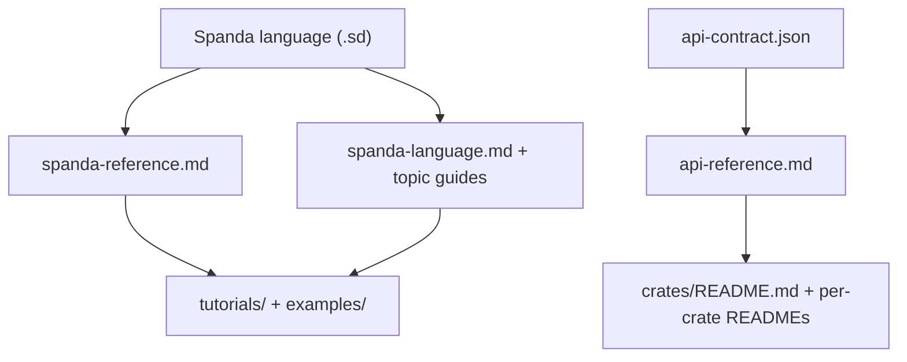

# API documentation map

How Spanda API references relate to each other — language surface, compiler crates, JSON contracts, and tutorials.

---

## Hierarchy (top → bottom)



| Level | Document | What it indexes |
|-------|----------|-----------------|
| **1 — Language** | [spanda-reference.md](./spanda-reference.md) | Keywords, `std.*`, builtins, CLI man-style pages |
| **1 — Language** | [spanda-language.md](./spanda-language.md) | Tutorial-style semantics and syntax |
| **2 — Compiler API** | [api-reference.md](./api-reference.md) | Rust crates + TypeScript packages (grouped by lean-core layer) |
| **3 — Wire format** | [api-contract.json](./api-contract.json) | JSON shapes for `check`, `verify`, `run` (CLI, WASM, Node) |
| **4 — Crate layout** | [crates/README.md](../crates/README.md) | Workspace dependency rules and README index |
| **5 — Learning** | [tutorials/README.md](./tutorials/README.md), [examples/README.md](../examples/README.md) | Lessons and runnable `.sd` programs |

---

## Two Rust API surfaces

### Stable facade (`spanda_core::`)

External embedders depend on **`spanda-core`** and import `spanda_core::check`, `spanda_core::run`, etc. The facade re-exports workspace crates and keeps thin compatibility shims.

See [spanda-core/README.md](../crates/spanda-core/README.md).

### Canonical workspace crates

In-repo code (`spanda-cli`, `spanda-node`, `spanda-wasm`, …) imports **owning crates** directly:

| Use case | Import |
|----------|--------|
| Compile / run | `spanda_driver::{check, run, compile}` |
| AST | `spanda_ast::nodes::Program` |
| Parse | `spanda_parser::parse` |
| Verify | `spanda_driver::verify_compatibility` |
| Transport routing | `spanda_transport_routing::RoutingCommBus` |
| Live hooks | `spanda_transport_routing::transport_live` |

Full mapping table: [api-reference.md § Facade → workspace](./api-reference.md#facade--workspace-mapping).

---

## TypeScript mirror

| Package | Role | API index |
|---------|------|-----------|
| `src/` | Parser/runtime tests, provider classification | [api-reference.md § TypeScript core](./api-reference.md#ts-src) |
| `@spanda/lsp` | Language server | [api-reference.md § @spanda/lsp](./api-reference.md#ts-packages-lsp) |
| `@spanda/web` | Playground | [api-reference.md § @spanda/web](./api-reference.md#ts-packages-web-src) |
| `@spanda/native` | N-API wrapper | [api-reference.md § @spanda/native](./api-reference.md#ts-packages-native) |

TypeScript delegates to the Rust CLI when `target/release/spanda` is available.

---

## Regenerating generated docs

```bash
# Language reference (keywords, std.*, CLI)
python3 scripts/generate_spanda_reference.py
# or: spanda reference --out docs/spanda-reference.md --man-dir docs/man

# Rust + TypeScript compiler API index
python3 scripts/generate_api_reference.py
```

Run after large API or crate-layout changes. See [CONTRIBUTING.md](../CONTRIBUTING.md#documentation-map).

---

## Related

- [lean-core.md](./lean-core.md) — architecture principles
- [architecture.md](./architecture.md) — pipeline diagrams
- [feature-status.md](./feature-status.md) — stable vs experimental APIs
