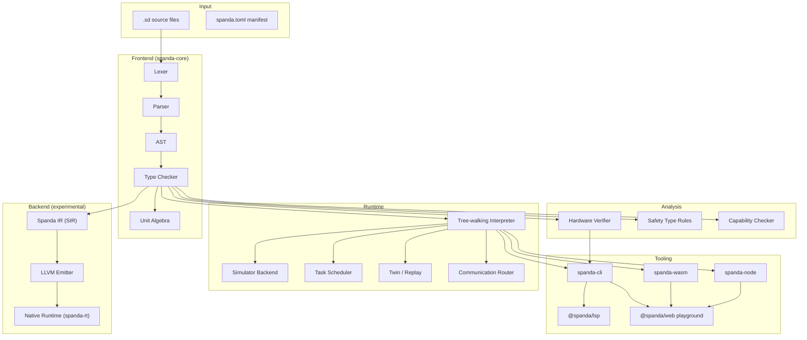
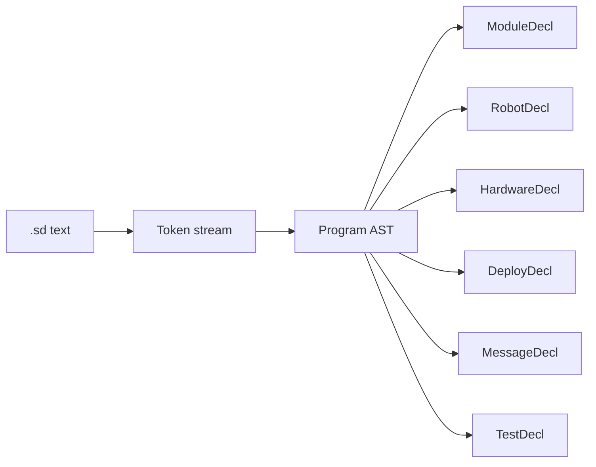
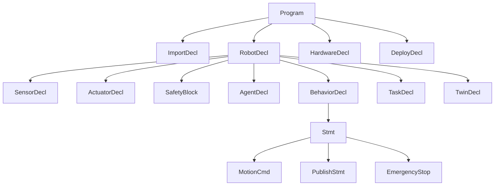
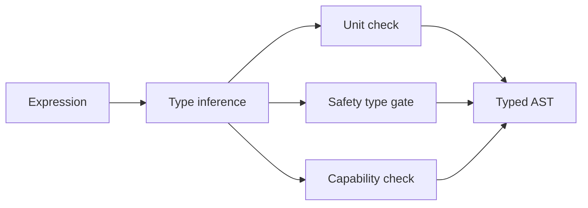
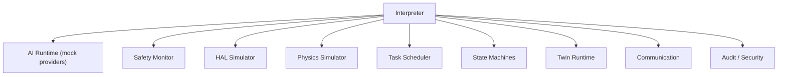
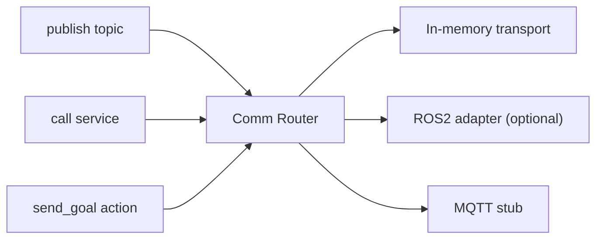
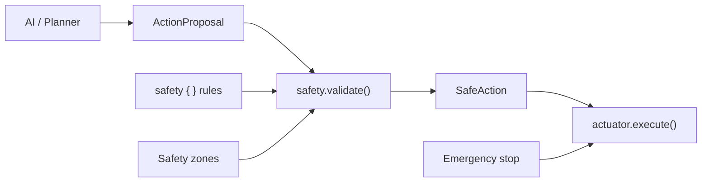
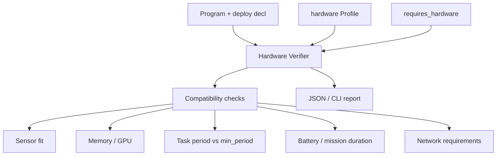

# Spanda Architecture

Technical architecture of the Spanda compiler, runtime, and tooling stack.

For a shorter overview, see [spanda-architecture.md](./spanda-architecture.md).

---

## System overview



---

## Parser

The lexer and parser are hand-written recursive descent implementations in Rust (`crates/spanda-core/src/lexer.rs`, `parser.rs`). A TypeScript mirror exists for tests and fallback execution.



**Parsed constructs include:**

- Foundations: `module`, `import`, `struct`, `enum`, `trait`, `extern fn`
- Robot surface: `sensor`, `actuator`, `safety`, `behavior`, `task`, `agent`
- Communication: `message`, `topic`, `service`, `action`, `bus`
- Autonomous: `state_machine`, `event`, `twin`, `observe`, `verify`
- Hardware: `hardware`, `deploy`, `requires_hardware`, `requires_network`

---

## AST

The AST (`ast.rs`, `foundations.rs`) is the canonical representation shared across type checking, verification, interpretation, and IR lowering.



Robot declarations are the primary unit of autonomous program structure. Hardware and deploy declarations are program-level siblings.

---

## Type System

The type checker (`types.rs`, `type_system.rs`, `units.rs`) enforces:

- Physical unit algebra (`m`, `s`, `rad`, `m/s`, compound units)
- AI safety types (`ActionProposal` vs `SafeAction`)
- Capability constraints (`can [ read(lidar), propose_motion ]`)
- Generic struct instantiation
- Trait object dispatch (`dyn Trait`)
- State machine transition validity



Key safety rule: `actuator.execute()` requires `SafeAction`. Passing `ActionProposal` is a **compile error**.

See [spanda-type-system.md](./spanda-type-system.md).

---

## Runtime

The tree-walking interpreter (`runtime.rs`, ~4k LOC) executes typed AST with integrated subsystems:



**Execution model:**

1. Parse and type-check program
2. Initialize robot state (pose, sensors, actuators)
3. Register tasks on deterministic scheduler (`task every Nms`)
4. On each tick: evaluate safety rules → execute behavior/task body
5. AI agents propose actions; safety monitor validates before motion
6. Simulator updates pose, lidar scans, and actuator feedback

---

## Communication

Spanda provides ROS2-style communication primitives as language keywords:



| Primitive | Syntax | Role |
|-----------|--------|------|
| `message` | `message Foo { field: Type; }` | Typed payload definition |
| `topic` | `topic cmd: Velocity publish on "/cmd"` | Pub/sub channel |
| `service` | `service reset: ResetCostmap` | Request/response RPC |
| `action` | `action go_to: NavigateTo` | Long-running goal with feedback |

Default simulator uses in-memory routing. Optional ROS2 transport via `spanda-ros2-rclrs-native` (requires ROS Humble).

---

## Safety Validation

Safety operates at **compile time** and **runtime**:



**Compile time:** Type checker rejects `wheels.execute(proposal)`.

**Runtime:** Safety monitor evaluates `max_speed`, `stop_if`, and zone membership before each motion command. Violations trigger `emergency_stop` and actuator `stop()`.

---

## Hardware Verification

Separate from behavioral `verify { }` blocks. Invoked via `spanda verify` or LSP diagnostics.



Checks include: required sensors present on profile, AI model memory/GPU fit, task budgets, mission power draw, network bandwidth/latency.

See [hardware-compatibility.md](./hardware-compatibility.md).

---

## Compiler backend (experimental)

```
AST → SIR (sir.rs) → LLVM IR (spanda-llvm) → native binary (spanda-rt)
```

Commands: `spanda ir`, `spanda llvm-ir`, `spanda compile-native`

HAL profiles (`--hal-profile`) influence conditional codegen for embedded targets. This path is experimental in v0.1.0-alpha; the interpreter is the primary runtime.

See [compiler-backend-roadmap.md](./compiler-backend-roadmap.md).

---

## Dual-layer architecture

| Layer | Location | Role |
|-------|----------|------|
| **Authoritative** | `crates/spanda-core` (Rust) | All language semantics |
| **Mirror** | `src/` (TypeScript) | Tests, fallback CLI, LSP helpers |
| **Bindings** | `spanda-node`, `spanda-wasm` | External integration |
| **UX** | `packages/web`, `packages/lsp` | Playground and language server |

The TypeScript mirror delegates to the Rust CLI when `target/release/spanda` is available (`src/rust-bridge.ts`).

---

## Crate map

| Crate | Purpose |
|-------|---------|
| `spanda-core` | Language implementation |
| `spanda-cli` | Native binary |
| `spanda-package` | Package manager |
| `spanda-audit` | Audit records and ledger |
| `spanda-security` | Capabilities, secrets, trust |
| `spanda-llvm` | LLVM IR emission |
| `spanda-rt` | Native runtime C ABI |
| `spanda-node` | N-API bindings |
| `spanda-wasm` | WASM bindings |
| `spanda-dap` | Debug adapter protocol |
| `spanda-ros2-rclrs-native` | ROS2 transport (optional) |

---

## Related documentation

- [spanda-language.md](./spanda-language.md) — language reference
- [feature-status.md](./feature-status.md) — stable vs experimental
- [ffi-and-ecosystem.md](./ffi-and-ecosystem.md) — Python/C++/ROS2 interop
- [api-contract.json](./api-contract.json) — JSON output schemas
