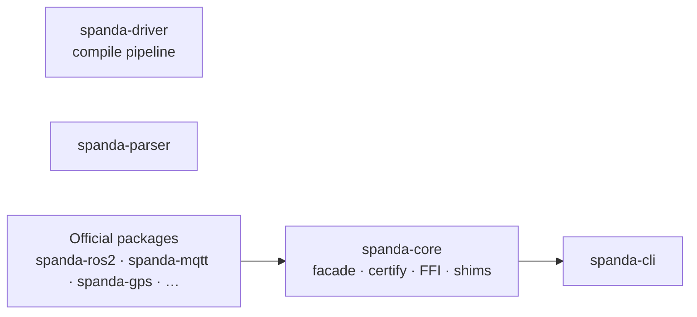
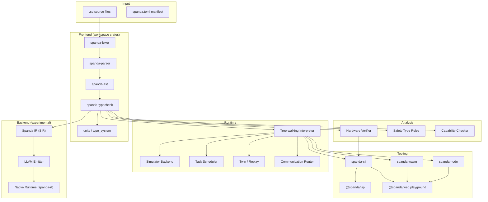
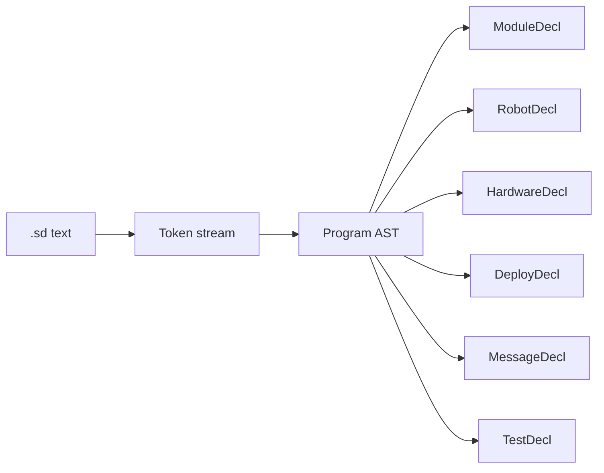
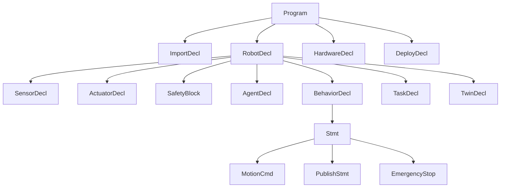
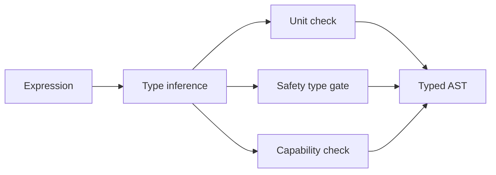
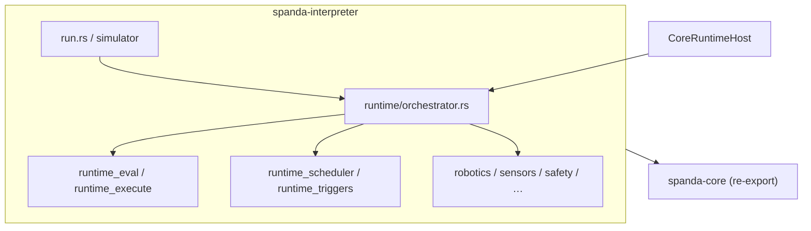
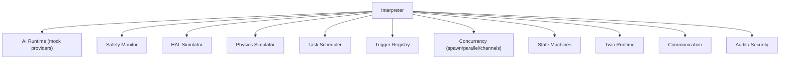
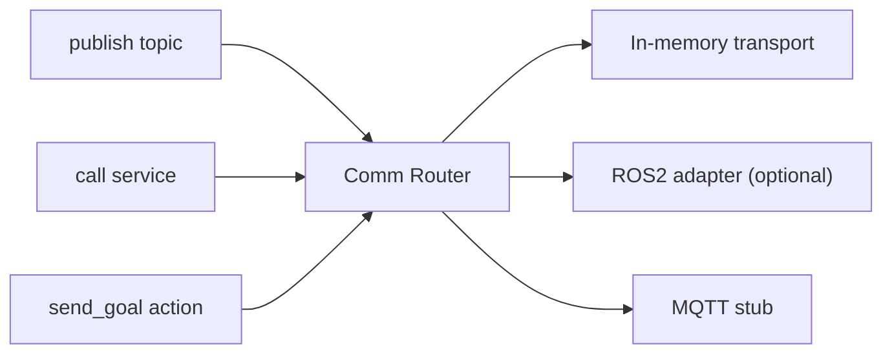
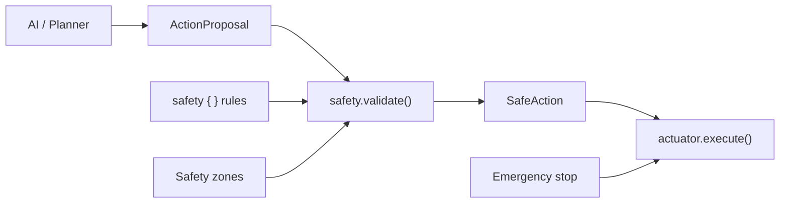
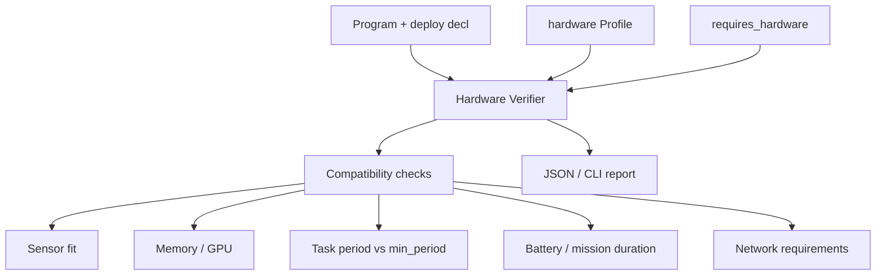

# Spanda Architecture

Technical architecture of the Spanda compiler, runtime, and tooling stack.

For a shorter overview, see [spanda-architecture.md](./spanda-architecture.md). For the lean-core model, see [lean-core.md](./lean-core.md).

---

## Lean-core model

Spanda Core defines **contracts** (types, safety, verification, provider traits). **Official packages** under `packages/registry/` supply domain implementations (ROS2, MQTT, GPS, SLAM, vision, simulation, fleet, OTA, cloud). Legacy core modules remain as compatibility shims — see [migration.md](./migration.md#lean-core-package-first-refactor).



---

## System overview



---

## Parser

The lexer lives in `spanda-lexer`; the parser in `spanda-parser` (~8k LOC); compile orchestration in `spanda-driver`. A TypeScript mirror exists in `src/` for tests and fallback execution.



**Parsed constructs include:**

- Foundations: `module`, `import`, `struct`, `enum`, `trait`, `extern fn`
- Robot surface: `sensor`, `actuator`, `safety`, `behavior`, `task`, `agent`
- Communication: `message`, `topic`, `service`, `action`, `bus`
- Autonomous: `state_machine`, `event`, `twin`, `observe`, `verify`
- Hardware: `hardware`, `deploy`, `requires_hardware`, `requires_network`

---

## AST

The AST lives in **`spanda-ast`** (`nodes`, `foundations`, `comm_decl`). Shared across type checking, verification, interpretation, and SIR lowering. `spanda_core::ast` is a compatibility re-export.



Robot declarations are the primary unit of autonomous program structure. Hardware and deploy declarations are program-level siblings.

---

## Type System

The type checker in **`spanda-typecheck`** (`checker`, `type_system`, `units`, `reliability_validation`) enforces:

- Physical unit algebra (`m`, `s`, `rad`, `m/s`, compound units)
- AI safety types (`ActionProposal` vs `SafeAction`)
- Capability constraints (`can [ read(lidar), propose_motion ]`)
- Generic struct instantiation
- Trait object dispatch (`dyn Trait`)
- State machine transition validity



Key safety rule: `actuator.execute()` requires `SafeAction`. Passing `ActionProposal` is a **compile error**.

See [spanda-type-system.md](./spanda-type-system.md).

---

## Runtime

The tree-walking **interpreter** executes typed AST with integrated subsystems. Implementation lives in **`crates/spanda-interpreter/src/runtime/`** (21 modules, ~10.7k LOC): orchestrator, eval/execute, scheduler, triggers, robotics, sensors, safety, security, and related child files.

**Composition root:** `spanda-driver` owns the full pipeline: `spanda-lexer` → `spanda-parser` → `spanda-typecheck`, then `spanda-certify` runtime gate and `spanda-bridge` FFI defaults, then `spanda-interpreter::run_program`. `spanda-core` is a one-way facade that re-exports the public API.

`CoreRuntimeHost` in `spanda-runtime-host` implements `spanda_runtime::RuntimeHost` and wires domain hooks (connectivity, fleet, transport adapters) into the interpreter.





**Execution model:**

1. Parse and type-check program
2. Initialize robot state (pose, sensors, actuators)
3. Register tasks on deterministic scheduler (`task every Nms`) and handlers in `TriggerRegistry`
4. On each tick: dispatch due triggers → evaluate safety rules → execute behavior/task body
5. Cooperative concurrency (`spawn`, `parallel`, channels) runs within the same deterministic loop
6. AI agents propose actions; safety monitor validates before motion
7. Simulator updates pose, lidar scans, and actuator feedback

See [triggers.md](./triggers.md) and [concurrency.md](./concurrency.md) for handler categories, fleet CLI, and telemetry flags.

---

## Communication

Spanda provides ROS2-style communication primitives as language keywords:



| Primitive | Syntax | Role |
|-----------|--------|------|
| `message` | `message Foo { field: Type; }` | Typed payload definition |
| `topic` | `topic cmd: Velocity publish on "/cmd"` | Pub/sub channel |
| `service` | `service reset: ResetCostmap` | Request/response RPC |
| `action` | `action go_to: NavigateTo` | Long-running goal with feedback |

Default simulator uses in-memory routing. Optional ROS2 transport via `spanda-ros2-rclrs-native` (requires ROS Humble).

---

## Safety Validation

Safety operates at **compile time** and **runtime**:



**Compile time:** Type checker rejects `wheels.execute(proposal)`.

**Runtime:** Safety monitor evaluates `max_speed`, `stop_if`, and zone membership before each motion command. Violations trigger `emergency_stop` and actuator `stop()`.

---

## Hardware Verification

Separate from behavioral `verify { }` blocks. Invoked via `spanda verify` or LSP diagnostics.



Checks include: required sensors present on profile, AI model memory/GPU fit, task budgets, mission power draw, network bandwidth/latency.

See [hardware-compatibility.md](./hardware-compatibility.md).

---

## Compiler backend (experimental)

```
AST → SIR (sir.rs) → LLVM IR (spanda-llvm) → native binary (spanda-rt)
```

Commands: `spanda ir`, `spanda llvm-ir`, `spanda compile-native`

HAL profiles (`--hal-profile`) influence conditional codegen for embedded targets. This path is experimental in v0.1.0-alpha; the interpreter is the primary runtime.

See [compiler-backend-roadmap.md](./compiler-backend-roadmap.md).

---

## Dual-layer architecture

| Layer | Location | Role |
|-------|----------|------|
| **Authoritative (Rust)** | `crates/*` workspace | All language semantics — see [crates/README.md](../crates/README.md) |
| **Public facade** | `spanda-core` | Stable `spanda_core::` API for external embedders |
| **First-party apps** | `spanda-cli`, `spanda-node`, `spanda-wasm`, `spanda-dap` | Direct workspace crate deps (no `spanda-core`) |
| **Mirror** | `src/` (TypeScript) | Tests, fallback CLI, LSP helpers, provider classification mirror |
| **UX** | `packages/web`, `packages/lsp`, `editor/vscode` | Playground, language server, extension scaffold |

The TypeScript mirror delegates to the Rust CLI when `target/release/spanda` is available (`src/rust-bridge.ts`).

---

## Crate map

See **[crates/README.md](../crates/README.md)** for the full workspace index. Summary:

| Layer | Key crates |
|-------|------------|
| Facade | `spanda-core` |
| Pipeline | `spanda-driver`, `spanda-lexer`, `spanda-parser`, `spanda-typecheck`, `spanda-sir`, `spanda-error` |
| Runtime | `spanda-interpreter`, `spanda-runtime`, `spanda-runtime-host`, `spanda-comm`, `spanda-safety`, `spanda-hal` |
| Transport | `spanda-transport`, `spanda-transport-routing`, `spanda-transport-{ros2,mqtt,dds,websocket}` |
| Domain | `spanda-hardware`, `spanda-fleet`, `spanda-ota`, `spanda-certify`, `spanda-connectivity` |
| Tooling | `spanda-format`, `spanda-lint`, `spanda-codegen`, `spanda-docs`, `spanda-modules` |
| Packages | `spanda-package`, `spanda-providers` |
| Apps | `spanda-cli`, `spanda-node`, `spanda-wasm`, `spanda-dap`, `spanda-llvm`, `spanda-rt` |
| Security | `spanda-security`, `spanda-audit` |

Optional: `spanda-ros2-rclrs-native` (in-process ROS 2, excluded from default workspace build).

---

## Related documentation

- [spanda-language.md](./spanda-language.md) — language reference
- [triggers.md](./triggers.md) — trigger-driven execution
- [concurrency.md](./concurrency.md) — tasks, spawn, channels, fleet CLI
- [feature-status.md](./feature-status.md) — stable vs experimental
- [ffi-and-ecosystem.md](./ffi-and-ecosystem.md) — Python/C++/ROS2 interop
- [api-contract.json](./api-contract.json) — JSON output schemas
