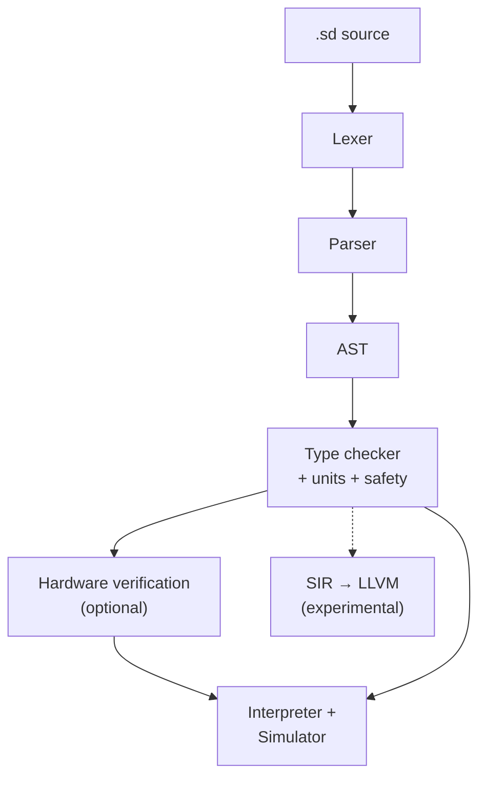
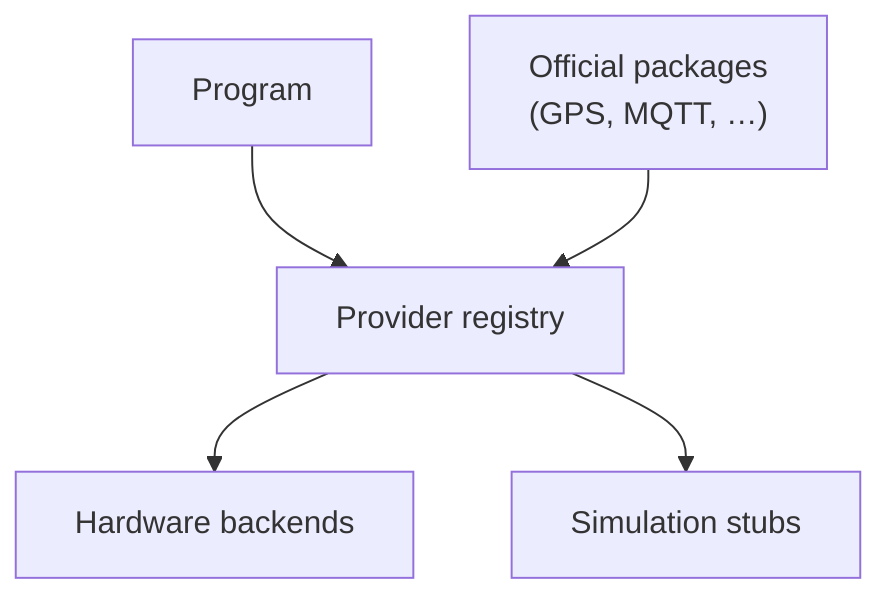
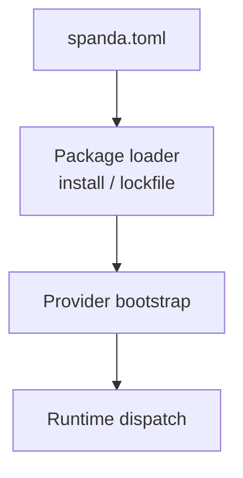

# Architecture diagrams

Visual overview of the Spanda compile and runtime pipeline.

## Language pipeline

## Provider architecture

## Package architecture

See also [architecture.md](../architecture.md) and [lean-core.md](../lean-core.md).
