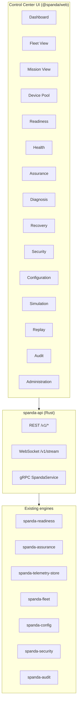

# Enterprise Operations Roadmap

Strategic expansion plan for Spanda as a **complete Autonomous Systems Platform** — production-ready for enterprise, industrial, robotics, medical, warehouse, agricultural, research, and defense deployments.

**Principle:** Every item strengthens at least one lifecycle phase: **Build · Verify · Simulate · Deploy · Operate · Observe · Recover · Govern · Audit · Continuously Improve** — without losing Spanda's core identity as a safety-first programming language and runtime.

**Lean-core rule:** Contracts and orchestration live in focused Rust crates; vendor integrations, transport adapters, and heavy UI ship in optional packages.

**Related:** [roadmap.md](./roadmap.md) · [platform-maturity-roadmap.md](./platform-maturity-roadmap.md) · [differentiation-roadmap.md](./differentiation-roadmap.md) · [feature-status.md](./feature-status.md) · [platform-overview.md](./platform-overview.md)

**Last updated:** 2026-06-25

---

## 1. Platform pillar classification

Enterprise operations pillars compose existing engines — they do **not** replace Language, Runtime, Compiler, Verification, Safety, Simulation, Health, Fleet, Packages, or the maturity/differentiation roadmaps.

| # | Pillar | Lifecycle phase(s) | Tier | Primary outcome |
|---|--------|-------------------|------|-----------------|
| 1 | **Control Center** | Operate, Observe, Govern | Experimental | Web-based operational visibility |
| 2 | **Device Pool** | Deploy, Operate | Experimental | Central device inventory and lifecycle |
| 3 | **Device Discovery** | Deploy | Experimental | Package-backed discovery transports (mock mDNS in core) |
| 4 | **Provisioning** | Deploy, Verify | Experimental | Discover → verify → assign → ready workflow |
| 5 | **Configuration Management** | Deploy, Operate | Experimental | Versioned cascading TOML with snapshots |
| 6 | **RBAC** | Govern, Operate | Experimental | Role-based access for humans and services |
| 7 | **Secret Management** | Deploy, Govern, Security | Experimental | Encrypted credentials contract with rotation metadata |
| 8 | **Telemetry** | Operate, Observe | Experimental | Time-series health, readiness, mission data |
| 9 | **Alerting** | Operate, Recover | Experimental | Multi-channel incident notifications |
| 10 | **Configuration Drift** | Operate, Verify | Experimental | Expected vs actual parity across dimensions |
| 11 | **OTA & Rollback** | Deploy | Experimental | Canary, blue/green, phased rollout |
| 12 | **Package Trust** | Verify, Build | Experimental | Signature, reputation, vulnerability scoring |
| 13 | **SDKs** | Build, Operate | Experimental | Python SDK + REST v1; JSON-RPC gateway; WebSocket client |
| 14 | **Operator Workflows** | Operate, Recover | Experimental | Mission approval, takeover, quarantine |
| 15 | **SRE** | Operate, Observe | Experimental | SLO/SLA, MTTR/MTBF, incident reporting |
| 16 | **Reporting** | Govern, Audit | Experimental | Fleet, mission, compliance, executive exports (incl. PDF) |
| 17 | **Compliance** | Verify, Govern, Audit | Experimental | Evidence packs, immutable audit trails |
| 18 | **APIs** | All | Experimental | REST v1 + OpenAPI; JSON-RPC gateway |
| 19 | **Observability** | Operate, Observe | Experimental | Trace log, OTLP export to Jaeger, WebSocket telemetry stream |
| 20 | **Digital Thread** | Build → Retire | Experimental | End-to-end traceability chain (v1 query) |

### Tier definitions

| Tier | Meaning |
|------|---------|
| **Experimental** | Shipped with caveats; CLI or partial UI; not enterprise-hardened |
| **Planned** | Design spec + integration contracts agreed; implementation scheduled |
| **Future** | Depends on Planned foundations; larger scope or external integrations |

### Existing foundations (do not rebuild)

| Capability | Current home | Enterprise reuse |
|------------|--------------|------------------|
| Device identity registry | `spanda-config::DeviceRegistry` | Device Pool v1 |
| Cascading configuration | `spanda-config::ConfigResolver` | Configuration Management |
| Config drift | `spanda-config::detect_config_drift` | Drift pillar (config dimension) |
| Device discovery CLI | `spanda device discover`, `network scan` | Discovery v1 (IP subnet) |
| Telemetry store | `spanda-telemetry-store` | Telemetry pillar |
| OTA deploy | `spanda-ota`, `deploy rollout` | OTA & Rollback |
| Package trust | `spanda-package::trust`, `spanda-trust` | Package Trust |
| Readiness / Health | `spanda-readiness`, health policies | Control Center, SRE, Alerting |
| Assurance / Diagnosis | `spanda-assurance` | Control Center, Reporting |
| Recovery | recovery planner + fleet mesh | Operator Workflows, Alerting |
| Security / Audit | `spanda-security`, `spanda-audit` | RBAC, Secrets, Compliance |
| Compliance profiles | `spanda-compliance` | Compliance pillar |
| Operations dashboard | `packages/web` Operations view | Control Center seed UI |
| Fleet agents / mesh | `spanda-fleet` | APIs, Telemetry ingest, Provisioning |
| Tamper / Trust | `spanda-tamper`, `spanda-trust` | Provisioning trust validation |

---

## 2. Core vs package ownership

### Core (lean workspace crates)

| Pillar | Core crate(s) | Responsibility |
|--------|---------------|----------------|
| Device Pool | extends `spanda-config` | Lifecycle state machine, inventory schema, assignment |
| Device Discovery | `spanda-config` + trait in `spanda-providers` | Discovery contract; no vendor SDKs in core |
| Provisioning | `spanda-readiness` + `spanda-config` | Workflow orchestration, gate composition |
| Configuration Management | `spanda-config` | Versioning, snapshots, diff, rollback metadata |
| RBAC | `spanda-security` | Roles, permissions, policy evaluation |
| Secret Management | `spanda-security` | Secret store contract, encryption, rotation hooks |
| Telemetry | `spanda-telemetry-store` | Storage, query, aggregation APIs |
| Alerting | `spanda-ops` (proposed) | Alert rules, routing, deduplication |
| Configuration Drift | `spanda-config` + `spanda-readiness` | Multi-dimensional drift reports |
| OTA & Rollback | `spanda-ota` | Rollout strategies, approval gates |
| Package Trust | `spanda-package`, `spanda-trust` | Scoring engine (exists) |
| Operator Workflows | `spanda-fleet` + `spanda-assurance` | Approval queues, takeover dispatch |
| SRE | extends `spanda-readiness` | SLO computation, incident aggregation |
| Reporting | `spanda-audit` + report composers | Report generation from engine outputs |
| Compliance | `spanda-compliance` | Evidence pack assembly (exists) |
| APIs | `spanda-api` (proposed) | REST + gRPC gateway over CLI engines |
| Observability | `spanda-telemetry-store` + OTLP | Metrics/logs/traces export (partial) |
| Digital Thread | `spanda-capability` + `spanda-audit` | Traceability graph (future) |
| Control Center backend | `spanda-api` | Serves all UI modules |

### Packages (optional, vendor-specific)

| Package family | Examples | Pillar |
|----------------|----------|--------|
| Discovery transports | `spanda-discovery-mdns`, `spanda-discovery-ble`, `spanda-discovery-opcua`, `spanda-discovery-modbus` | Device Discovery |
| Alert channels | `spanda-alert-slack`, `spanda-alert-pagerduty`, `spanda-alert-teams` | Alerting |
| Secret backends | `spanda-secrets-vault`, `spanda-secrets-aws-sm`, `spanda-secrets-k8s` | Secret Management |
| Telemetry backends | `spanda-telemetry-timescale`, `spanda-telemetry-influx` | Telemetry |
| Observability exporters | `spanda-otel-collector` | Observability |
| SDK language bindings | `spanda-sdk-python` (official package) | SDKs |
| Control Center UI | `@spanda/web` (`ControlCenterPanel`) + embedded serve HTML | Control Center |
| Compliance industry packs | `spanda-compliance-medical`, `spanda-compliance-defense` | Compliance |
| Reporting templates | `spanda-report-executive`, `spanda-report-fleet` | Reporting |

**Rule:** If it requires a vendor SDK, cloud account, or third-party SaaS, it is a package — not core.

---

## 3. UI architecture (Control Center)

### Stack

| Layer | Technology | Notes |
|-------|------------|-------|
| UI framework | React + TypeScript | Extends existing `packages/web` |
| State | React Query + context | Server state from APIs; optimistic operator actions |
| Styling | Existing design tokens from web playground | Consistent with WASM demo |
| Desktop | Tauri (`@spanda/control-center-desktop`) | Wraps `ControlCenterPanel`; API via `spanda control-center serve` |
| Build | Vite | Shared with `@spanda/web` |

### Module map



### Module responsibilities

| Module | Data sources | Operator actions |
|--------|-------------|------------------|
| **Dashboard** | Readiness rollup, fleet health, active alerts, mission count | Navigate to detail views |
| **Fleet View** | Fleet mesh, agent registry, swarm state | Orchestrate, remote commands |
| **Mission View** | Mission plans, progress, contracts, continuity state | Approve, pause, resume, cancel |
| **Device Pool** | `DeviceRegistry`, lifecycle state, assignments | Assign, quarantine, retire |
| **Readiness** | `spanda readiness`, trends, gates | Run readiness, record snapshot |
| **Health** | Health policies, fault timeline | View degraded devices |
| **Assurance** | Assurance cases, anomaly reports | Run assure, view prognostics |
| **Diagnosis** | `spanda diagnose`, root-cause reports | Trigger diagnosis |
| **Recovery** | Recovery planner, knowledge store | Approve recovery, execute heal |
| **Security** | Trust scores, tamper alerts, secure-boot status | View integrity, quarantine |
| **Configuration** | Resolved config, diff, history, approval queue | Approve, rollback config |
| **Simulation** | Active sim sessions, twin state | Launch sim, inject faults |
| **Replay** | Trace library, deterministic playback | Replay, time-travel scrub |
| **Audit** | Decision audit trail, compliance evidence | Export evidence packs |
| **Administration** | RBAC, secrets metadata, API keys | Manage users, roles, integrations |

### Evolution from current UI

`packages/web` Operations view (readiness scoring, live agent fetch, continuity panel, WASM telemetry) becomes the **Dashboard + Readiness + Health** seed. New modules add incrementally without replacing the playground.

---

## 4. Backend API architecture

### Design principles

1. **CLI parity** — every `spanda` command maps to an API endpoint; no CLI-only capabilities.
2. **Versioned** — `/v1/` prefix; breaking changes require `/v2/`.
3. **Engine delegation** — APIs are thin wrappers over existing crates; no duplicate business logic.
4. **Auth at boundary** — RBAC middleware on all mutating endpoints.
5. **Audit on mutation** — every deploy, approve, override, recover writes to `spanda-audit`.

### Proposed crate: `spanda-api`

```
spanda-api/
  src/
    rest/          # axum or actix-web handlers
    grpc/          # tonic service definitions
    ws/            # WebSocket streaming (telemetry, alerts)
    auth/          # RBAC middleware
    openapi/       # OpenAPI 3.1 spec generation
```

### API surface (representative)

| Domain | REST | gRPC | CLI equivalent |
|--------|------|------|----------------|
| Readiness | `GET /v1/readiness/{robot}` | `EvaluateReadiness` | `spanda readiness` |
| Health | `GET /v1/health/{robot}` | `GetHealth` | health_check runtime |
| Assurance | `POST /v1/assure` | `RunAssurance` | `spanda assure` |
| Diagnosis | `POST /v1/diagnose` | `Diagnose` | `spanda diagnose` |
| Recovery | `POST /v1/recovery/execute` | `ExecuteRecovery` | `spanda recover` |
| Fleet | `GET /v1/fleet/agents` | `ListAgents` | `spanda fleet agent list` |
| Devices | `GET /v1/devices` | `ListDevices` | `spanda device discover` |
| Provisioning | `POST /v1/provision` | `ProvisionDevice` | (new workflow) |
| Config | `GET /v1/config/resolve` | `ResolveConfig` | `spanda config resolve` |
| Drift | `GET /v1/drift` | `DetectDrift` | `spanda drift` |
| Deploy | `POST /v1/deploy/rollout` | `Rollout` | `spanda deploy rollout` |
| Trust | `GET /v1/trust/{target}` | `EvaluateTrust` | `spanda trust` |
| Telemetry | `GET /v1/telemetry` | `QueryTelemetry` | `spanda telemetry` |
| Alerts | `GET /v1/alerts` | `StreamAlerts` | (new) |
| Audit | `GET /v1/audit` | `QueryAudit` | `spanda audit` |
| Missions | `POST /v1/missions/{id}/approve` | `ApproveMission` | operator workflow |
| Secrets | `POST /v1/secrets` | `RotateSecret` | (new) |

### Deployment modes

| Mode | Description |
|------|-------------|
| **Embedded** | `spanda control-center serve` — single-process API + static UI |
| **Fleet mesh** | Extends existing fleet mesh coordinator with API routes |
| **Standalone** | `spanda-api` container for enterprise deployments |
| **Edge agent** | Lightweight agent on robot; syncs to central Control Center |

Existing fleet agent endpoints (`/v1/status`, `/v1/recovery/execute`, `/v1/continuity/execute`, `/v1/fleet/telemetry/ingest`) remain the edge contract; Control Center aggregates them.

---

## 5. Integration map

Every enterprise pillar integrates with the platform spine:


### Cross-pillar integration matrix

| Pillar | Readiness | Assurance | Diagnosis | Recovery | Trust | Health | Device Reg | Config | Trace | Audit | Security | Packages |
|--------|-----------|-----------|-----------|----------|-------|--------|------------|--------|-------|-------|----------|----------|
| Control Center | ✓ | ✓ | ✓ | ✓ | ✓ | ✓ | ✓ | ✓ | ✓ | ✓ | ✓ | ✓ |
| Device Pool | ✓ | | | | ✓ | ✓ | ✓ | ✓ | ✓ | ✓ | ✓ | |
| Discovery | ✓ | | | | ✓ | | ✓ | ✓ | ✓ | | ✓ | ✓ |
| Provisioning | ✓ | ✓ | ✓ | | ✓ | ✓ | ✓ | ✓ | ✓ | ✓ | ✓ | ✓ |
| Config Mgmt | ✓ | | | | ✓ | ✓ | ✓ | ✓ | ✓ | ✓ | ✓ | ✓ |
| RBAC | ✓ | ✓ | | ✓ | ✓ | ✓ | ✓ | ✓ | | ✓ | ✓ | |
| Secrets | | | | | ✓ | | ✓ | ✓ | | ✓ | ✓ | ✓ |
| Telemetry | ✓ | ✓ | ✓ | ✓ | ✓ | ✓ | ✓ | | ✓ | ✓ | ✓ | |
| Alerting | ✓ | ✓ | ✓ | ✓ | ✓ | ✓ | ✓ | ✓ | | ✓ | ✓ | |
| Drift | ✓ | | ✓ | | ✓ | ✓ | ✓ | ✓ | ✓ | ✓ | ✓ | ✓ |
| OTA | ✓ | ✓ | | ✓ | ✓ | ✓ | ✓ | ✓ | ✓ | ✓ | ✓ | ✓ |
| Package Trust | ✓ | | | | ✓ | | | ✓ | ✓ | ✓ | ✓ | ✓ |
| SDKs | ✓ | ✓ | ✓ | ✓ | ✓ | ✓ | ✓ | ✓ | ✓ | ✓ | ✓ | ✓ |
| Operator Workflows | ✓ | ✓ | ✓ | ✓ | ✓ | ✓ | ✓ | ✓ | ✓ | ✓ | ✓ | |
| SRE | ✓ | ✓ | ✓ | ✓ | ✓ | ✓ | ✓ | | ✓ | ✓ | ✓ | |
| Reporting | ✓ | ✓ | ✓ | ✓ | ✓ | ✓ | ✓ | ✓ | ✓ | ✓ | ✓ | ✓ |
| Compliance | ✓ | ✓ | | ✓ | ✓ | ✓ | ✓ | ✓ | ✓ | ✓ | ✓ | ✓ |
| APIs | ✓ | ✓ | ✓ | ✓ | ✓ | ✓ | ✓ | ✓ | ✓ | ✓ | ✓ | ✓ |
| Observability | ✓ | ✓ | ✓ | ✓ | ✓ | ✓ | ✓ | | ✓ | ✓ | ✓ | |
| Digital Thread | ✓ | ✓ | ✓ | ✓ | ✓ | ✓ | ✓ | ✓ | ✓ | ✓ | ✓ | ✓ |

---

## 6. Pillar specifications

### 6.1 Device Pool

Central inventory extending `DeviceRegistry` with lifecycle states:

**Device types:** Robots, Sensors, Actuators, Accessories, Compute Modules, Controllers, Gateways, Cameras, GPS, Lidar, Radar, BLE/WiFi/LTE/5G/USB/CAN/EtherCAT/PLC devices.

**Lifecycle states:** Discovered → Quarantined → Verified → Assigned → Healthy → Degraded → Offline → Failed → Retired.

**Core schema:** extends `[[devices]]` in `spanda.toml` with `lifecycle_state`, `assigned_robot`, `last_seen`, `provisioning_id`.

### 6.2 Device Discovery

Package-backed discovery transports:

| Transport | Package (proposed) | Status |
|-----------|-------------------|--------|
| IP subnet | core (`network scan`) | **Experimental** |
| Manual | core (`[[devices]]`) | **Experimental** |
| mDNS / DNS-SD | `spanda-discovery-mdns` | Planned |
| USB | `spanda-discovery-usb` | Planned |
| Bluetooth / BLE | `spanda-discovery-ble` | Planned |
| CAN / EtherCAT | `spanda-discovery-can`, `spanda-discovery-ethercat` | Planned |
| ROS2 / DDS | `spanda-ros2` (extend) | Experimental |
| MQTT | `spanda-mqtt` (extend) | Experimental |
| OPC-UA / Modbus | `spanda-opcua`, `spanda-modbus` | Experimental |
| Serial | `spanda-discovery-serial` | Planned |

### 6.3 Provisioning workflow

```
Discover → Verify Identity → Trust Validation → Firmware Validation
  → Health Validation → Capability Validation → Assign → Ready
```

Each gate composes existing engines:

| Step | Engine | Gate |
|------|--------|------|
| Verify Identity | `DeviceRegistry` + network validation | Duplicate IP/MAC/serial check |
| Trust Validation | `spanda-trust`, `spanda-tamper` | Composite trust ≥ threshold |
| Firmware Validation | `spanda-tamper::secure_boot` | Attestation match |
| Health Validation | `spanda-readiness` | Health policy pass |
| Capability Validation | `spanda-verify` | Capability matrix match |
| Assign | `DeviceRegistry` | Robot/fleet binding |
| Ready | `spanda-readiness` | Deployment gate pass |

### 6.4 Configuration Management

Extends cascading TOML ([cascading-config.md](./cascading-config.md)):

| Feature | Status | Notes |
|---------|--------|-------|
| Environment overrides | **Experimental** | `[extends]` layers |
| Deployment / robot / fleet overrides | **Experimental** | `ConfigResolver` |
| Versioning | Planned | Config snapshot IDs |
| Rollback | Planned | Point-in-time restore |
| Snapshots | Planned | `.spanda/config-snapshots/` |
| History | Planned | Audit-linked change log |
| Diff | **Experimental** | `spanda config diff` |
| Approval | Planned | RBAC-gated publish |

### 6.5 RBAC

| Role | Deploy | Operate | Approve | Override | Shutdown | Recover | Delete | Provision |
|------|--------|---------|---------|----------|----------|---------|--------|-----------|
| Administrator | ✓ | ✓ | ✓ | ✓ | ✓ | ✓ | ✓ | ✓ |
| Developer | ✓ | ✓ | | | | | | |
| Operator | | ✓ | | | ✓ | ✓ | | |
| Supervisor | ✓ | ✓ | ✓ | ✓ | ✓ | ✓ | | ✓ |
| Safety Officer | | ✓ | ✓ | | ✓ | | | |
| Auditor | | | | | | | | |
| Guest | | | | | | | | |

Core: `spanda-security::rbac` with JWT/API-key auth at API boundary.

### 6.6 Secret Management

Secures: API keys, certificates, private keys, robot credentials, cloud credentials, provider credentials.

Features: rotation, expiration, audit trail, encryption at rest (AES-256-GCM, existing wire crypto).

Package backends: HashiCorp Vault, AWS Secrets Manager, Kubernetes secrets.

### 6.7 Telemetry

Builds on [telemetry-store.md](./telemetry-store.md):

| Signal | Status |
|--------|--------|
| Health, Readiness | **Experimental** |
| CPU, Memory, Battery, Temperature | **Experimental** |
| GPS, Connectivity | **Experimental** |
| Events, Diagnostics | **Experimental** |
| Mission Progress, Recovery Events | **Experimental** |
| Time-series history | Planned (package backend) |
| Trend analysis | **Experimental** (`readiness trends`) |
| Forecasting | Planned |

### 6.8 Alerting

| Channel | Package |
|---------|---------|
| Email | `spanda-alert-email` |
| Slack | `spanda-alert-slack` |
| Microsoft Teams | `spanda-alert-teams` |
| Discord | `spanda-alert-discord` |
| SMS | `spanda-alert-sms` |
| Webhook | core (generic HTTP POST) |
| PagerDuty | `spanda-alert-pagerduty` |

**Alert types:** Mission Failure, Robot Offline, Crash, Reboot, Memory Leak, Tamper, Security, Low Battery, Health Critical, Readiness Failed, Recovery Failed.

Core: `spanda-ops::alerting` — rule engine, deduplication, severity routing.

### 6.9 Configuration Drift

Extends [drift-detection.md](./drift-detection.md):

| Dimension | Detector | Status |
|-----------|----------|--------|
| Configuration | `detect_config_drift` | **Experimental** |
| Firmware | attestation vs baseline | **Experimental** |
| Package | lockfile vs agent report | Planned |
| Provider | resolved vs runtime dispatch | Planned |
| Capability | matrix vs runtime grants | Planned |
| Policy | declared vs enforced | Planned |
| Safety | certify hash vs runtime | Planned |

### 6.10 OTA & Rollback

Extends existing `spanda deploy plan|rollout|rollback|status`:

| Strategy | Status |
|----------|--------|
| Version pinning | **Experimental** |
| Rollback | **Experimental** |
| Approval gates (`--require-certify`) | **Experimental** |
| Canary | Planned |
| Blue/Green | Planned |
| Phased rollout | Planned |

### 6.11 Operator Workflows

| Workflow | Integration |
|----------|-------------|
| Mission Approval | `requires approval`, RBAC, audit |
| Mission Pause / Resume / Cancel | runtime + fleet mesh |
| Manual Takeover | `spanda takeover`, continuity framework |
| Emergency Stop | kill switch + safety engine |
| Recovery Approval | `SPANDA_OPERATOR_APPROVAL`, RBAC |
| Device Assignment | Device Pool |
| Device Quarantine | Device Pool lifecycle + trust downgrade |

### 6.12 SRE

| Metric | Source |
|--------|--------|
| SLO / SLA | readiness history + telemetry |
| Availability / Uptime | health_check + agent heartbeat |
| MTTR | recovery knowledge store |
| MTBF | fault timeline |
| Crash / Recovery statistics | `spanda-runtime-faults` |
| Incident reports | alerting + audit |
| Health trends | `spanda readiness trends` |

### 6.13 Reporting

| Report | Engines | Export formats |
|--------|---------|----------------|
| Fleet | readiness, health, fleet mesh | HTML, Markdown, JSON, PDF, CSV |
| Mission | assurance, contracts, continuity | HTML, Markdown, JSON, PDF, CSV |
| Health / Readiness | readiness, health | HTML, Markdown, JSON, PDF, CSV |
| Security / Trust | tamper, trust, security assurance | HTML, Markdown, JSON, PDF, CSV |
| Compliance | compliance profiles, audit | HTML, Markdown, JSON, PDF, CSV |
| Configuration | config resolver, drift | HTML, Markdown, JSON, PDF, CSV |
| Recovery | recovery planner, knowledge | HTML, Markdown, JSON, PDF, CSV |
| Executive Dashboard | scorecard | HTML, PDF |

### 6.14 Digital Thread (Future)

End-to-end traceability chain:

Requirement → Mission → Capability → Hardware → Device → Provider → Package → Simulation → Verification → Deployment → Runtime → Recovery → Evidence → Audit → Retirement

Builds on `spanda-capability` traceability matrices + `spanda-audit` + mission contracts.

---

## 7. Phased implementation plan

### Priority horizons

| Horizon | Timeline | Pillars |
|---------|----------|---------|
| **NOW** | 0–6 months (v0.5–v0.6) | Control Center, Device Pool, Provisioning, Telemetry, Alerting, RBAC, Secrets — **E1 shipped** (experimental) |
| **NEXT** | 6–12 months (v0.6–v0.7) | SDKs, Configuration Drift (full), OTA strategies, Package Trust (UI), Observability — **E2–E3 shipped** (experimental) |
| **LATER** | 12–18 months (v0.8–v1.0) | Compliance Packs, Executive Dashboards, Digital Thread, Predictive Analytics — **E4 shipped** (experimental; Tauri scaffold) |

### Phase E1 — Control plane foundation (v0.5+, Q3–Q4 2026)

**Theme:** Operators can see and govern the fleet from a browser.

| Deliverable | Component | Depends on |
|-------------|-----------|------------|
| `spanda-api` REST v1 | `spanda-api` crate | existing engines |
| Control Center shell | `ControlCenterPanel` in `@spanda/web` + embedded HTML | `spanda-api` |
| Dashboard + Fleet + Readiness modules | UI modules | telemetry, readiness APIs |
| Device Pool schema + lifecycle | extends `spanda-config` | `DeviceRegistry` |
| RBAC v1 (API keys + 4 roles) | `spanda-security` | audit |
| Secret store contract | `spanda-security` | encryption |
| Alerting core (webhook + email) | `spanda-ops` | telemetry events |

**Exit criteria:** `spanda control-center serve` + `scripts/enterprise_ops_smoke.sh` — **shipped** (wired into `scripts/showcase_smoke.sh`).

### Phase E2 — Provision and observe (v0.6, Q1 2027)

**Theme:** Devices enter the fleet through a verified pipeline; operators get notified.

| Deliverable | Component |
|-------------|-----------|
| Provisioning workflow API | readiness + trust + verify gates |
| Device Pool UI | assign, quarantine, lifecycle |
| Discovery packages (mDNS, BLE, OPC-UA) | optional packages |
| Telemetry time-series backend package | `spanda-telemetry-timescale` |
| Alerting packages (Slack, PagerDuty) | optional packages |
| Health + Assurance + Diagnosis UI modules | Control Center |
| Config versioning + snapshots | `spanda-config` |

**Exit criteria:** End-to-end provision demo; alert on readiness failure — **shipped** (`scripts/enterprise_ops_smoke.sh`).

### Phase E3 — Deploy and integrate (v0.7, Q2 2027)

**Theme:** External systems integrate; deployments are safe and reversible.

| Deliverable | Component |
|-------------|-----------|
| Python SDK + REST OpenAPI | `spanda-sdk-python`, OpenAPI spec |
| gRPC service | `spanda-api::grpc` |
| Full drift detection (6 dimensions) | config + readiness + trust |
| OTA canary + phased rollout | `spanda-ota` |
| Package Trust UI | Control Center Security module |
| Observability (OpenTelemetry export) | OTLP + correlation IDs |
| Operator Workflows UI | mission approve, takeover, quarantine |
| SRE dashboard | MTTR/MTBF, incident reports |

**Exit criteria:** SDK integration test; canary deploy demo; correlation trace API — **shipped** (`scripts/enterprise_ops_smoke.sh`, `packages/sdk-python`). Full OTLP trace export to Jaeger and WebSocket telemetry SDK — **shipped** (`POST /v1/observability/otlp/export`, `WS /v1/stream/telemetry`).

### Phase E4 — Govern and trace (v1.0, 2027)

**Theme:** Enterprise audit, compliance, and executive visibility.

| Deliverable | Component |
|-------------|-----------|
| Compliance evidence packs (UI) | `spanda-compliance` + Control Center Audit |
| Executive dashboards | scorecard + reporting templates |
| Digital Thread v1 | capability traceability graph |
| Predictive analytics | readiness forecasting + anomaly trends |
| Reporting exports (PDF) | report composer |
| Tauri desktop packaging | `@spanda/control-center-desktop` |
| WebSocket SDK | real-time telemetry stream |

**Exit criteria:** Compliance report export; digital thread query demo — **shipped** (`scripts/enterprise_ops_smoke.sh`). PDF executive export — **shipped** (`format=pdf`). Tauri desktop scaffold — **shipped** (`scripts/control_center_desktop_smoke.sh`; dev via `npm run control-center:desktop:dev`).

---

## 8. Risks and mitigation

| Risk | Severity | Likelihood | Mitigation |
|------|----------|------------|------------|
| UI scope creep — 15 modules at once | High | High | Phase E1 ships Dashboard + Fleet + Readiness only; add modules incrementally |
| API/CLI divergence | High | Medium | OpenAPI generated from same handler traits; contract tests |
| RBAC bypass on fleet agents | High | Medium | Agent auth tokens; mesh mTLS; audit all mutations |
| Secret leakage in logs/traces | High | Low | Redaction middleware; secret references only (never values) |
| Telemetry storage at scale | Medium | High | Package backends (Timescale/Influx); retention policies exist |
| Discovery false positives | Medium | Medium | Quarantine lifecycle; human verification step in provisioning |
| Alert fatigue | Medium | High | Deduplication, severity routing, SLO-based thresholds |
| OTA bricking robots | High | Low | Canary + rollback; `--require-certify`; readiness gate before promote |
| Package trust gaming | Medium | Medium | Transparent scoring; community appeals (existing) |
| Compliance liability | Medium | Low | Template-only disclaimer (existing); not accredited regulatory approval |
| Tauri packaging complexity | Low | Medium | Scaffold shipped; web-first; installers not published |
| Duplicate drift logic | Medium | Medium | Single `spanda-config::drift` module; dimensions as plugins |
| Breaking JSON schemas | High | Low | Version fields on all API responses |
| Docs ahead of code | Low | High | All new docs marked **Planned** until CI smoke exists |

---

## 9. Success criteria

Spanda becomes a **complete Autonomous Systems Platform** covering:

| Phase | Question | Answered by |
|-------|----------|-------------|
| Build | Can I compose and verify a mission? | Language + verify + packages |
| Verify | Is it safe and capable? | Safety + readiness + assurance |
| Simulate | Can I test without hardware? | Sim + replay + twins |
| Deploy | Can I provision and roll out safely? | Provisioning + OTA + gates |
| Operate | Can I run missions with oversight? | Control Center + operator workflows |
| Observe | Can I see health and trends? | Telemetry + observability + SRE |
| Recover | Can failures self-heal safely? | Recovery + continuity + alerting |
| Govern | Who can do what? | RBAC + secrets + audit |
| Audit | Can I prove compliance? | Compliance + reporting + digital thread |
| Improve | Can I learn from operations? | Trends + forecasting + scorecards |

**Without losing:** safety-first language, lean-core architecture, and package extensibility.

---

## Related documents

- [configuration.md](./configuration.md) · [cascading-config.md](./cascading-config.md) · [device-tree.md](./device-tree.md)
- [telemetry-store.md](./telemetry-store.md) · [drift-detection.md](./drift-detection.md) · [deployment-gates.md](./deployment-gates.md)
- [package-trust.md](./package-trust.md) · [trust-framework.md](./trust-framework.md) · [compliance-profiles.md](./compliance-profiles.md)
- [platform-maturity-roadmap.md](./platform-maturity-roadmap.md) · [differentiation-roadmap.md](./differentiation-roadmap.md)
- [security-architecture.md](./security-architecture.md) · [readiness.md](./readiness.md) · [self-healing.md](./self-healing.md)
