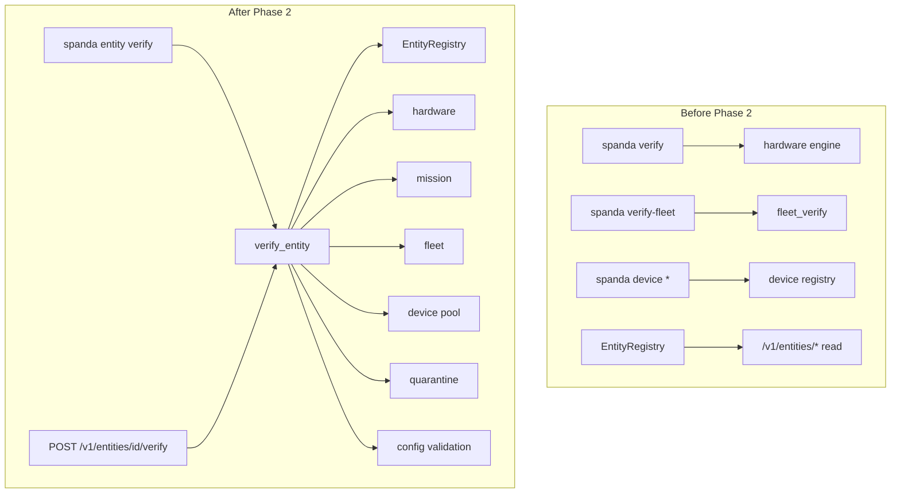

# Entity Model Integration Report

**Date:** 2026-06-28  
**Status:** Shipped (Experimental tier) — Phases 1–17 complete; Phase 18 validated in CI

## Summary

The Unified Entity Model integrates registry, graph, query, traceability, verification, readiness, health, and trust across REST, gRPC, CLI, SDKs, and Control Center. Every managed object routes through `EntityRegistry` while preserving existing program- and device-level APIs.

## Deliverables

| Deliverable | Status | Location |
|-------------|--------|----------|
| Entity registry & graph | ✅ | `crates/spanda-config/src/entity.rs` |
| Verification engine | ✅ | `crates/spanda-readiness/src/entity_verify.rs` |
| Readiness / health / trust engines | ✅ | `entity_readiness.rs`, `entity_health.rs`, `spanda-trust/entity_trust.rs` |
| REST API (14 routes) | ✅ | `crates/spanda-api/src/sdk_ops.rs`, `entity_mutations.rs` |
| gRPC entity RPCs (proto 1.0.3) | ✅ | `crates/spanda-api/proto/spanda/v1/control_center.proto` |
| CLI | ✅ | `spanda entity *` in `crates/spanda-cli/src/entity_cli.rs` |
| Rust / TS / Python SDK | ✅ | `crates/spanda-sdk`, `sdk/typescript`, `sdk/python` |
| Control Center Entities tab | ✅ | `packages/web/src/EntityGraphPanel.tsx` |
| CI smoke | ✅ | `scripts/entity_model_smoke.sh` |
| API reference | ✅ | [entity-apis.md](./entity-apis.md) |
| SDK reference | ✅ | [entity-sdk.md](./entity-sdk.md) |
| Topic guides | ✅ | verification, readiness, health, trust, graph, query, migration |
| Examples (8 programs) | ✅ | `examples/entity/` |

## Architecture change



## Verification routing by entity kind

| Entity kind | Engines invoked |
|-------------|-----------------|
| `robot`, `drone`, `vehicle` | Device pool, quarantine, hardware (optional program), mission (optional program), linked missions |
| `fleet`, `swarm` | Member graph, fleet verify (optional program), per-robot checks |
| `mission` | Mission verify (optional program), participant graph |
| `human`, `team` | Human registry availability and certifications |
| `device`, `sensor`, `actuator`, … | Device pool, quarantine |
| `package`, `provider` | Provider/manifest registry |
| `facility`, `building`, `zone` | Child entity graph |
| All | Health/readiness/trust snapshot, relationship integrity, optional dependency chain |

## Backward compatibility

| Surface | Change |
|---------|--------|
| `spanda verify` | Unchanged |
| `spanda verify-fleet` | Unchanged |
| `spanda device *` | Unchanged |
| `/v1/programs/verify/*` | Unchanged |
| `/v1/devices`, `/v1/robots`, `/v1/fleets` | Unchanged |
| `/v1/entities/*` | **Additive** `POST …/verify` |

## Migration notes

1. **Prefer entity verify for operational checks** — `spanda entity verify rover-001` replaces ad-hoc combinations of device inspect + verify when you need a single report.
2. **Program context is optional** — hardware and mission checks run only when `--program` (CLI) or `file` (REST) is provided.
3. **Dependency traversal is opt-in** — pass `--dependencies` or `"include_dependencies": true` to verify the full `depends_on` chain.
4. **Existing workflows unchanged** — CI pipelines using `spanda verify` do not need updates.

## Validation results

```bash
cargo fmt --all
cargo clippy -p spanda-readiness -p spanda-api -p spanda -- -D warnings
cargo test -p spanda-readiness entity_verify
cargo run -p spanda -- entity verify rover-001 --config spanda.toml
scripts/entity_model_smoke.sh
```

## Next phases (roadmap)

| Phase | Focus | Status |
|-------|-------|--------|
| 1 | Entity Registry Integration | ✅ Shipped |
| 2 | Verification Integration | ✅ Shipped |
| 3 | Readiness Integration | ✅ Shipped — `evaluate_entity_readiness` |
| 4 | Health Integration | ✅ Shipped — `evaluate_entity_health` |
| 5 | Trust Integration | ✅ Shipped — `evaluate_entity_trust` |
| 6 | Relationship Graph | ✅ Shipped |
| 7 | Control Center Entity Explorer | ✅ Entities tab shipped |
| 8 | SDK EntityClient | ✅ Shipped + verify |
| 9 | REST generic APIs | ✅ Shipped + verify |
| 10 | CLI entity commands | ✅ Shipped |
| 11 | Entity Query Language | ✅ Shipped |
| 12 | Traceability | ✅ Shipped |
| 13–17 | Documentation & diagrams | ✅ Shipped (overview, APIs, SDK, guides, architecture, examples) |
| 15 | Example programs | ✅ `examples/entity/*.sd` (8 programs) |
| 18 | Full workspace validation | ✅ fmt, clippy, grpc + entity smoke in CI |

## Stable promotion

Entity model tier remains **Experimental** until [entity-model-stable-promotion.md](./entity-model-stable-promotion.md) gates pass. Phase 2 does not change promotion criteria.
