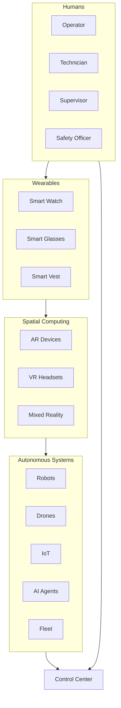
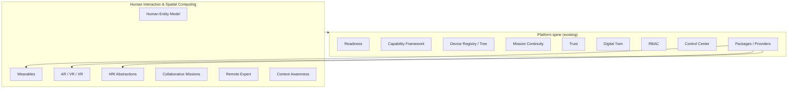

# Human Interaction & Spatial Computing Roadmap

Strategic expansion plan for Spanda as a platform for **human–robot collaboration**, **wearables**, **AR/VR/XR**, and **collaborative autonomy** — without bloating the core language or embedding proprietary device SDKs.

**Principle:** Humans, wearables, and spatial devices are first-class entities in configuration, device registry, capability framework, readiness, and Control Center — integrated through **packages**, **providers**, **solution blueprints**, and **existing platform spine** capabilities.

**Lean-core rule:** No AR/VR engines, no wearable vendor SDKs, and no HRI-specific language keywords in core. Contracts live in workspace crates (`spanda-config`, `spanda-capability`, `spanda-readiness`, `spanda-api`); device bridges ship in optional packages (`spanda-vision-pro`, `spanda-hololens`, `spanda-arkit`, …).

**Related:** [roadmap.md](./roadmap.md) · [solutions/spatial-computing.md](./solutions/spatial-computing.md) · [human-interaction.md](./human-interaction.md) · [feature-status.md](./feature-status.md) · [platform-overview.md](./platform-overview.md)

**Last updated:** 2026-06-28

---

## 0. Platform context

Spanda already ships the spine required for human–robot collaboration:

| Spine capability | HRI / spatial role |
|------------------|-------------------|
| **Device Registry & Device Tree** | Humans, wearables, AR/VR devices as typed nodes |
| **Capability Framework** | Operator capabilities verified like robot capabilities |
| **Readiness Engine** | Operator, team, and mission readiness scoring |
| **Assurance & Diagnosis** | Remote expert context, anomaly on operator fatigue (optional) |
| **Recovery & Mission Continuity** | Human takeover, robot takeover, delegation, approval workflows |
| **Trust** | Operator trust level, wearable attestation, device quarantine |
| **Digital Twin** | Operator twin, team twin, training twin |
| **Replay & Simulation** | VR training, mission replay, digital twin overlay |
| **Control Center** | Human dashboard, approval queue, AR session viewer |
| **RBAC & Security** | Role-based permissions, privacy controls for health data |
| **Packages & Providers** | Vision Pro, HoloLens, ARKit, smartwatch, gesture, voice bridges |

### Collaboration stack

**Success criteria:** Safe collaboration among humans, wearables, AR/VR/XR devices, robots, drones, IoT, AI agents, and fleets — with **zero new core language keywords** for HRI.

---

## 1. Architecture impact analysis

### 1.1 What changes in core (minimal)

| Area | Change | Tier |
|------|--------|------|
| **Device tree schema** | New node kinds: `Human`, `Wearable`, `ARDevice`, `VRDevice`, `XRSession`; optional `health_status`, `availability`, `certifications` fields on human nodes | **Planned** (config/TOML only) |
| **Capability registry** | Operator capability tokens (`operate_robot`, `approve_mission`, `emergency_override`, …) registered alongside robot capabilities | **Planned** |
| **Readiness profiles** | `human_readiness`, `team_readiness`, `mission_collaboration` profile sections in `spanda.readiness.toml` | **Planned** |
| **RBAC matrix** | Human roles map to existing permission hooks (`OperatorMissionApprove`, config approvals) | **Planned** (extends E1 RBAC) |
| **Control Center API** | REST/gRPC endpoints for operator readiness, wearable inventory, AR session metadata, approval queue (extends existing operator workflows) | **Planned** |
| **Digital twin config** | Operator/team/training twin declarations in device tree + twin mirror fields (no new twin runtime) | **Planned** |

### 1.2 What does NOT change in core

| Out of scope | Rationale |
|--------------|-----------|
| AR/VR rendering engines | Package bridges to ARKit, ARCore, OpenXR, vendor SDKs |
| Proprietary wearable SDKs | Optional packages (`spanda-smartwatch`, `spanda-industrial-wearables`, …) |
| Hand/eye/gesture ML models | Optional packages (`spanda-gesture`, `spanda-eye-tracking`, `spanda-voice`) |
| Healthcare data storage | Connected Healthcare blueprint; privacy via deployment config |
| New `.sd` syntax for HRI | Programs use existing `agent`, `task`, `continuity_policy`, `requires_capability`, `approval` patterns |

### 1.3 Crate ownership (lean-core)

| Concern | Owner crate | Notes |
|---------|-------------|-------|
| Human entity TOML parsing | `spanda-config` | Extends `DeviceRegistry` / fleet schema |
| Operator capability traceability | `spanda-capability` | Same matrices as hardware capabilities |
| Human readiness scoring | `spanda-readiness` | Weighted dimensions; optional health gate |
| Operator twin metadata | `spanda-runtime` (twin) | Mirror fields; no new twin engine |
| Control Center human APIs | `spanda-api` | REST v1 + gRPC parity |
| HRI provider dispatch | `spanda-runtime` | Provider traits; packages implement backends |
| Privacy / health opt-in | `spanda-security` | RBAC + deployment flags |

### 1.4 Integration spine

Every HRI pillar routes through the same platform spine as enterprise operations and ADAS:

### 1.5 Risks and mitigation

| Risk | Mitigation |
|------|------------|
| Core language bloat | All device-specific logic in packages; blueprint TOML + `.sd` programs only |
| Privacy / HIPAA exposure | Health status opt-in per deployment; RBAC + audit on health reads |
| Vendor SDK fragmentation | Provider trait per modality (AR session, wearable telemetry, gesture); one package per vendor |
| Latency in teleoperation | Existing real-time contracts + mission continuity takeover paths |
| Operator readiness false negatives | Certifications + availability as separate dimensions; override with supervisor approval |

---

## 2. Platform pillar: Human Interaction & Spatial Computing

| # | Area | Priority | Status |
|---|------|----------|--------|
| 1 | Human entity model (roles, identity, capabilities, certifications) | NOW | **Planned** |
| 2 | Operator capability framework extension | NOW | **Planned** |
| 3 | Device tree: Human, Wearable, AR, VR nodes | NOW | **Planned** |
| 4 | Human readiness (operator, team, mission) | NOW | **Planned** |
| 5 | Wearable device registry & reference packages | NEXT | **Planned** |
| 6 | AR reference integrations (Vision Pro, HoloLens, ARKit, ARCore) | NEXT | **Planned** |
| 7 | VR training & mission replay workflows | NEXT | **Planned** |
| 8 | XR mixed-reality overlays (robot, mission, sensor, readiness) | NEXT | **Planned** |
| 9 | HRI abstractions (voice, gesture, hand/eye/pose, spatial anchors) | NEXT | **Planned** |
| 10 | Collaborative missions (human + robot + drone + IoT + agent + fleet) | NEXT | **Planned** |
| 11 | Remote expert workflows (AR + live camera + annotations) | LATER | **Planned** |
| 12 | Context awareness (geofencing, hazard zones, fatigue alerts) | LATER | **Planned** |
| 13 | Human digital twin (operator, team, training) | LATER | **Planned** |
| 14 | Human health integration (optional, privacy-controlled) | LATER | **Planned** |
| 15 | Control Center human dashboards & collaboration UI | LATER | **Planned** |

---

## 3. Human entity model

Humans are **first-class entities** in the device tree and device pool — not language objects.

### Roles

| Role | Typical capabilities |
|------|---------------------|
| Operator | `operate_robot`, `approve_mission` |
| Technician | `maintenance_technician`, `remote_expert` |
| Supervisor | `approve_recovery`, `emergency_override` |
| Safety Officer | `approve_mission`, `emergency_override`, `hazmat_certified` |
| Emergency Responder | `medical_responder`, `search_rescue_operator` |
| Healthcare Worker | `medical_responder` (Connected Healthcare blueprint) |
| Driver | `operate_robot`, `drone_pilot` |
| Patient | Health subject only (optional health twin) |
| Researcher | `remote_expert`, mission observe |
| Volunteer | Restricted `operate_robot` with supervisor gate |

### Entity fields

| Field | Required | Description |
|-------|----------|-------------|
| `id` | Yes | Unique human identifier |
| `role` | Yes | Primary role token |
| `capabilities` | Yes | Operator capability tokens |
| `certifications` | No | Expiring cert IDs with validity windows |
| `assignments` | No | Active robot/mission/fleet bindings |
| `health_status` | No | Opt-in; package-backed telemetry summary |
| `availability` | No | `available`, `busy`, `off_duty`, `unreachable` |
| `trust_level` | No | Same scale as devices: `unverified` → `trusted` |
| `location` | No | GPS, indoor beacon, or zone ID |
| `permissions` | No | RBAC permission tokens |

See [human-interaction.md](./human-interaction.md) and [operator-capabilities.md](./operator-capabilities.md).

---

## 4. Phased delivery

| Phase | Release | Theme | Status |
|-------|---------|-------|--------|
| **H1** | v0.6 (Q1 2027) | Human entity & readiness | **Planned** |
| **H2** | v0.7 (Q2 2027) | Wearables & AR packages | **Planned** |
| **H3** | v0.8 (Q3 2027) | HRI, collaboration, remote expert | **Planned** |
| **H4** | v1.0 (2027) | Control Center human UI, health opt-in, stable hardening | **Planned** |

### H1 — Human entity & readiness

| Deliverable | Owner |
|-------------|-------|
| Human / wearable / AR / VR device tree schema | `spanda-config` |
| Operator capability registry + traceability | `spanda-capability` |
| `human_readiness` profile dimensions | `spanda-readiness` |
| Spatial Computing solution blueprint scaffold | `examples/solutions/spatial-computing/` |
| Topic guides (8 docs) | `docs/` |

**Exit criteria:** `spanda verify` traces operator capabilities; `spanda readiness --profile human_collaboration` scores operator + team; device tree includes human nodes; `./scripts/spatial_computing_smoke.sh` (planned).

### H2 — Wearables & AR

| Deliverable | Owner |
|-------------|-------|
| Registry packages: `spanda-smartwatch`, `spanda-bodycam`, `spanda-arkit`, `spanda-arcore`, `spanda-hololens`, `spanda-vision-pro` | Packages |
| Wearable discovery ingest (BLE, Wi-Fi) | Existing discovery + packages |
| AR session provider trait | `spanda-runtime` + packages |
| Example: `warehouse-ar/`, `wearable-health/` | Examples |

### H3 — HRI & collaboration

| Deliverable | Owner |
|-------------|-------|
| Packages: `spanda-voice`, `spanda-gesture`, `spanda-eye-tracking` | Packages |
| Collaborative mission patterns (continuity + delegation) | Blueprint programs |
| Remote expert workflow (replay + diagnosis + AR annotations) | Blueprint + Control Center API |
| Examples: `remote-maintenance/`, `search-and-rescue-ar/`, `operator-approval/` | Examples |

### H4 — Control Center & stable

| Deliverable | Owner |
|-------------|-------|
| Human dashboard, operator dashboard, wearable inventory | `@spanda/web` |
| AR session viewer, VR training launcher, approval queue | Control Center |
| Human health opt-in + privacy controls | `spanda-security` + blueprint |
| Example: `vr-training/` | Examples |
| Stable tier promotion after field soak | Ops gates |

---

## 5. Solution blueprint

**Spatial Computing & Human-Robot Collaboration** — see [solutions/spatial-computing.md](./solutions/spatial-computing.md).

Applications: warehouse, manufacturing, healthcare, search & rescue, field service, utilities, construction, defense, emergency response, training.

Path: `examples/solutions/spatial-computing/`

---

## 6. Optional packages

Full catalog: [hri-packages.md](./hri-packages.md).

| Package | Modality | Status |
|---------|----------|--------|
| `spanda-vision-pro` | AR (Apple Vision Pro) | **Planned** |
| `spanda-hololens` | AR (Microsoft HoloLens) | **Planned** |
| `spanda-magic-leap` | AR (Magic Leap) | **Planned** |
| `spanda-arkit` | AR (Apple ARKit) | **Planned** |
| `spanda-arcore` | AR (Google ARCore) | **Planned** |
| `spanda-smartwatch` | Wearable (smart watch) | **Planned** |
| `spanda-industrial-wearables` | Wearable (industrial vest, helmet) | **Planned** |
| `spanda-bodycam` | Wearable (body camera) | **Planned** |
| `spanda-voice` | HRI (voice commands) | **Planned** |
| `spanda-gesture` | HRI (gesture recognition) | **Planned** |
| `spanda-eye-tracking` | HRI (eye tracking) | **Planned** |

---

## 7. Control Center extensions

| Tab / panel | Content |
|-------------|---------|
| **Human Dashboard** | Fleet-wide human entity summary, role distribution, availability |
| **Operator Dashboard** | Per-operator readiness, certifications, active assignment |
| **Wearable Inventory** | Connected wearables, battery, connectivity, last telemetry |
| **AR Session Viewer** | Active AR sessions, spatial anchors, overlay state |
| **VR Training** | Training session launcher, replay links, twin state |
| **Live Collaboration** | Active collaborative missions, participant graph |
| **Mission Collaboration** | Human + robot + drone task allocation status |
| **Operator Readiness** | Team readiness rollup, blocking dimensions |
| **Approval Queue** | Mission approve, recovery approve, config approve (extends E1) |

See [control-center.md](./control-center.md#human-interaction-dashboard).

---

## 8. Documentation plan

| Document | Topic |
|----------|-------|
| [human-interaction.md](./human-interaction.md) | Human entity model, roles, assignments |
| [operator-capabilities.md](./operator-capabilities.md) | Capability tokens, verification, traceability |
| [wearables.md](./wearables.md) | Wearable types, registry, packages |
| [spatial-computing.md](./spatial-computing.md) | Spatial anchors, shared workspaces, overlays |
| [ar-vr-xr.md](./ar-vr-xr.md) | AR/VR/XR modalities and use cases |
| [hri.md](./hri.md) | Voice, gesture, tracking, takeover abstractions |
| [human-readiness.md](./human-readiness.md) | Operator, team, mission readiness |
| [remote-expert.md](./remote-expert.md) | Field technician → remote expert workflows |
| [hri-packages.md](./hri-packages.md) | Optional package catalog |
| [solutions/spatial-computing.md](./solutions/spatial-computing.md) | Official Solution Blueprint |

---

## 9. Related

- [mission-continuity.md](./mission-continuity.md) — takeover, delegation, human takeover mode
- [readiness.md](./readiness.md) — readiness engine foundation
- [capability-traceability.md](./capability-traceability.md) — capability matrices
- [device-tree.md](./device-tree.md) — fleet hierarchy
- [enterprise-operations-roadmap.md](./enterprise-operations-roadmap.md) — Control Center, RBAC, operator workflows
- [differentiation-roadmap.md](./differentiation-roadmap.md) — Human/Robot Teaming (LATER)
