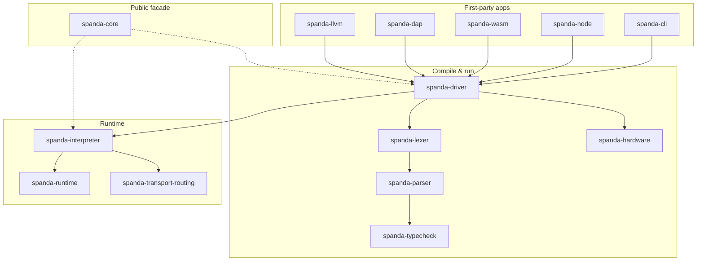

# Lean-Core Architecture

Spanda uses a **lean-core, package-first** architecture. The language kernel defines contracts, safety, verification interfaces, and runtime hooks. Domain integrations — ROS2, MQTT, GPS, SLAM, vision, fleet, OTA, cloud — ship as **optional official packages** under `packages/registry/`.

Lean-core extraction is **complete through Phase 17** (see [lean-core-roadmap.md](./lean-core-roadmap.md)).

---

## Principles

| Principle | Meaning |
|-----------|---------|
| **Core = contracts** | Types, safety gate, scheduler interfaces, provider traits, default simulator |
| **Workspace crates = implementations** | Parser, interpreter, transport adapters, hardware verify, fleet/OTA |
| **Facade = stability** | `spanda-core` re-exports the public API for external embedders |
| **Apps = direct deps** | CLI, Node, WASM, DAP, LLVM import workspace crates, not the full facade |
| **Packages = optional domain** | Vendor protocols and drivers via `spanda.toml` + provider traits |
| **No feature loss** | Remaining shims are thin `pub use` until callers migrate |

---

## Crate layers (summary)

Full crate index: [crates/README.md](../crates/README.md).

---

## What lives where

### Language front-end

| Concern | Crate |
|---------|-------|
| AST | `spanda-ast` |
| Lexer | `spanda-lexer` |
| Parser | `spanda-parser` |
| Type checker | `spanda-typecheck` |
| Diagnostics | `spanda-error` |
| SIR | `spanda-sir` |

### Compile, verify, run

| Concern | Crate |
|---------|-------|
| `compile`, `check`, `run` | `spanda-driver` |
| Hardware verify | `spanda-hardware` |
| Certification | `spanda-certify` |
| Interpreter | `spanda-interpreter` |
| `RuntimeHost` wiring | `spanda-runtime-host` |

### Runtime domains (extracted)

| Concern | Crate |
|---------|-------|
| Comm bus | `spanda-comm` |
| Safety monitor | `spanda-safety` |
| HAL / SoC | `spanda-hal` |
| Concurrency | `spanda-concurrency` |
| Debugger | `spanda-debug` |
| AI registry | `spanda-ai` |
| Replay / telemetry / triggers | `spanda-runtime` |

### Transport & connectivity

| Concern | Crate |
|---------|-------|
| Adapter traits + wire | `spanda-transport` |
| `RoutingCommBus` + live hooks | `spanda-transport-routing` |
| ROS2 / MQTT / DDS / WebSocket | `spanda-transport-{ros2,mqtt,dds,websocket}` |
| GPS / nav bridges | `spanda-connectivity`, `spanda-connectivity-runtime` |

### Fleet, OTA, deploy

| Concern | Crate |
|---------|-------|
| Fleet orchestration | `spanda-fleet` |
| OTA rollout | `spanda-ota` |
| Deploy agent HTTP | `spanda-deploy-http` |

### Tooling

| Concern | Crate |
|---------|-------|
| `fmt` | `spanda-format` |
| `lint` | `spanda-lint` |
| Codegen metadata | `spanda-codegen` |
| `doc` / reference | `spanda-docs` |
| Project modules | `spanda-modules` |

### Package ecosystem

| Concern | Crate |
|---------|-------|
| `spanda.toml` / registry | `spanda-package` |
| Provider bootstrap | `spanda-providers` |
| Security / audit | `spanda-security`, `spanda-audit` |

---

## `spanda-core` today

`spanda-core` is a **facade**, not a monolith:

- Re-exports `spanda_driver::{check, run, compile, …}`
- Thin shims for deploy, fleet, connectivity adapters, `transport`, `transport_rclrs`
- `providers.rs` facade → `spanda-providers` + classification
- **Removed (Phase 17):** `transport_live`, `transport_mqtt`, `transport_dds`, `transport_websocket`

External code may keep using `spanda_core::`. In-repo and new integrations should prefer the owning crate (see [migration.md](./migration.md)).

---

## Official packages

Twenty first-party packages under `packages/registry/` (GPS, Wi-Fi, ROS2, MQTT, fleet, OTA, …). Each declares capabilities in `spanda.toml` and registers providers when installed.

Catalog: [official-packages.md](./official-packages.md)  
Traits: [provider-interfaces.md](./provider-interfaces.md)

---

## Module classification

Core modules are tagged in `spanda_runtime::classification` (mirrored in TypeScript `src/providers/index.ts`):

| Ownership | Description |
|-----------|-------------|
| `Core` | Language and platform kernel |
| `StandardLibrary` | `std.*` without vendor code |
| `OfficialPackage` | `packages/registry/*` |
| `CompatibilityShim` | Legacy `spanda_core` module with target package |
| `Deprecated` | Removed from core; use workspace crate |

---

## Related docs

- [lean-core-roadmap.md](./lean-core-roadmap.md) — phases 1–17
- [architecture.md](./architecture.md) — pipeline diagrams
- [migration.md](./migration.md#lean-core-package-first-refactor) — import path changes
- [packages.md](./packages.md) — package manager
- [crates/README.md](../crates/README.md) — workspace crate index
