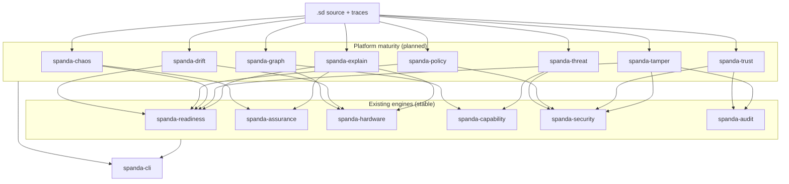
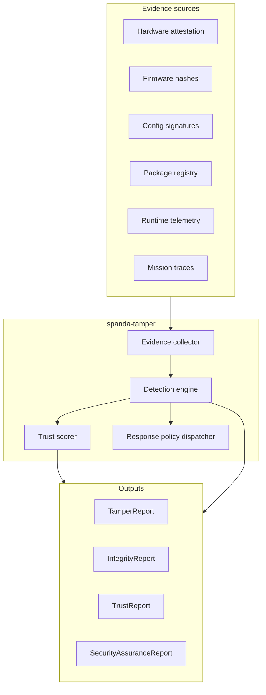

# Platform Maturity Roadmap

Strategic expansion plan for Spanda as a **Safety, Verification, Readiness, Assurance, and Operations Platform** for autonomous systems. This document does not add unrelated features — it strengthens adoption, trust, operations, explanation, deployment, and maintenance on top of the existing language and engines.

**Principle:** Every item must strengthen at least one lifecycle phase: **Build · Verify · Simulate · Deploy · Operate · Recover**.

**Related:** [roadmap.md](./roadmap.md) · [differentiation-roadmap.md](./differentiation-roadmap.md) · [product-strategy.md](./product-strategy.md) · [feature-status.md](./feature-status.md) · [platform-overview.md](./platform-overview.md)

**Last updated:** 2026-06-24

---

## 1. Roadmap classification

Each area is classified by lifecycle phase, maturity tier, and primary outcome.

| # | Area | Phase(s) | Tier | Outcome | New crate (proposed) |
|---|------|----------|------|---------|----------------------|
| 1 | AI-assisted development (`generate`, `explain`, `suggest`) | Build, Operate | Experimental (mock-first) | Faster authoring; explain failures | `spanda-generate` |
| 2 | Dependency graph visualization | Build, Operate | Experimental | System understandability | `spanda-graph` |
| 3 | Threat modeling | Verify, Deploy | Planned | Pre-deploy security awareness | `spanda-threat` |
| 4 | Configuration drift detection | Deploy, Operate | Experimental | Expected vs actual parity | `spanda-config::drift` |
| 5 | Policy engine | Verify, Operate | Planned | Declarative operational rules | `spanda-policy` — **Experimental** (verify-time) |
| 6 | Compliance profiles | Verify, Deploy | Future | Industry-specific gates | `spanda-compliance` — **Experimental** |
| 7 | Explainability reports | Operate, Recover | Future | Decision transparency | `spanda-explain` |
| 8 | Chaos engineering | Simulate, Recover | Planned | Resilience validation | `spanda-chaos` — **Experimental** |
| 9 | Mission resource estimation | Simulate, Deploy | Planned | Pre-flight cost awareness | `spanda-estimate` — **Experimental** |
| 10 | Readiness trend analysis | Operate | Planned | Predictive degradation | extends `spanda-readiness` — **Experimental** |
| 11 | Package trust framework | Verify, Build | Planned | Ecosystem trust | `spanda-trust` |
| 12 | Architecture decision records | Build | Planned | Design rationale capture | `spanda-adr` — **Experimental** |
| 13 | Mission differencing | Build, Verify | Planned | Change-impact analysis | `spanda-diff` |
| 14 | Deployment gates | Deploy | Experimental | Unsafe deploy prevention | extends `spanda-readiness` |
| 15 | Autonomous systems scorecard | Operate | Planned | Executive visibility | `spanda-score` |
| 16 | Hack / tamper detection | Verify, Operate, Recover | Experimental (verify-time) | Runtime trust & integrity | `spanda-tamper` |

### Tier definitions

| Tier | Meaning |
|------|---------|
| **Planned** | Design spec + CLI contract agreed; implementation scheduled |
| **Future** | Depends on Planned foundations; larger scope or external AI integration |
| **Stable** | Shipped, CI-backed (none of the 16 areas yet — builds on existing stable engines) |

### Existing foundations (do not rebuild)

| Capability | Current home | Reuse for maturity roadmap |
|------------|--------------|----------------------------|
| Readiness scoring | `spanda-readiness` | Gates, scorecard, trends, drift severity |
| Mission assurance | `spanda-assurance` | Explain, chaos recovery validation |
| Diagnosis | `spanda-assurance` + `spanda-readiness` | `explain`, tamper diagnosis |
| Hardware verify | `spanda-hardware` | Drift, estimation, gates |
| Capability traceability | `spanda-capability` | Graph, diff, compliance |
| Security / audit | `spanda-security`, `spanda-audit` | Threat model, tamper, package trust |
| Twin drift | `spanda-readiness::twin` | Configuration drift v1 |
| Fault injection | `simulate_compatibility`, `sim --inject-failure` | Chaos engineering v1 |
| Deploy OTA gates | `deploy rollout --require-certify` | Deployment gates v1 |

---

## 2. Architecture impact analysis

### Lean-core principle

New capabilities follow the established pattern: **contracts in focused crates**, **CLI in `spanda-cli`**, **optional package backends** for vendor-specific integrations (secure boot, HSM, cloud attestation).



### Impact by subsystem

| Subsystem | Impact | Regression risk | Mitigation |
|-----------|--------|-----------------|------------|
| Parser / AST | Policy syntax (Area 5); tamper policy blocks (Area 16) | Medium | Opt-in keywords; `#[experimental]` gate in docs |
| Type checker | Policy rule types | Low | New decl kinds; no change to SafeAction gate |
| `spanda-readiness` | Gates, trends, scorecard composition | Medium | Additive APIs; existing `evaluate_readiness` unchanged |
| `spanda-verify` | Policy + compliance profile hooks | Low | New flags; default behavior identical |
| `spanda-cli` | New subcommands | Low | Separate modules; smoke tests per command |
| Runtime | Tamper monitors, chaos injectors | High | Feature flags; off by default until v1.0 |
| Packages | Trust scoring, secure boot adapters | Low | Package-only backends |

### No-regression contract

1. All existing CLI commands, flags, and JSON schemas remain valid.
2. Default `spanda check`, `verify`, `readiness`, `sim`, `replay` behavior unchanged.
3. New commands are additive (`spanda graph`, `spanda drift`, …).
4. CI golden paths (`killer_demo`, `self_healing_smoke`, `cargo test --workspace`) must pass after each phase.

---

## 3. Dependency mapping

### Cross-engine integration matrix

| Roadmap area | Readiness | Assurance | Diagnosis | Health | Cap Verify | HW Verify | Trace | Sim | Replay | Audit | Providers | Packages |
|--------------|-----------|-----------|-----------|--------|------------|-----------|-------|-----|--------|-------|-----------|----------|
| 1 AI assist | ✓ explain failures | ✓ | ✓ | ✓ | ✓ | ✓ | | | ✓ | | | ✓ |
| 2 Graph | ✓ | ✓ | | ✓ | ✓ | ✓ | ✓ | | | | ✓ | ✓ |
| 3 Threat model | ✓ | | | ✓ | ✓ | | | | | ✓ | ✓ | ✓ |
| 4 Drift | ✓ | | ✓ | ✓ | ✓ | ✓ | ✓ | ✓ | | ✓ | ✓ | ✓ |
| 5 Policy | ✓ | ✓ | | ✓ | ✓ | ✓ | ✓ | ✓ | | ✓ | | |
| 6 Compliance | ✓ | ✓ | | ✓ | ✓ | ✓ | ✓ | | | ✓ | | ✓ |
| 7 Explainability | ✓ | ✓ | ✓ | ✓ | | | ✓ | | ✓ | ✓ | | |
| 8 Chaos | ✓ | ✓ | ✓ | ✓ | ✓ | ✓ | | ✓ | ✓ | ✓ | ✓ | ✓ |
| 9 Estimate | ✓ | | | | ✓ | ✓ | | ✓ | | | ✓ | ✓ |
| 10 Trends | ✓ | ✓ | ✓ | ✓ | | | ✓ | | ✓ | ✓ | | |
| 11 Package trust | ✓ | | | | ✓ | | ✓ | | | ✓ | ✓ | ✓ |
| 12 ADR | | ✓ | | | ✓ | ✓ | ✓ | | | ✓ | ✓ | ✓ |
| 13 Mission diff | ✓ | ✓ | | ✓ | ✓ | ✓ | ✓ | ✓ | | | ✓ | ✓ |
| 14 Deploy gates | ✓ | ✓ | | ✓ | ✓ | ✓ | ✓ | | | ✓ | | |
| 15 Scorecard | ✓ | ✓ | | ✓ | ✓ | ✓ | ✓ | ✓ | ✓ | ✓ | ✓ | ✓ |
| 16 Tamper | ✓ | ✓ | ✓ | ✓ | ✓ | ✓ | ✓ | ✓ | ✓ | ✓ | ✓ | ✓ |

### Internal crate dependency graph (planned)

```
spanda-graph       → spanda-ast, spanda-capability, spanda-hardware, spanda-package
spanda-threat      → spanda-ast, spanda-security, spanda-capability
spanda-drift       → spanda-readiness, spanda-hardware, spanda-package
spanda-policy      → spanda-ast, spanda-readiness, spanda-security
spanda-compliance  → spanda-policy, spanda-readiness, spanda-capability
spanda-chaos       → spanda-assurance, spanda-readiness, spanda-interpreter (inject)
spanda-estimate    → spanda-hardware, spanda-capability, spanda-readiness
spanda-trust       → spanda-package, spanda-security, spanda-audit
spanda-tamper      → spanda-security, spanda-audit, spanda-readiness, spanda-assurance
spanda-explain     → spanda-assurance, spanda-readiness, spanda-hardware
spanda-score       → spanda-readiness, spanda-assurance, spanda-threat, spanda-trust
spanda-diff        → spanda-ast, spanda-capability, spanda-readiness
spanda-adr         → spanda-ast, spanda-capability, spanda-audit
```

---

## 4. Recommended priorities

Ordered by **adoption impact × trust impact ÷ implementation risk**.

### P0 — Ship with v0.5 beta extension (Q3–Q4 2026)

| Priority | Area | Rationale |
|----------|------|-----------|
| P0.1 | **Dependency graph** (`spanda graph`) | Immediate understandability; pure static analysis; no runtime risk |
| P0.2 | **Deployment gates** | Extends readiness + certify; blocks unsafe deploy — core trust story |
| P0.3 | **`spanda explain`** (static) | Unifies verify/readiness/safety failures; highest DX ROI |
| P0.4 | **Package trust** (static scoring) | Registry already has 38 packages; leverages audit + signatures |

### P1 — v0.6 operational excellence (Q1 2027)

| Priority | Area | Rationale |
|----------|------|-----------|
| P1.1 | **Configuration drift** | Twin readiness exists; extends to fleet/agent actuals |
| P1.2 | **Threat modeling** (static) | Complements `spanda security check`; pre-deploy checklist |
| P1.3 | **Mission diff** | Change-impact for CI and review workflows |
| P1.4 | **Scorecard** | Executive rollup of existing engines |
| P1.5 | **Policy engine** (verify-time) | Declarative ops rules without runtime enforcement yet |

### P2 — v0.7 resilience & compliance (Q2 2027)

| Priority | Area | Rationale |
|----------|------|-----------|
| P2.1 | **Chaos engineering** | Builds on `sim --inject-failure` + assurance recovery |
| P2.2 | **Readiness trends** | Requires history store (`.spanda/readiness-history.json`) |
| P2.3 | **Resource estimation** | Pre-mission planning; uses verify budgets |
| P2.4 | **Compliance profiles** | Depends on policy engine + verify hooks |
| P2.5 | **ADR generation** | Documentation artifact; low risk |

### P3 — v1.0 trust & assurance (2027)

| Priority | Area | Rationale |
|----------|------|-----------|
| P3.1 | **Tamper / integrity framework** | Verify-time `spanda tamper-check` and `spanda integrity` with `--baseline` and `--agent` |
| P3.2 | **Explainability reports** (trace decisions) | `spanda explain decision <trace>` shipped; richer replay v3 traces planned |
| P3.3 | **AI generate / suggest** | Mock-first templates with parse+typecheck gate; `spanda generate`, `spanda suggest` |
| P3.4 | **Runtime policy enforcement** | `spanda run|sim --enforce-policy` for max_speed and operation_hours |
| P3.5 | **Spoofing detection** (GPS/sensor) | Package-backed; hardware-specific |

---

## 5. Documentation plan

### Master and index

| Document | Action | Phase |
|----------|--------|-------|
| [platform-maturity-roadmap.md](./platform-maturity-roadmap.md) | Created (this file) | Now |
| [roadmap.md](./roadmap.md) | Add Platform Maturity section | Now |
| [product-strategy.md](./product-strategy.md) | Add maturity focus paragraph | Now |
| [feature-status.md](./feature-status.md) | Add Planned matrix rows | Per phase ship |

### Topic design specs (planned features)

| Document | Area |
|----------|------|
| [dependency-graphs.md](./dependency-graphs.md) | 2 |
| [threat-modeling.md](./threat-modeling.md) | 3 |
| [drift-detection.md](./drift-detection.md) | 4 |
| [policy-engine.md](./policy-engine.md) | 5 |
| [compliance-profiles.md](./compliance-profiles.md) | 6 |
| [explainability.md](./explainability.md) | 1, 7 |
| [chaos-engineering.md](./chaos-engineering.md) | 8 |
| [resource-estimation.md](./resource-estimation.md) | 9 |
| [readiness-trends.md](./readiness-trends.md) | 10 |
| [package-trust.md](./package-trust.md) | 11 |
| [deployment-gates.md](./deployment-gates.md) | 14 |
| [scorecards.md](./scorecards.md) | 15 |
| [tamper-detection.md](./tamper-detection.md) | 16 |
| [integrity-verification.md](./integrity-verification.md) | 16 |
| [trust-framework.md](./trust-framework.md) | 11, 16 |
| [spoofing-detection.md](./spoofing-detection.md) | 16 |
| [security-assurance.md](./security-assurance.md) | 3, 16 |

### Per-phase doc updates

When each area ships: update `CHANGELOG.md`, `feature-status.md`, `getting-started.md` (if CLI demo-worthy), and `docs/README.md` index.

---

## 6. Risk analysis

| Risk | Severity | Likelihood | Mitigation |
|------|----------|------------|------------|
| Scope creep — 16 areas at once | High | High | Strict phasing; P0 only in next release |
| Runtime tamper false positives | High | Medium | Default off; confidence scores; human approval policies |
| AI generate produces unsafe code | High | Medium | `check` + `verify` mandatory gate; no auto-deploy; suggest-only mode |
| CLI surface explosion | Medium | High | Group under `spanda ops` namespace in v0.6 if needed |
| Duplicate logic vs readiness | Medium | Medium | Compose, don't fork — scorecard calls `evaluate_readiness` |
| Compliance profile liability | Medium | Low | Mark as templates, not certifications |
| Package trust gaming | Medium | Medium | Transparent scoring formula; community appeals process |
| Performance on large fleets | Medium | Medium | `--json` streaming; incremental graph/diff |
| Breaking JSON schemas | High | Low | Version fields on all new report types |
| Docs ahead of code | Low | High | All new docs marked **Planned** until CI smoke exists |

---

## 7. Phased implementation plan

### Phase A — Understand & trust (v0.5+, Q3–Q4 2026)

**Theme:** Easier to explain and trust before deploy.

| Deliverable | CLI | Crate | Tests |
|-------------|-----|-------|-------|
| Dependency graph | `spanda graph <file> [--format json\|mermaid\|dot]` | `spanda-graph` | Golden graph outputs |
| Static explain | `spanda explain <file> [--config] [--baseline]`, subcommands `readiness\|verify\|safety` | `spanda-explain` | Fixture-based explanations |
| Package trust | `spanda trust <name> [--version]` | `spanda-package::trust` | Registry fixture scoring |
| Deployment gates | `spanda deploy gate <file>`, `--gate` on rollout | extends readiness | Gate pass/fail CI |

**Exit criteria:** `spanda demo maturity` + `scripts/maturity_smoke.sh` (wired into `scripts/showcase_smoke.sh`).

### Phase B — Operate & compare (v0.6, Q1 2027)

**Theme:** Easier to operate and detect mismatch.

| Deliverable | CLI | Crate |
|-------------|-----|-------|
| Drift detection | `spanda drift <file> [--agent <id>]` | `spanda-drift` |
| Threat model | `spanda threat-model <file>` | `spanda-threat` | Security fixture scoring |
| Mission diff | `spanda diff <a.sd> <b.sd>` | `spanda-diff` | Showcase rover pair |
| Scorecard | `spanda score <file>` | `spanda-score` | Readiness rover fixture |
| Policy (verify) | `policy { }` syntax + `spanda verify --policy` | `spanda-policy` |

**Exit criteria:** CI drift check on twin; scorecard JSON in Operations dashboard.

### Phase C — Resilience & planning (v0.7, Q2 2027)

| Deliverable | CLI |
|-------------|-----|
| Chaos | `spanda chaos <file> --inject <kind>` |
| Readiness trends | `spanda readiness trends`, history file |
| Resource estimate | `spanda estimate <mission.sd>` |
| Compliance profiles | `spanda verify --profile warehouse\|medical\|…` |
| ADR | `spanda adr <file>` |

### Phase D — Full trust platform (v1.0, 2027)

| Deliverable | CLI |
|-------------|-----|
| Tamper framework | `spanda tamper-check` (verify-time); `spanda integrity` (verify-time); runtime tamper (planned) |
| Explainability | `spanda explain decision <trace>` |
| AI assist | `spanda generate`, `spanda suggest` (mock-first, guardrailed) |
| Showcase demos | `examples/showcase/gps_spoofing/`, `package_tampering/`, … |

---

## Area 16 — Hack / tamper detection (deep dive)

### Tamper architecture



**Core types:** `TamperEvent`, `TamperAlert`, `TamperEvidence`, `TamperSeverity`, `TamperPolicy`, `TamperDetectionResult`, `TamperStatus` (Trusted · Suspicious · Tampered · Compromised · Unknown).

### Trust model

| Layer | What is trusted | Verification |
|-------|-----------------|--------------|
| Source | `.sd` at commit/approval time | Hash + optional signature in audit |
| Build | Packages, providers | `spanda package trust` |
| Deploy | Bundle on agent | Existing `--require-signature`, `--require-hash` |
| Runtime | Live behavior vs approved model | Tamper monitors + trace replay |
| Fleet | Peer identity | `trust_boundary`, signed comm |

**Composite `TrustScore` (0–100):** weighted blend of package trust, device integrity, firmware integrity, configuration integrity, identity validation, safety integrity.

### Detection strategies

| Threat | Strategy | Phase |
|--------|----------|-------|
| Config / mission tampering | Hash compare vs audit baseline | B |
| Package tampering | Signature + registry trust score | A |
| Firmware modification | Declared hash vs agent report | D |
| GPS / sensor spoofing | IMU cross-check, plausibility bounds | D (package) |
| Replay attacks | Nonce + timestamp on signed comm | Exists (`simulate_compatibility`) |
| Runtime injection | Capability usage monitor vs grants | D |
| Safety rule modification | AST hash at certify time | B |

### Response policies

Declarative `tamper_policy` blocks (Area 16) integrate with existing `recovery_policy`:

```spanda
tamper_policy CriticalResponse {
    on tamper severity Critical {
        enter SafeMode;
        stop_all_actuators();
        audit.record("critical_tamper_detected");
    }
}
```

**Actions:** Alert · Audit · Degraded Mode · Safe Mode · Kill Switch · Human Approval · Mission Pause · Mission Abort.

### Reports

| Report | CLI | Formats |
|--------|-----|---------|
| Tamper Report | `spanda tamper-check <file>` | JSON, Markdown, HTML |
| Integrity Report | `spanda integrity <file>` | JSON, Markdown, HTML |
| Trust Report | `spanda trust <file>` | JSON, Markdown, HTML |
| Security Assurance | `spanda security assurance <file>` | JSON, Markdown, HTML |

**Diagnosis:** `spanda diagnose tamper.trace` → tamper source, affected components, impact, recovery recommendations (extends `spanda-assurance::diagnosis`).

### Demos (planned)

| Example | Demonstrates |
|---------|--------------|
| `examples/showcase/gps_spoofing/` | GPS vs IMU conflict, spoofing alert |
| `examples/showcase/package_tampering/` | Modified package hash detection |
| `examples/showcase/mission_tampering/` | Mission hash drift since approval |
| `examples/showcase/runtime_intrusion/` | Unexpected capability usage |

### Remaining gaps (honest)

| Gap | Notes |
|-----|-------|
| Hardware secure boot | Requires vendor packages (TPM, Jetson, Pi secure boot) |
| Real-time spoofing ML | Out of scope for core; package backends only |
| Fleet-wide tamper correlation | Needs mesh coordinator extensions |
| Legal/compliance certification | Profiles are templates, not accredited standards |
| Zero false-positive guarantee | Confidence scores + human approval for Critical |

---

## Success criteria

Spanda evolves from *Autonomous Systems Language* to **Safety, Verification, Readiness, Assurance, and Operations Platform** while preserving `.sd` as the foundation.

| Question | Answered by (target) |
|----------|----------------------|
| Can I understand this system? | `spanda graph`, `spanda explain`, ADR |
| Can I trust it? | Gates, trust score, package trust, tamper check |
| Is it safe to deploy? | Deployment gates, drift, threat model |
| Will it survive failures? | Chaos, recovery, readiness trends |
| What changed? | Mission diff, drift report |
| What should executives see? | Scorecard |
| Has anything been compromised? | Tamper framework (v1.0) |

---

## Related documents

- [tamper-detection.md](./tamper-detection.md) · [integrity-verification.md](./integrity-verification.md) · [trust-framework.md](./trust-framework.md)
- [deployment-gates.md](./deployment-gates.md) · [dependency-graphs.md](./dependency-graphs.md) · [package-trust.md](./package-trust.md)
- [security-architecture.md](./security-architecture.md) · [trust-boundaries.md](./trust-boundaries.md) · [readiness.md](./readiness.md)
