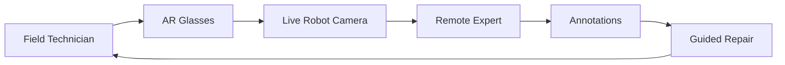

# Remote Expert

Remote expert workflows connect **field technicians** with **off-site specialists** through AR glasses, live robot cameras, annotations, and Spanda's diagnosis, assurance, replay, and audit spine.

**Related:** [ar-vr-xr.md](./ar-vr-xr.md) · [spatial-computing.md](./spatial-computing.md) · [hri.md](./hri.md)

---

## Workflow



### Steps

1. **Field technician** passes operator readiness (`maintenance_technician`, `remote_expert` session).
2. **AR glasses** register spatial session (`spanda-hololens` or industrial AR package).
3. **Live robot camera** streams via existing vision provider (`spanda-opencv`, body cam, robot-mounted camera).
4. **Remote expert** joins via Control Center **Live Collaboration** panel.
5. **Annotations** (arrows, text, 3D anchors) publish through spatial session provider.
6. **Guided repair** steps tracked in mission log + decision audit trail.

---

## Platform integration

| Capability | Use in remote expert |
|------------|---------------------|
| **Replay** | Record session for training and compliance |
| **Diagnosis** | `spanda diagnose` on fault traces during session |
| **Assurance** | Anomaly hints overlay on AR view |
| **Mission logs** | Step-by-step repair mission trace |
| **Audit** | Expert annotations and approvals logged |
| **Trust** | Expert `remote_expert` capability + cert verification |

```bash
spanda replay maint-session.trace --playback
spanda diagnose repair_mission.sd maint-session.trace
spanda explain maint-session.trace
```

---

## Session configuration

```toml
[[spatial_sessions]]
id = "repair-session-001"
type = "remote_expert"
field_human_id = "tech-001"
expert_human_id = "expert-002"
robot_id = "arm-001"
ar_device_id = "hololens-001"
camera_device_id = "wrist-cam-001"
capabilities = ["live_video", "spatial_anchors", "annotation", "replay_record"]
```

---

## Roles & capabilities

| Role | Required capabilities |
|------|----------------------|
| Field technician | `maintenance_technician` |
| Remote expert | `remote_expert` |
| Supervisor (optional) | `approve_recovery` for part swap / reset steps |

---

## Control Center

- **Live Collaboration** — participant list, video tiles, annotation feed
- **AR Session Viewer** — anchor list, expert cursor position
- **Replay viewer** — post-session playback link

Planned REST endpoints:

| Endpoint | Description |
|----------|-------------|
| `GET /v1/hri/sessions` | Active remote expert sessions |
| `POST /v1/hri/sessions` | Start session |
| `POST /v1/hri/sessions/{id}/annotate` | Publish annotation |
| `GET /v1/hri/sessions/{id}/replay` | Replay artifact URL |

---

## Example

`examples/solutions/spatial-computing/remote-maintenance/` — guided repair with mock AR session and replay capture.

---

## Applications

| Industry | Typical scenario |
|----------|------------------|
| Field service | Industrial robot arm repair |
| Utilities | Substation inspection with expert overlay |
| Manufacturing | Line changeover with remote OEM support |
| Healthcare | Surgical robot assist (regulated deployments) |
| Defense | Field equipment maintenance |
