# Spanda Roadmap

Version plan organized by **platform area**. Tiers: **Stable** (CI-backed, documented), **Experimental** (usable with caveats), **Future** (planned, not shipped).

Current release line: **v0.4.0** (tagged 2026-06-22). **Next:** v0.5 beta (Q4 2026).

**Last audited:** 2026-06-26 — [roadmap-codebase-audit-2026-06.md](./roadmap-codebase-audit-2026-06.md)

Platform overview: [platform-overview.md](./platform-overview.md) · Feature truth table: [feature-status.md](./feature-status.md)

---

## Complete Autonomous Systems Platform

Spanda is a **complete Autonomous Systems Platform** with a safety-first language at its core. Existing pillars (unchanged — see sections below) already cover:

| Pillar | Role |
|--------|------|
| Language | Safety-typed `.sd` source, robot primitives, units |
| Runtime | Interpreter, scheduler, HAL, provider dispatch |
| Compiler | Parse, typecheck, optional LLVM codegen |
| Package Ecosystem | Registry, install, publish, provider packages |
| Provider Registry | Trait dispatch, official adapters |
| Hardware Verification | `spanda verify`, deploy profiles |
| Capability Verification | Traceability matrices, minimum-hardware |
| Safety Validation | `ActionProposal` → `SafeAction`, zones, kill switch |
| Readiness | Operational go/no-go scoring |
| Assurance | Knowledge models, anomaly, prognostics |
| Diagnosis | Root-cause analysis, tamper diagnosis |
| Recovery | Self-healing planner, fleet mesh relay |
| Trust | Composite program trust, secure-boot attestation |
| Mission Continuity | Takeover, delegation, checkpoints |
| Delegation / Takeover | Continuity framework, succession |
| Mission Contracts | Static contract verification |
| Explainability | `spanda explain`, decision traces |
| Simulation | `spanda sim`, twins, fault injection |
| Replay | Mission trace record and playback |
| Health | `health_check`, fleet policies |
| Digital Twin | Mirror fields, replay buffer |
| Device Tree | Logical ↔ physical mapping |
| Cascading Configuration | `spanda.toml` layers, `ConfigResolver` |
| Security | Capabilities, signed messages, RBAC hooks |
| Encryption | AES-GCM wire frames, TLS sessions |
| Tamper Detection | Verify-time and runtime tamper checks |

**Enterprise operations** (20 pillars below) closes the gap for production deployments in enterprise, industrial, robotics, medical, warehouse, agricultural, research, and defense — without redesigning the architecture above. Every enterprise pillar **composes** Readiness, Assurance, Diagnosis, Recovery, Trust, Health, Device Registry, Configuration, Traceability, Audit, Security, and Packages.

**Success criteria:** Spanda must cover **Build · Verify · Simulate · Deploy · Operate · Observe · Recover · Govern · Audit · Continuously Improve** while preserving lean-core identity (contracts in workspace crates; vendor SDKs and heavy UI in optional packages).

Full enterprise analysis: [enterprise-operations-roadmap.md](./enterprise-operations-roadmap.md)

---

## Platform areas at a glance

| Area | Current focus (v0.4) | Next (v0.5+) |
|------|----------------------|--------------|
| [Language](#language) | Stable core; typed handler I/O | Generics polish; self-hosting subset (future) |
| [Runtime](#runtime) | Interpreter LTS; certify gate | Native codegen golden paths (experimental) |
| [Verification](#verification) | `spanda verify`, capability matrices | 5+ production hardware profiles (v1.0) |
| [Safety](#safety) | ActionProposal → SafeAction stable | Safety Coverage CLI; stricter certify workflows |
| [Simulation](#simulation) | `spanda sim`, twins, replay, telemetry store | OTLP/fleet aggregation polish; Gazebo/Webots scaffolds |
| [Health](#health) | health_check, readiness engine | Swarm quorum hardening |
| [Fleet](#fleet) | In-process + HTTP agents + mesh telemetry | Distributed orchestration polish |
| [Packages](#packages) | 38 official registry packages, publish mirror | Curated remote registry growth |
| [Tooling](#tooling) | CLI, 9 bundled demos, CI golden paths | VS Code Marketplace (blocked on `VSCE_PAT`) |
| [Mission assurance](#mission-assurance) | Static analysis + learned anomaly (experimental) | Package-backed ML anomaly backends |
| [Mission continuity](#mission-continuity) | Runtime takeover, checkpoints, fleet mesh (**Stable**) | Field validation; swarm quorum hardening |
| [Self-healing](#self-healing--recovery) | Recovery planner + CLI + runtime dispatch (**Stable**) | Recovery coverage hardening |
| [Platform maturity](#platform-maturity) | 16 areas shipped **Experimental** (graph, explain, gates, trust, policy, drift, …) | Stable hardening for Phase A–D deliverables |
| [Differentiation](#differentiation--signature-capabilities) | NOW items shipped **Experimental** (contracts, explain, audit, coverage) | Stable hardening; NEXT signature capabilities |
| Enterprise operations | E1–E4 **Experimental** (Control Center, device pool, provisioning, APIs, smoke) | **Stable promotion:** operational gates (soak, audit, releases) — code checklist **shipped** |
| Official Solution Blueprints | ADAS & Autonomous Driving **Experimental** | Spatial Computing & HRI blueprint; warehouse ops, medical devices |
| Human Interaction & Spatial Computing | — | Human entity model, wearables, AR/VR/XR, collaborative missions (**Planned** H1–H4) |

---

## Platform maturity

**Adoption, trust, and operations** — not new unrelated features. Every item strengthens **Build · Verify · Simulate · Deploy · Operate · Recover**.

Full analysis: [platform-maturity-roadmap.md](./platform-maturity-roadmap.md)

| # | Area | Phase | Priority | Status |
|---|------|-------|----------|--------|
| 1 | AI-assisted development (`generate`, `explain`, `suggest`) | Build, Operate | P0.3 / P3.3 | **Experimental** |
| 2 | Dependency graph visualization | Build, Operate | P0.1 | **Experimental** |
| 3 | Threat modeling | Verify, Deploy | P1.2 | **Experimental** |
| 4 | Configuration drift detection | Deploy, Operate | P1.1 | **Experimental** |
| 5 | Policy engine | Verify, Operate | P1.5 | **Experimental** |
| 6 | Compliance profiles | Verify, Deploy | P2.4 | **Experimental** |
| 7 | Explainability reports | Operate, Recover | P0.3 / P3.2 | **Experimental** |
| 8 | Chaos engineering | Simulate, Recover | P2.1 | **Experimental** |
| 9 | Mission resource estimation | Simulate, Deploy | P2.3 | **Experimental** |
| 10 | Readiness trend analysis | Operate | P2.2 | **Experimental** |
| 11 | Package trust framework | Verify, Build | P0.4 | **Experimental** |
| 12 | Architecture decision records | Build | P2.5 | **Experimental** |
| 13 | Mission differencing | Build, Verify | P1.3 | **Experimental** |
| 14 | Deployment gates | Deploy | P0.2 | **Experimental** |
| 15 | Autonomous systems scorecard | Operate | P1.4 | **Experimental** |
| 16 | Hack / tamper detection | Verify, Operate, Recover | P3.1 | **Experimental** (verify-time) |

### Phased delivery

| Phase | Release | Theme | Status |
|-------|---------|-------|--------|
| A | v0.5+ (Q3–Q4 2026) | Understand & trust | **Shipped (experimental)** — `spanda graph`, `explain`, package trust, deployment gates |
| B | v0.6 (Q1 2027) | Operate & compare | **Shipped (experimental)** — drift, threat model, mission diff, scorecard, policy verify + readiness |
| C | v0.7 (Q2 2027) | Resilience & planning | **Shipped (experimental)** — chaos, readiness trends, estimate, compliance, ADR |
| D | v1.0 (2027) | Full trust platform | **Shipped (experimental)** — tamper/integrity, decision explain, runtime policy, AI generate/suggest |

Topic guides: [dependency-graphs.md](./dependency-graphs.md) · [deployment-gates.md](./deployment-gates.md) · [tamper-detection.md](./tamper-detection.md) · [security-assurance.md](./security-assurance.md)

---

## Official Solution Blueprints

Industry reference architectures built entirely on existing platform capabilities — optional packages and blueprint programs, not core language extensions.

| Blueprint | Status | Path |
|-----------|--------|------|
| **ADAS & Autonomous Driving** | **Experimental** | [examples/solutions/adas/](../examples/solutions/adas/) · [solutions/adas.md](./solutions/adas.md) |
| Autonomous Rover (flagship) | **Stable** | [examples/showcase/autonomous_rover/](../examples/showcase/autonomous_rover/) |
| Compliance profiles | **Experimental** | [examples/showcase/compliance/](../examples/showcase/compliance/) |

**ADAS blueprint** (2026-06): lane keeping, adaptive cruise, AEB, sensor recovery, driver takeover, highway pilot; nine application device-tree variants; scenario fixtures + sim-recorded golden traces; seven automotive registry package stubs; ROS 2 automotive bridge; Grafana ADAS dashboard; stable promotion gate (`adas_stable_promotion_gate.sh`); automotive device tree; ISO 26262 readiness/assurance; Control Center ADAS tab; `spanda demo adas` (bundled); `./scripts/adas_smoke.sh` (CI).

**Planned:** warehouse operations blueprint, medical device blueprint; live radar/LiDAR/CAN vehicle I/O backends.

**Spatial Computing & Human-Robot Collaboration** (2026-06): human entity model, operator capabilities, wearables, AR/VR/XR reference packages, collaborative missions, remote expert, human readiness — composes Device Registry, Capability Framework, Readiness, Continuity, Trust, Digital Twin, and Control Center without core language extensions. Path: [examples/solutions/spatial-computing/](../examples/solutions/spatial-computing/) · [solutions/spatial-computing.md](./solutions/spatial-computing.md) · [human-interaction-spatial-computing-roadmap.md](./human-interaction-spatial-computing-roadmap.md)

Demo plan: [demo-plan-adas.md](./demo-plan-adas.md) · Website: [website/solutions.html](../website/solutions.html)

---

## Human Interaction & Spatial Computing

**Seamless collaboration between humans, wearables, AR/VR/XR devices, robots, and autonomous systems** — integrated through packages, providers, device registry, capability framework, readiness, and solution blueprints. No AR/VR engines or proprietary wearable SDKs in core.

Full analysis: [human-interaction-spatial-computing-roadmap.md](./human-interaction-spatial-computing-roadmap.md)

### Platform pillar

| # | Area | Priority | Status |
|---|------|----------|--------|
| 1 | Human entity model (roles, identity, certifications, trust) | NOW | **Experimental** |
| 2 | Operator capability framework | NOW | **Experimental** |
| 3 | Device tree: Human, Wearable, AR, VR nodes | NOW | **Experimental** |
| 4 | Human readiness (operator, team, mission) | NOW | **Experimental** |
| 5 | Wearable reference packages | NEXT | **Planned** |
| 6 | AR integrations (Vision Pro, HoloLens, ARKit, ARCore) | NEXT | **Planned** |
| 7 | VR training & mission replay | NEXT | **Planned** |
| 8 | XR overlays (robot, mission, sensor, readiness) | NEXT | **Planned** |
| 9 | HRI abstractions (voice, gesture, tracking, anchors) | NEXT | **Planned** |
| 10 | Collaborative missions & remote expert | LATER | **Planned** |
| 11 | Context awareness (geofencing, hazard zones) | LATER | **Planned** |
| 12 | Human digital twin & optional health | LATER | **Planned** |
| 13 | Control Center human dashboards | LATER | **Planned** |

### Phased delivery

| Phase | Release | Theme | Status |
|-------|---------|-------|--------|
| H1 | v0.6 (Q1 2027) | Human entity, operator capabilities, readiness profiles | **Experimental** |
| H2 | v0.7 (Q2 2027) | Wearables & AR reference packages | **Experimental** |
| H3 | v0.8 (Q3 2027) | HRI, collaboration, remote expert | **Experimental** |
| H4 | v1.0 (2027) | Control Center human UI, health opt-in, stable hardening | **Experimental** (promotion gate **shipped**) |
| H5 | v1.1 (2027) | Team readiness, collaboration graph, hazard zones / context | **Experimental** |
| H6 | v1.2 (2027) | Vendor live backends, human twins, mission approval queue, soak/audit ops | **Experimental** |

### Solution blueprint

| Blueprint | Status | Path |
|-----------|--------|------|
| **Spatial Computing & Human-Robot Collaboration** | **Experimental** | [examples/solutions/spatial-computing/](../examples/solutions/spatial-computing/) · [solutions/spatial-computing.md](./solutions/spatial-computing.md) |

Topic guides: [human-interaction.md](./human-interaction.md) · [wearables.md](./wearables.md) · [spatial-computing.md](./spatial-computing.md) · [ar-vr-xr.md](./ar-vr-xr.md) · [hri.md](./hri.md) · [human-readiness.md](./human-readiness.md) · [remote-expert.md](./remote-expert.md) · [operator-capabilities.md](./operator-capabilities.md) · [hri-packages.md](./hri-packages.md)

---

## Enterprise operations

**Production-ready operations for enterprise, industrial, robotics, medical, warehouse, agricultural, research, and defense deployments** — composes Readiness, Assurance, Diagnosis, Recovery, Trust, Health, Device Registry, Configuration, Traceability, Audit, Security, and Packages without duplicating them.

Full analysis: [enterprise-operations-roadmap.md](./enterprise-operations-roadmap.md)

### Platform pillars (20 areas)

| # | Pillar | Priority | Status |
|---|--------|----------|--------|
| 1 | Control Center (web UI) | NOW | **Experimental** — `spanda control-center serve` |
| 2 | Device Pool (central inventory) | NOW | **Experimental** — lifecycle, assign/trust/quarantine, failover chains, recovery integration |
| 3 | Device Discovery (package transports) | NOW | **Experimental** — subnet, host-backed mDNS/BLE/USB/CAN/MQTT/ROS2 + pool ingest |
| 4 | Provisioning (discover → ready workflow) | NOW | **Experimental** — `POST /v1/provision` |
| 5 | Configuration Management (versioned cascading TOML) | NOW | **Experimental** — resolve, diff, snapshots, approval queue + publish-on-approve |
| 6 | RBAC (roles + permissions) | NOW | **Experimental** — `SPANDA_API_KEY`, `/v1/rbac/matrix` |
| 7 | Secret Management (rotation, audit) | NOW | **Experimental** — `ManagedSecretVault` contract |
| 8 | Telemetry (time-series, trends) | NOW | **Experimental** — [telemetry-store.md](./telemetry-store.md) |
| 9 | Alerting (multi-channel) | NOW | **Experimental** — `spanda-ops`, webhook/email env |
| 10 | Configuration Drift (7 dimensions) | NEXT | **Experimental** — `detect_operational_drift_full` via REST and gRPC |
| 11 | OTA & Rollback (canary, blue/green) | NEXT | **Experimental** — rollout plan, rollback, canary/staged/blue_green dry-run |
| 12 | Package Trust (scoring) | NEXT | **Experimental** — `spanda trust`, `/v1/trust/package` |
| 13 | SDKs (Python, REST, gRPC, WebSocket) | NEXT | **Experimental** — Python SDK, REST v1, remote CLI, tonic gRPC (60 RPCs), WebSocket telemetry |
| 14 | Operator Workflows (approve, takeover, quarantine) | NEXT | **Experimental** — device trust API/CLI/UI, mission approve, quarantine |
| 15 | SRE (SLO, MTTR, incidents) | NEXT | **Experimental** — `/v1/sre/summary` + incident workflow API (`/v1/sre/incidents`) |
| 16 | Reporting (fleet, mission, compliance exports) | LATER | **Experimental** — markdown/PDF/JSON exports + **scheduled webhook delivery** (`/v1/reports/schedules`) |
| 17 | Compliance (evidence packs) | LATER | **Experimental** — export + **signed profile catalog** (`/v1/compliance/profiles`) |
| 18 | APIs (REST + gRPC CLI parity) | NEXT | **Experimental** — REST v1 + OpenAPI; tonic gRPC (60 RPCs); remote `spanda control-center` CLI |
| 19 | Observability (OTel, traces, correlation) | NEXT | **Experimental** — trace log, OTLP export, correlation IDs, `spanda-otel-collector` backend wiring |
| 20 | Digital Thread (requirement → retirement) | LATER | **Experimental** — lifecycle phases on query API + graph UI (`lifecycle_phase` filter) |

### Priority horizons

| Horizon | Timeline | Focus |
|---------|----------|--------|
| **NOW (shipped experimental)** | v0.5–v0.6 | Control Center, Device Pool, Provisioning, Discovery, Telemetry, Alerting, RBAC, Secrets — E1 gate: `enterprise_ops_smoke.sh` |
| **NEXT (shipped experimental)** | v0.6–v0.7 | SDKs, drift (partial), OTA plan, package trust API, observability OTLP/WS, operator workflows, SRE summary — E2–E3 gates |
| **LATER (shipped experimental)** | v0.8–v1.0 | Compliance export, executive scorecard, digital thread query, PDF reporting, Tauri desktop scaffold — E4 gate |
| **Stable hardening** | v0.5 beta → v1.0 | **Checklist shipped in code** — operational gates remain (field soak, audit sign-off, production releases) |

### Phased delivery

Phases E1–E4 are **shipped at experimental tier** (CI smoke + docs). The table below is the original delivery map; see **Remaining for Stable** for production hardening.

| Phase | Release | Theme | Status |
|-------|---------|-------|--------|
| E1 | v0.5+ (Q3–Q4 2026) | Control plane | **Shipped (experimental)** |
| E2 | v0.6 (Q1 2027) | Provision & observe | **Shipped (experimental)** |
| E3 | v0.7 (Q2 2027) | Deploy & integrate | **Shipped (experimental)** |
| E4 | v1.0 (2027) | Govern & trace | **Shipped (experimental)** |

| Phase | Key deliverables (experimental) |
|-------|--------------------------------|
| E1 | `spanda-api` REST v1, Control Center shell, Device Pool lifecycle, RBAC v1, secret store contract, alerting core |
| E2 | Provisioning workflow API, config snapshots, discovery API + pool ingest, Health/Assurance/Diagnosis summaries, device trust/assign/quarantine |
| E3 | Python SDK, JSON-RPC gateway, operational drift, OTA canary dry-run, package trust API, OTLP/WebSocket observability, operator + SRE APIs |
| E4 | Compliance export, digital thread query, executive scorecard, PDF reports, Tauri desktop scaffold |

### Remaining for Stable

See **[stable-hardening-enterprise-ops.md](./stable-hardening-enterprise-ops.md)** for the full per-pillar checklist. **All stable-hardening implementation items are shipped**; promotion to **Stable** tier requires operational gates only.

| Gate | Status |
|------|--------|
| Code + docs checklist | **Shipped** — OpenAPI parity, RBAC, HA persistence, OTA certify policy, signed compliance catalog, scheduled reports, discovery TLS, SLO burn monitor, PagerDuty sync, Grafana templates, desktop CI/signing scaffold |
| 30-day field soak | **Pending** — run `scripts/field_soak_gate.sh` after pilot start ([field-soak-gate.md](./field-soak-gate.md)) |
| Third-party security audit | **Pending** — prep shipped; external sign-off ([security-audit-third-party.md](./security-audit-third-party.md)) |
| Production releases | **Pending** — PyPI (`sdk-python-v*`), npm (`npm-web-v*`), desktop (`desktop-v*`) with registry/signing secrets |
| Tier promotion | **Pending** — update `feature-status.md` after gates pass |

| Area | Experimental today | Stable hardening (code) |
|------|-------------------|-------------------------|
| Discovery | Host-backed probes + registry packages + TLS policy | **Shipped** |
| Device Pool | Full lifecycle + HA persistence + multi-tenant | **Shipped** (1000-device perf gate) |
| APIs | REST v1 + 60 gRPC RPCs + remote CLI + OpenAPI parity | **Shipped** |
| Observability | OTLP + WebSocket + Grafana templates + HA guide | **Shipped** |
| Desktop | Tauri scaffold + CI + signing runbook + env-gated updater | **Shipped** (first release pending) |
| Drift / OTA | 7-dimension drift + scheduled scans; certify in production | **Shipped** |
| Digital Thread | Full lifecycle graph + query API | **Shipped** |
| Compliance / Reports | Signed catalog + scheduled delivery | **Shipped** |

**Exit criteria (E1):** `spanda control-center serve` + `scripts/enterprise_ops_smoke.sh` — **shipped**

**Exit criteria (E2):** End-to-end provision demo + alert on readiness failure — **shipped** (`scripts/enterprise_ops_smoke.sh`)

**Exit criteria (E3):** SDK integration test, canary deploy demo, correlation trace in observability API — **shipped** (`scripts/enterprise_ops_smoke.sh`, `packages/sdk-python`)

**Exit criteria (E4):** Compliance report export, digital thread query, executive PDF export, and Tauri desktop scaffold — **shipped** (`scripts/enterprise_ops_smoke.sh`, `scripts/control_center_desktop_smoke.sh`)

**UI stack:** React + TypeScript (`ControlCenterPanel` in `@spanda/web`, desktop shell `@spanda/control-center-desktop`); Rust backend (`spanda-api`); Tauri desktop scaffold (experimental).

**Lean-core:** Contracts in `spanda-api`, `spanda-config`, `spanda-security`, `spanda-ops`; vendor SDKs and alert channels in optional packages.

### Enterprise integration spine

Every enterprise pillar routes through the same platform spine — no duplicate engines:

```mermaid
flowchart TB
  subgraph spine ["Platform spine (existing)"]
    RDY["Readiness"]
    ASR["Assurance"]
    DIAG["Diagnosis"]
    REC["Recovery"]
    TRST["Trust"]
    HLTH["Health"]
    DEV["Device Registry"]
    CFG["Configuration"]
    TRACE["Traceability"]
    AUD["Audit"]
    SEC["Security"]
    PKG["Packages"]
  end

  subgraph enterprise ["Enterprise operations (20 pillars)"]
    CC["Control Center"]
    DP["Device Pool"]
    DISC["Discovery"]
    PROV["Provisioning"]
    CFM["Config Mgmt"]
    RBAC["RBAC"]
    SECM["Secrets"]
    TEL["Telemetry"]
    ALT["Alerting"]
    DRFT["Drift"]
    OTA["OTA & Rollback"]
    PTR["Package Trust"]
    SDK["SDKs"]
    OPS["Operator Workflows"]
    SRE["SRE"]
    RPT["Reporting"]
    CMP["Compliance"]
    API["APIs"]
    OBS["Observability"]
    DT["Digital Thread"]
  end

  enterprise --> spine
```

| Deliverable | Document section |
|-------------|------------------|
| Platform pillar classification | [enterprise-operations-roadmap.md §1](./enterprise-operations-roadmap.md#1-platform-pillar-classification) |
| Core vs package ownership | [§2](./enterprise-operations-roadmap.md#2-core-vs-package-ownership) |
| UI architecture (Control Center) | [§3](./enterprise-operations-roadmap.md#3-ui-architecture-control-center) |
| Backend API architecture | [§4](./enterprise-operations-roadmap.md#4-backend-api-architecture) |
| Integration map | [§5](./enterprise-operations-roadmap.md#5-integration-map) |
| Phased implementation (E1–E4) | [§7](./enterprise-operations-roadmap.md#7-phased-implementation-plan) |
| Risks and mitigation | [§8](./enterprise-operations-roadmap.md#8-risks-and-mitigation) |

---

## Differentiation & signature capabilities

**Verifiable missions, explainable operations, predictive trust** — composes Readiness, Assurance, Diagnosis, Recovery, Trust, Health, Continuity, Simulation, Replay, and Traceability without duplicating them.

Full analysis: [differentiation-roadmap.md](./differentiation-roadmap.md)

### Signature capabilities

| Capability | Status |
|------------|--------|
| Safety-Typed AI | **Stable** |
| Readiness Engine | **Stable** |
| Continuity & Takeover | **Stable** |
| Mission Contracts | **Planned** (NOW) |
| Trust Framework | **Planned** (NEXT) |
| Explainability & Audit Trail | **Planned** (NOW) |

### Priority horizons

| Horizon | Timeline | Areas |
|---------|----------|-------|
| **NOW** | 0–3 months | Mission Contracts, Explainability, Decision Audit Trail, Safety Coverage, Recovery Coverage |
| **NEXT** | 3–6 months | What-If Analysis, Mission Risk Analysis, Readiness Forecasting, Trust Graph, Scorecards |
| **LATER** | 6–12 months | Digital Mission Twin, Certification Packs, Mission Time Travel, Human/Robot Teaming, Autonomous Governance |

### NOW deliverables (v0.5+)

Design specs and topic guides are **shipped**; CLI crates and commands are **implemented** (`spanda-contract`, `spanda-explain`, `spanda-decision` in the workspace).

| Item | CLI | Crate | Docs | Code |
|------|-----|-------|------|------|
| Mission Contracts | `spanda contract verify` | `spanda-contract` | [mission-contracts.md](./mission-contracts.md) | **Stable** (static analysis v1) |
| Explainability | `spanda explain` | `spanda-explain` | [explainability.md](./explainability.md) | **Stable** (static v1) |
| Decision Audit Trail | trace synthesis + `spanda audit decisions` | `spanda-decision` | [decision-audit-trail.md](./decision-audit-trail.md) | **Stable** (trace parse v1) |
| Safety Coverage | `spanda safety-coverage` | extends `spanda-readiness` | [safety-coverage.md](./safety-coverage.md) | **Stable** |
| Recovery Coverage | `spanda recovery-coverage` | extends `spanda-assurance` | [recovery-coverage.md](./recovery-coverage.md) | **Stable** |

**Exit criteria:** `spanda demo differentiation` + `scripts/differentiation_smoke.sh`.

Topic guides: [mission-contracts.md](./mission-contracts.md) · [explainability.md](./explainability.md) · [decision-audit-trail.md](./decision-audit-trail.md) · [safety-coverage.md](./safety-coverage.md) · [recovery-coverage.md](./recovery-coverage.md)

---

## Mission assurance

**Mission-grade autonomous operations** — knowledge models, state estimation, anomaly detection, prognostics, mitigation, resilience, assurance cases.

| Item | Status |
|------|--------|
| `spanda-assurance` crate (static analysis) | **Stable** |
| Language declarations (`knowledge_model`, `state_estimator`, `anomaly_detector`, …) | **Stable** |
| CLI (`assure`, `anomaly scan`, `state estimate`, `prognostics`, `mission verify`, `resilience check`, `mitigation plan`) | **Stable** |
| Runtime `state_estimator` → weighted fusion bindings | **Experimental** |
| Learned anomaly backends (`learned backend`, `spanda-anomaly`) | **Experimental** — runtime `scan_learned` + EMA volatility + optional ONNX (`SPANDA_ANOMALY_ONNX_MODEL_PATH`) |
| Weighted fusion package (`spanda-fusion`, `assurance.fusion`) | **Experimental** — provider dispatch for fusion weights |
| Full ML inference (custom ONNX architectures) | **Future** — beyond 2-feature anomaly scaffold |

See [mission-assurance.md](./mission-assurance.md), [state-estimation.md](./state-estimation.md).

---

## Self-healing & recovery

**Safety-first recovery** — `recovery_policy`, validation gates, knowledge store, runtime dispatch, fleet mesh relay.

| Item | Status |
|------|--------|
| `recovery_policy` syntax + `RecoveryPlanner` | **Stable** |
| CLI (`heal`, `recover`, `recovery-report`, `recovery knowledge`, `sim --inject-failure`) | **Stable** |
| Recovery diagnostics (`spanda check --readiness-json`) | **Stable** |
| Runtime dispatch (modes, speed caps, connectivity, mission pause) | **Stable** |
| Auto-trigger recovery during `run` / `sim` on health faults | **Stable** |
| Operator approval (env, Approval topics, mission `requires approval`, deferred retry) | **Stable** |
| Fleet mesh recovery (`POST /v1/fleet/recovery`, `SPANDA_FLEET_MESH_URL`) | **Stable** |
| Recovery reassign → continuity mesh relay | **Stable** | Fleet recovery `reassign mission` relays continuity when mesh URL is set |
| Fleet agent assurance recovery (`POST /v1/recovery/execute`, deployed program) | **Stable** |
| Fleet agent interpreter recovery (`execute_recovery_on_program`, `recovery_engine`) | **Stable** |
| TypeScript recovery diagnostics (LSP fallback) | **Stable** |
| `spanda demo self-healing` | **Stable** |

See [self-healing.md](./self-healing.md), [recovery-policies.md](./recovery-policies.md).

---

## Mission continuity

**Mission continuity, delegation, takeover, and succession** — checkpoint resume, state transfer, successor ranking, safety-gated takeover.

| Item | Status |
|------|--------|
| Continuity framework (`MissionContinuityManager`, `TakeoverCoordinator`, `SuccessionPlanner`, …) | **Stable** |
| Takeover modes (resume, restart, partial, shadow, hot, cold, human) | **Stable** |
| State transfer (`MissionStateSnapshot`, `MissionContextTransfer`) | **Stable** |
| CLI (`continuity`, `takeover`, `delegate`, `succession`) | **Stable** |
| Continuity diagnostics (`spanda check --readiness-json`) | **Stable** |
| TypeScript continuity diagnostics (LSP fallback) | **Stable** |
| `spanda demo continuity` + showcase examples | **Stable** |
| Official package `spanda-mission-continuity` (`assurance.continuity`) | **Stable** |
| Language `continuity_policy` declarations | **Stable** |
| Durable checkpoint store (`.spanda/mission-checkpoints.json`) | **Stable** |
| Runtime takeover dispatch (interpreter + fleet agents) | **Stable** |
| Auto-trigger continuity during `run` / `sim` on health faults | **Stable** |
| Swarm member continuity (`spanda swarm coordinate --failed`) | **Stable** |
| TypeScript mission continuity mirror + checkpoint store | **Stable** |

See [mission-continuity.md](./mission-continuity.md) and [continuity-policies.md](./continuity-policies.md).

---

## Language

**Spanda Language (`.sd`)** — syntax, types, robot primitives, units, safety types.

| Item | Status |
|------|--------|
| Lexer, parser, AST, type checker | **Stable** |
| Physical units, `module`/`import`, structs/enums/traits | **Stable** |
| Robot primitives (`robot`, `sensor`, `actuator`, `task`, `agent`) | **Stable** |
| Trigger model (`on`, `every`, `when`, `while`) | **Stable** |
| Typed handler return types | **Stable** |
| Regex literals and validation rules | **Stable** |
| Self-hosting compiler subset | **Future** |
| LLVM as language execution path | **Experimental** — see [compiler-backend-roadmap.md](./compiler-backend-roadmap.md) |

Foundation: Phases 1–35 complete — [lean-core-roadmap.md](./lean-core-roadmap.md)

---

## Runtime

**Spanda Runtime** — interpreter, scheduler, HAL, concurrency, provider dispatch.

| Item | Status |
|------|--------|
| Tree-walking interpreter (primary path) | **Stable** |
| Cooperative concurrency (`spawn`, `join`, `select`) | **Stable** |
| Trigger-driven scheduler + telemetry flags | **Stable** |
| `spanda-certify` runtime gate | **Stable** |
| Real-time contracts (`deadline`, `jitter`, `priority`) | **Stable** |
| Reliability (watchdogs, modes, `recover from`) | **Stable** |
| World model / fusion belief hook | **Experimental** |
| Native binary via LLVM | **Experimental** — `spanda deploy --target native`, [native-deploy.md](./native-deploy.md) |

---

## Verification

**Spanda Verify** — hardware, capability, and behavioral verification.

| Item | Status |
|------|--------|
| `spanda verify` (profiles, `--simulate`, `--json`) | **Stable** |
| `deploy`, `requires_hardware`, hardware profiles | **Stable** |
| Behavioral `verify { }` assertions | **Stable** |
| Capability traceability matrices | **Stable** |
| `spanda check --verification-json` + LSP quick-fixes | **Stable** |
| CI integration guide | **Stable** — [ci-verify.md](./ci-verify.md) |
| Production verify on 5+ profiles | **Future** (v1.0) |
| Hardware adapter trait codegen | **Future** |

---

## Safety

**Spanda Safety** — type-level and runtime safety engine.

| Item | Status |
|------|--------|
| `ActionProposal` → `SafeAction` compile-time gate | **Stable** |
| `safety { }` zones, `max_speed`, `stop_if` | **Stable** |
| Kill switch + `remote_signed` handlers | **Stable** |
| Agent `can[]` capability clarity | **Stable** |
| Certification metadata (`certify`, `spanda certify prove`) | **Experimental** |
| Minimum-hardware safety analysis | **Stable** |

---

## Simulation

**Spanda Sim** and **Spanda Replay** — test and regress without hardware.

| Item | Status |
|------|--------|
| `spanda run` / `spanda sim` (physics-lite) | **Stable** |
| Digital twins (`twin`, mirror, replay buffer) | **Stable** |
| `simulate_compatibility` fault injection | **Stable** |
| Mission trace `--record` | **Stable** |
| `spanda replay` (`--deterministic`, `--playback`) | **Stable** |
| Persistent telemetry store (`--persist-telemetry`, `spanda telemetry`) | **Stable** — JSONL/SQLite, sessions, replay; OTLP `push`/`serve`, `fleet-push` mesh aggregation — [telemetry-store.md](./telemetry-store.md) |
| Wall-clock sim mode | **Stable** — [realtime.md](./realtime.md), [replay.md](./replay.md) |
| Twin cloud SaaS | **Future** |
| Full physics (Gazebo/Isaac class) | **Out of scope** — package bridges only |

---

## Health

**Spanda Health** — operational readiness and fleet policies.

| Item | Status |
|------|--------|
| `health_check`, `health_policy` | **Stable** |
| Fleet `require` clauses at runtime | **Stable** |
| `spanda demo health` showcase | **Stable** |
| Operational readiness engine (`spanda readiness`) | **Stable** — [readiness.md](./readiness.md) |
| Mission verification, failure analysis, safety reports | **Stable** — see readiness docs |
| Swarm quorum / mesh health | **Experimental** — [swarm-health.md](./swarm-health.md) |

---

## Fleet

**Spanda Fleet** — multi-robot simulation and distributed coordination.

| Item | Status |
|------|--------|
| `spanda fleet run` (in-process) | **Stable** |
| Fleet orchestrate (round-robin report) | **Stable** |
| HTTP fleet agents + `--remote` | **Experimental** — [fleet-distributed.md](./fleet-distributed.md) |
| Fleet mesh coordinator | **Experimental** |
| OTA deploy plan / rollout / rollback | **Stable** (local state) / remote **Experimental** |
| ROS2 rclpy golden path | **Experimental** — [ros2-golden-path.md](./ros2-golden-path.md) |
| `spanda ros2 check` | **Stable** |

---

## Packages

**Spanda Registry** and **Spanda Providers** — extensibility without bloating the core.

| Item | Status |
|------|--------|
| `spanda install` / `update` / `publish` | **Stable** |
| Hosted registry index (38 packages) | **Stable** — [registry.md](./registry.md) |
| Provider dispatch + `--trace-providers` | **Stable** |
| Official packages (ROS2, MQTT, GPS, vision, …) | **Stable** scaffolds / live **Experimental** |
| Live AI providers (OpenAI, Anthropic, ONNX) | **Experimental** — [live-ai-provider.md](./live-ai-provider.md) |
| Live IoT / MQTT bridges | **Experimental** |
| Blockchain / ledger adapters | **Future** (community packages only) |

---

## Tooling

CLI, LSP, debugger, docs site, and contributor ergonomics.

| Item | Status |
|------|--------|
| Native CLI (`check`, `verify`, `run`, `sim`, `fleet`, `fmt`, `lint`) | **Stable** |
| `cargo install spanda` | **Stable** |
| Bundled `spanda demo {rover,safety,verify,fleet,health,readiness,assurance,self-healing,continuity,differentiation}` | **Stable** |
| Operations dashboard (`packages/web` Operations view) | **Experimental** — local readiness scoring, live agent fetch, continuity panel, WASM telemetry panel |
| mdBook GitHub Pages | **Stable** |
| LSP hover + SafeAction quick-fix | **Stable** |
| VS Code snippets + VSIX CI | **Stable** |
| VS Code Marketplace listing | **Partial** — CI + release workflow ready; listing blocked on maintainer `VSCE_PAT` |
| DAP debugger | **Experimental** — [debugging.md](./debugging.md) |
| WASM web playground | **Experimental** — killer demo preset; Check/Run sim; Operations + telemetry when WASM built |

---

## Release milestones

### v0.4 — Deploy path (current tag)

**Theme:** Native binaries, ROS2 polish, distributed fleet docs.  
**Tagged:** 2026-06-22. Post-tag work on `main` (continuity runtime hardening, telemetry OTLP/fleet, differentiation docs) ships toward **v0.5**.

| Item | Status |
|------|--------|
| `spanda deploy --target native` | **Experimental** |
| `spanda compile-native` / LLVM golden paths | **Experimental** |
| `spanda ros2 check` | **Stable** |
| Distributed fleet guide | **Stable** |
| Mission continuity runtime (takeover, checkpoints, fleet mesh) | **Stable** (post-v0.4.0 on `main`) |
| Persistent telemetry + OTLP/fleet aggregation | **Stable** (post-v0.4.0 on `main`) |

### v0.5 — Beta credibility (next)

**Theme:** Close the last adoption blocker; implement differentiation NOW capabilities.  
**Target:** Q4 2026.

| Item | Status |
|------|--------|
| Killer demo + CI golden path | **Stable** |
| Live AI (OpenAI, Anthropic, ONNX) + CI | **Stable** |
| ROS2 rclpy golden path + CI | **Stable** |
| Hosted registry (38 packages) + `spanda publish` mirror | **Stable** |
| CI verify guide + adoption paths (P1 enablers) | **Stable** — [ci-verify.md](./ci-verify.md), [adoption-path.md](./adoption-path.md) |
| VS Code Marketplace listing | **Partial** — only open P0 blocker; needs maintainer `VSCE_PAT` |
| Mission Contracts (`spanda contract verify`) | **Stable** — static analysis over mission_plan + policies |
| Explainability (`spanda explain`) | **Stable** — static explain v1 |
| Decision Audit Trail (`spanda audit decisions`) | **Stable** — trace parse + synthesis v1 |
| Safety / Recovery Coverage CLIs | **Stable** |

**Exit criteria:** Marketplace publish + `spanda demo differentiation` + `scripts/differentiation_smoke.sh` — **differentiation smoke shipped**; Marketplace still pending `VSCE_PAT`.

See [product-strategy.md](./product-strategy.md) § v0.5 beta and [tier-3-priority-plan.md](./tier-3-priority-plan.md) § P0–P1.

### v0.3 — Tooling polish (complete)

**Theme:** IDE, diagnostics, registry, install ergonomics.

| Item | Status |
|------|--------|
| Crate rename → `spanda`, bundled demos | **Stable** |
| Hosted registry (38 packages) | **Stable** |
| LSP + showcase CI smoke | **Stable** |

### v0.2 — Credibility & onboarding (complete)

**Theme:** Trust table, showcase demos, docs site, one-command demos.

| Item | Status |
|------|--------|
| Feature status audit + `spanda demo` | **Stable** |
| mdBook GitHub Pages | **Stable** |

### v1.0 — Production positioning

**Theme:** Trust for field deployment and enterprise operations.

| Item | Tier |
|------|------|
| Interpreter + sim as supported LTS runtime | Stable |
| Safety + verify + replay as certified workflows | Stable |
| Native codegen for selected HAL profiles | Experimental → Stable |
| Control Center + `spanda-api` (REST/gRPC CLI parity) | Experimental → Stable |
| Device Pool + Provisioning + RBAC | Experimental → Stable |
| Self-hosting compiler subset | Future (not primary) |
| Blockchain / cryptocurrency adapters | **Out of scope** |
| Advanced swarm intelligence research | **Out of scope** |

---

## Related

- [enterprise-operations-roadmap.md](./enterprise-operations-roadmap.md) — Control Center, Device Pool, provisioning, RBAC, APIs, observability (20 pillars)
- [differentiation-roadmap.md](./differentiation-roadmap.md) — signature capabilities, mission contracts, explainability, coverage (15 areas)
- [platform-maturity-roadmap.md](./platform-maturity-roadmap.md) — adoption, trust, operations expansion (16 areas)
- [solutions/adas.md](./solutions/adas.md) — ADAS & Autonomous Driving Official Solution Blueprint
- [human-interaction-spatial-computing-roadmap.md](./human-interaction-spatial-computing-roadmap.md) — Human Interaction, wearables, AR/VR/XR, collaborative autonomy (H1–H4)
- [solutions/spatial-computing.md](./solutions/spatial-computing.md) — Spatial Computing & Human-Robot Collaboration blueprint
- [platform-overview.md](./platform-overview.md)
- [feature-status.md](./feature-status.md)
- [product-strategy.md](./product-strategy.md)
- [compiler-backend-roadmap.md](./compiler-backend-roadmap.md)
- [lean-core-roadmap.md](./lean-core-roadmap.md)
- [roadmap-codebase-audit-2026-06.md](./roadmap-codebase-audit-2026-06.md)
