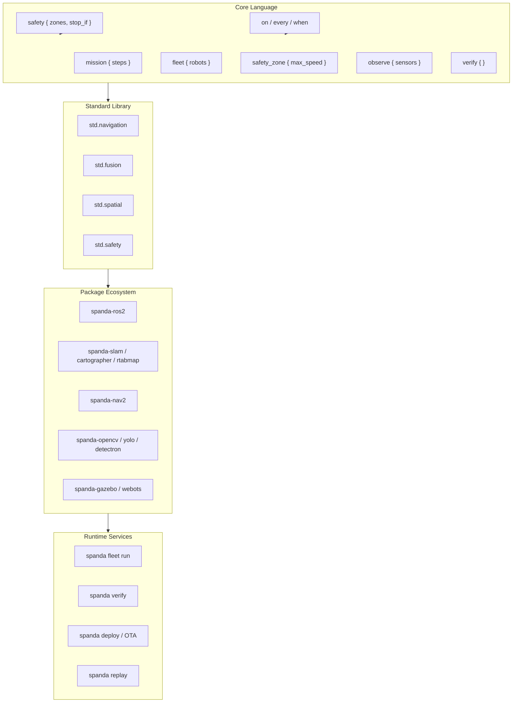

# Spanda Robotics Platform

Spanda is an **autonomous systems coordination and verification layer** — not a replacement for ROS 2, Nav2, Gazebo, or ML stacks. The robotics platform extends the language with first-class orchestration primitives while delegating algorithms to packages and external runtimes.

**Related docs:** [ROS 2 golden path](./ros2-golden-path.md) · [Standard library](./standard-library.md) · [Packages](./packages.md) · [Trust boundaries](./trust-boundaries.md) · [Triggers](./triggers.md)

## Architecture



## Design principle

**Orchestrate, don't rewrite.** Spanda programs coordinate perception, planning, safety, and actuation. SLAM, path planning, computer vision, and low-level drivers stay in community packages or bridged stacks (ROS 2, Python/C++ `extern`).

Reuse existing Spanda seams:

| Seam | Use for |
|------|---------|
| `observe { }` + `fusion.read()` | Multi-sensor fusion declaration |
| `safety { }` + `ActionProposal → SafeAction` | All motion gating |
| `topic` / `service` / `action` + `spanda-ros2` | Nav2, SLAM, drivers |
| `on` / `every` / `when` triggers | Reactive binding to external outputs |
| `verify { }` + `spanda verify` | Pre-deploy compatibility |
| `trust_boundary` + `secure_comm` | Fleet mesh and cloud |
| `spanda fleet run` | Multi-robot coordination testing |

---

## Capability classification matrix

| # | Capability | Classification | Rationale |
|---|------------|----------------|-----------|
| 1 | **SLAM & mapping** | **Package ecosystem** (`spanda-slam`, `spanda-cartographer`, `spanda-rtabmap`) + `std.slam` types | SLAM algorithms belong in bridged stacks; Spanda declares maps/pose types and orchestrates updates |
| 2 | **Navigation stack** | **Standard library** (`std.navigation`) + **packages** (`spanda-nav`, `spanda-nav2`) | Core needs goals/paths/trajectories; Nav2/ planners stay external |
| 3 | **Perception framework** | **Standard library** types + **packages** (`spanda-opencv`, `spanda-yolo`, `spanda-detectron`) | CV/ML inference is ecosystem territory; Spanda wires triggers + safety |
| 4 | **Sensor fusion** | **Core** (`observe`) + **stdlib** (`std.fusion`) | Declarative fusion is a language seam; algorithms are pluggable |
| 5 | **Motion planning** | **Standard library** + **packages** (`spanda-moveit`) | Manipulation/motion planning via MoveIt or similar adapters |
| 6 | **Fleet management** | **Core language** (`fleet`) + **runtime service** (`spanda fleet run`) | Fleet grouping is orchestration; distributed orchestration evolves as runtime service |
| 7 | **Human-robot interaction** | **Standard library** (`std.hri`) + **package** (`spanda-hri`) | Speech/gesture/intent types in std; dialogue stacks in packages |
| 8 | **Mission management** | **Core language** (`mission`) | Missions are first-class autonomous-system contracts (steps, lifecycle, verify) |
| 9 | **Energy management** | **Standard library** types + **triggers** (`on battery…`) | Battery/mission duration already integrate with `spanda verify`; triggers for reactive policy |
| 10 | **Environmental awareness** | **Standard library** (`std.environment`) + sensors | Weather/IAQ types; hardware via sensor packages |
| 11 | **Computer vision pipelines** | **AI framework** (`VisionModel`, agents) + **packages** | Overlap with `std.ai` and `vision.*` packages — not a second CV stack |
| 12 | **Manipulation** | **Standard library** (`std.manipulation`) + **packages** | Pick/place orchestration in language; grasp planning in MoveIt adapters |
| 13 | **Swarm robotics** | **Experimental / future** | Peer robots + fleet primitives suffice for alpha; swarm policies later |
| 14 | **Autonomous decision framework** | **AI agents** (`agent`, `goal`, `plan`, `Belief`, `Policy`) | Reuse existing agent framework — no parallel decision DSL |
| 15 | **Safety zones** | **Core language** (`safety_zone` + `safety { zone }`) | Integrates geofencing, triggers, safety validation — core identity |
| 16 | **Predictive maintenance** | **Standard library** (`std.maintenance`) + **observe/verify** | Health scores as types; ML backends via packages |
| 17 | **OTA deployment** | **Runtime service** | `spanda deploy plan\|rollout\|rollback\|status` — rollout/canary with `.spanda/deploy-state.json` |
| 18 | **Edge ↔ cloud** | **Runtime service** + **trust boundaries** | `trust_boundary`, `secure_comm`, deploy validation |
| 19 | **Safety certification** | **Future metadata** | `certify ISO13849` program metadata + verify reporting — not runtime prover yet |
| 20 | **Robotics package ecosystem** | **Package ecosystem strategy** | See [Package ecosystem strategy](#package-ecosystem-strategy) |

### Priority tiers (current release)

| Tier | Capabilities |
|------|----------------|
| **P0 — Core language** | Mission management, Safety zones, Fleet grouping |
| **P1 — Standard library** | Navigation, Sensor fusion |
| **P2 — Packages** | SLAM, OpenCV/YOLO, Nav2, Gazebo/Webots |
| **P3 — Future** | Certification metadata, distributed fleet orchestrator, swarm policies |

---

## Core language constructs

### Mission management

Named missions with optional duration (for `spanda verify` battery budgeting) and ordered steps. Lifecycle states: `Pending`, `Running`, `Paused`, `Completed`, `Failed`.

```spanda
mission Delivery {
  duration: 45 min;
  navigate;
  deliver;
  return_home;
}

behavior execute() {
  mission.start();
  let step = mission.advance();
  let state = mission.state();
}
```

Runtime API: `mission.start()`, `pause()`, `resume()`, `advance()`, `complete()`, `fail()`, `state()`, `step()`.

### Fleet grouping

Program-level fleet declarations group robot names for coordination. Validated at type-check time against declared `robot` blocks.

```spanda
fleet Warehouse {
  Picker1;
  Picker2;
}

behavior coordinate() {
  let count = fleet.members("Warehouse");
}
```

Use `spanda fleet run program.sd` for in-process multi-robot simulation.

Use `spanda fleet orchestrate program.sd` for distributed-style mission coordination (round-robin mission advance across fleet members). With registered fleet agents, add `--remote` to relay peer mission steps over HTTP:

```bash
spanda fleet agent start --robot ScoutB --bind 0.0.0.0:8766
spanda fleet agent register ScoutB http://scout-b.local:8766
spanda fleet mesh start --bind 0.0.0.0:8767
spanda fleet orchestrate --remote --mesh-url http://mesh.local:8767 examples/robotics/fleet_peer_missions.sd
```

Strict certification gates for CI and runtime:

```bash
spanda verify examples/robotics/certified_deployment.sd --strict-certify
spanda run examples/robotics/certified_deployment.sd --enforce-certify
```

Production Nav2/SLAM backends (optional subprocess hooks):

```bash
export SPANDA_NAV2_CMD="/opt/nav2/bridge.sh {goal}"
export SPANDA_SLAM_CMD="/opt/slam/bridge.sh {op}"
spanda run examples/robotics/nav2_bridge.sd
```

Validate adapter package manifests:

```bash
cd examples/packages/nav2_adapter_package && spanda verify-adapter --import navigation.nav2
```

Export a certification proof artifact for CI/audit:

```bash
spanda certify prove examples/robotics/certified_deployment.sd --strict --out proof.json
```

### Safety zones

Program-level speed policies complement robot-local geometry in `safety { zone … }`:

```spanda
safety_zone HumanArea {
  max_speed 0.5 m/s;
}

robot R {
  safety {
    zone HumanArea circle at (0.0 m, 0.0 m) radius 2.0 m;
    stop_if robot.in_zone("HumanArea");
  }
}
```

Integrates with existing safety monitor, geofencing, and `on safety` triggers. Program-level `safety_zone` speed caps are enforced at runtime via `SafetyMonitor.clamp_speed_at_pose()` when the robot is inside a matching named zone — motion remains allowed inside speed-cap zones (use `stop_if robot.in_zone(...)` for hard stops). The TypeScript interpreter mirrors the Rust runtime for fleet, mission, navigation, fusion, and zone caps (LSP/sim path).

### Certification metadata

Declare safety standard intent at program scope for verify and CI gates:

```spanda
certify ISO13849;
certify ISO13849 {
  level PLd;
}
certify IEC61508;
certify ISO26262;
```

Recorded during `spanda verify` as pass items under category `certify`. Programs with `deploy` targets but no `certify` metadata receive a verify warning. This is **metadata only** — Spanda does not prove ISO/IEC compliance at runtime. See `examples/robotics/certified_deployment.sd`.

### OTA deployment CLI

```bash
spanda deploy plan examples/robotics/ota_deployment.sd
spanda deploy rollout examples/robotics/ota_deployment.sd --strategy canary --canary-percent 10 --version 1.2.0
spanda deploy rollout examples/robotics/certified_deployment.sd --require-certify --version 1.0.0
spanda deploy rollback examples/robotics/ota_deployment.sd
spanda deploy status
```

Deploy plans include a `certification_proof` summary (relaxed and strict pass flags). Use `--require-certify` on rollout to block OTA updates when strict certification proof fails (same checklist as `spanda verify --strict-certify` / `spanda certify prove --strict`).

Golden-path script: `examples/robotics/golden_path_deploy.sh`.

State persists to `.spanda/deploy-state.json` (override with `SPANDA_DEPLOY_STATE`).

### Remote OTA via deploy agents

Run a lightweight HTTP deploy agent on each device (or edge gateway):

```bash
# On device / edge node
spanda deploy agent start --target RoverProgram@JetsonOrin --bind 0.0.0.0:8765

# On CI / operator workstation
spanda deploy agent register RoverProgram@JetsonOrin http://192.168.1.50:8765
spanda deploy rollout examples/robotics/remote_ota_deployment.sd --remote --require-certify --version 1.3.0
spanda deploy rollback examples/robotics/remote_ota_deployment.sd --remote
spanda deploy agent list
```

Agent registry: `.spanda/deploy-agents.json` (`SPANDA_DEPLOY_AGENTS` override).  
Agent state on device: `.spanda/agent-state.json` (`SPANDA_AGENT_STATE` override).

Protocol: `GET /v1/health`, `GET /v1/status`, `POST /v1/rollout`, `POST /v1/rollback` (JSON, optional bearer token).

### Nav2 golden path

When a robot declares `topic cmd_vel: Velocity publish on "/cmd_vel"`, calling `navigation.navigate()` publishes a stub velocity on `/cmd_vel` for ROS2 bridge validation (`SPANDA_ROS2_LIVE=1`). See `examples/robotics/nav2_bridge.sd` and `docs/ros2-golden-path.md`. Nav2 itself remains a ROS2 stack — Spanda orchestrates, it does not replace planners.

### Sensor fusion (existing, extended)

```spanda
observe { camera; lidar; imu; }

behavior run() {
  let fused = fusion.read();
  let _ = fused.pose;
  let _ = fused.confidence;
  let _ = fused.state_estimate;
}
```

---

## Standard library namespaces

| Namespace | Types |
|-----------|-------|
| `std.navigation` | `NavigationGoal`, `Path`, `Waypoint`, `Trajectory`, `CostMap` |
| `std.fusion` | `FusedObservation`, `StateEstimate`, `Confidence`, `SensorFusion` |
| `std.slam` | `Map`, `OccupancyGrid`, `Landmark`, `LocalizationEstimate`, `MapLayer` |
| `std.manipulation` | `Arm`, `Gripper`, `EndEffector`, `Grasp`, `Pick`, `Place` |
| `std.maintenance` | `HealthScore`, `MaintenanceAlert`, `FailurePrediction` |
| `std.environment` | `Weather`, `Temperature`, `Humidity`, `AirQuality`, `LightLevel` |

Navigation runtime (when `mission` is declared on a robot):

```spanda
navigation.goal("Dock at charger");
let path = navigation.path();
let traj = navigation.navigate();
let cost = navigation.cost_map();

// Statement sugar (equivalent goal + navigate + optional cmd_vel overrides):
navigate {
  goal: "Dock at charger";
  linear: 0.2 m/s;
  angular: 0.0 rad/s;
}
```

---

## Package ecosystem strategy

Packages expose **adapter import paths** — Spanda orchestrates; packages implement.

| Package | Import path | Role |
|---------|-------------|------|
| `spanda-ros2` | `robotics.ros2` | Topics/services/actions bridge |
| `spanda-slam` | `navigation.slam` | SLAM orchestration |
| `spanda-cartographer` | `navigation.cartographer` | Cartographer adapter |
| `spanda-rtabmap` | `navigation.rtabmap` | RTAB-Map adapter |
| `spanda-nav` | `navigation.path_planning` | Path planning stub/adapter |
| `spanda-nav2` | `navigation.nav2` | Nav2 integration |
| `spanda-opencv` | `vision.opencv` | OpenCV bindings |
| `spanda-yolo` | `vision.yolo` | YOLO detection |
| `spanda-detectron` | `vision.detectron` | Detectron2 |
| `spanda-moveit` | `manipulation.moveit` | Arm motion planning |
| `spanda-gazebo` / `spanda-sim-gazebo` | `sim.gazebo` | Gazebo backend |
| `spanda-webots` / `spanda-sim-webots` | `sim.webots` | Webots backend |
| `spanda-ble` | `connectivity.ble` | BLE peripherals |
| `spanda-gps` | `positioning.gps` | GNSS receivers |
| `spanda-lte` | `connectivity.lte` | Cellular modems |

### Package interface pattern

```toml
[package]
name = "spanda-nav2"
categories = ["navigation"]

[adapter]
provides = ["Nav2Adapter", "NavigationGoal", "CostMap"]
requires = ["topic.publish", "topic.subscribe", "safety.validate"]
```

Programs import adapter paths and call `extern` bridges where needed — see [FFI and ecosystem](./ffi-and-ecosystem.md).

---

## Examples

Runnable programs under `examples/robotics/`:

| Example | Demonstrates |
|---------|--------------|
| `mission_management.sd` | Named mission, steps, lifecycle |
| `fleet_management.sd` | Fleet declaration + coordination |
| `safety_zones.sd` | Program + robot safety zones |
| `navigation.sd` | `std.navigation` goals and paths |
| `nav2_bridge.sd` | Nav2 golden path — `navigation.navigate()` publishes `/cmd_vel` when declared |
| `sensor_fusion.sd` | `observe` + extended fusion fields |
| `slam_integration.sd` | Package + `extern` SLAM bridge |
| `predictive_maintenance.sd` | `std.maintenance` health signals |
| `ota_deployment.sd` | Deploy + verify workflow |
| `certified_deployment.sd` | `certify` metadata for verify/CI |
| `edge_cloud.sd` | Trust boundaries + edge agents |

---

## Future roadmap

| Item | Target |
|------|--------|
| Distributed fleet orchestrator | **Partial** — `spanda fleet orchestrate` with peer mesh delivery (`peer_mesh_mission`) and remote HTTP relay (`distributed_peer_mesh`) |
| `navigate { … }` statement sugar | **Done** — parser sugar over `navigation.goal()` + Nav2 `/cmd_vel` publish |
| Safety zone speed enforcement at runtime | **Done** — `SafetyMonitor.clamp_speed_at_pose()` (Rust + TS) |
| `certify ISO13849` / IEC 61508 / ISO 26262 | **Partial** — program `certify` metadata (+ optional `level`) + verify reporting; `--strict-certify` / `--enforce-certify`; `spanda certify prove`; deploy `--require-certify` gate |
| OTA rollout/canary/rollback | **Partial** — local deploy CLI + remote HTTP(S) agents with `program_hash`, optional Ed25519 signed bundles, and certification proof summary on deploy plans |
| Swarm coordinator runtime | Experimental; build on fleet + peer robots |
| World model runtime | Explicitly deferred in product strategy |
| Production SLAM/nav package implementations | **Partial** — `slam.localize()` / `slam.map()` stub hooks; `SPANDA_NAV2_CMD` / `SPANDA_SLAM_CMD` subprocess bridges; `spanda verify-adapter` |

---

## Anti-patterns

- Do **not** implement SLAM or Nav2 algorithms in Spanda syntax
- Do **not** duplicate the AI agent framework with a parallel decision DSL
- Do **not** replace ROS 2 transport at scale — bridge it
- Do **not** add overlapping fusion/perception abstractions — use `observe` + packages

---

## Implementation reference

| Layer | Location |
|-------|----------|
| AST / parser | `crates/spanda-core/src/foundations.rs`, `parser.rs`, `ast.rs` |
| Platform runtime | `crates/spanda-core/src/robotics_platform.rs` |
| OTA deploy service | `crates/spanda-core/src/deploy_service.rs` |
| Fleet orchestrator | `crates/spanda-core/src/fleet_orchestrator.rs` |
| Fleet remote agents | `crates/spanda-core/src/fleet_remote.rs`, `fleet_agent.rs` |
| Fleet mesh coordinator | `crates/spanda-core/src/fleet_mesh.rs` |
| Certification verify/runtime | `crates/spanda-core/src/certify_verify.rs`, `certify_runtime.rs`, `certify_prover.rs` |
| Adapter bridges | `crates/spanda-core/src/adapter_bridge.rs` |
| Nav2 adapter hooks | `crates/spanda-core/src/nav2_adapter.rs` |
| Type checker | `crates/spanda-core/src/types.rs` (`builtin_methods`) |
| Interpreter | `crates/spanda-core/src/runtime.rs` |
| Package registry stubs | `crates/spanda-package/src/adapter.rs` |
| Tests | `crates/spanda-core/tests/robotics_platform.rs` |
