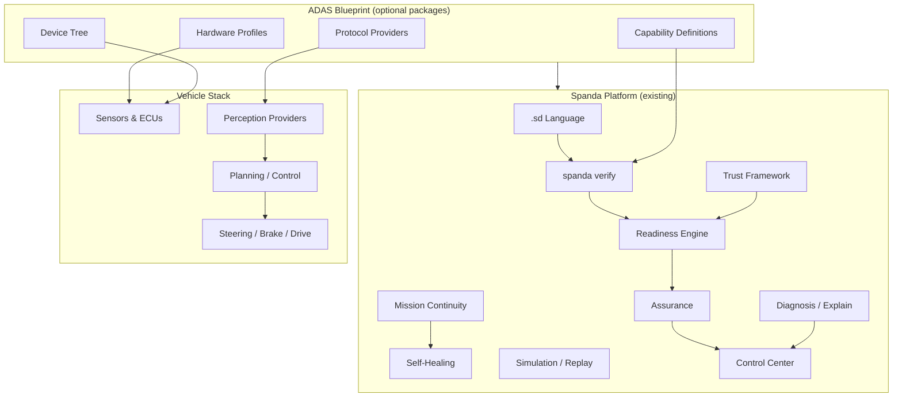

# ADAS & Autonomous Driving — Solution Blueprint

**Status:** **Stable** · **Profile:** ISO 26262 template · **Path:** `examples/solutions/adas/`

Official Solution Blueprint demonstrating how Spanda supports intelligent vehicles using existing platform capabilities — no automotive-specific core language extensions.

---

## Architecture



### Design principles

1. **Lean core** — ADAS logic lives in `.sd` programs and optional packages, not in language keywords.
2. **Capability verification** — Logical capabilities (`lane_detection`, `emergency_braking`, …) map to sensors/actuators via `requires_capability` and `exposes capabilities`.
3. **Readiness gates** — No ADAS function activates until sensors, calibration, firmware, health, and trust pass.
4. **Assurance evidence** — Every deployment produces an auditable evidence bundle.
5. **Mission continuity** — Sensor loss triggers degraded mode, speed reduction, and driver takeover — never silent failure.
6. **Explainability** — `spanda diagnose` and `spanda explain` produce human-readable event narratives.

---

## Applications

Reference configurations for nine vehicle classes. Each uses the same blueprint with profile-specific speed limits, sensor requirements, and readiness thresholds.

| Application | Typical profile | Key capabilities | Notes |
|-------------|-----------------|------------------|-------|
| Passenger vehicles | `iso26262` | LKA, ACC, AEB, DMS | Full sensor suite |
| Commercial trucks | `iso26262` | ACC, BSM, AEB | Extended radar range |
| Autonomous shuttles | `iso26262` | Low-speed autonomy, pedestrian detection | Geo-fenced routes |
| Mining vehicles | `iec61508` | Obstacle detection, GPS, connectivity | Harsh environment sensors |
| Agricultural vehicles | `agriculture` | GPS, route following, low-speed autonomy | Outdoor connectivity |
| Delivery vehicles | `warehouse` | Parking assist, low-speed autonomy | Urban sensor mix |
| Airport ground vehicles | `industrial` | Route following, obstacle detection | Strict speed caps |
| Campus mobility | `research` | Low-speed autonomy, pedestrian detection | Relaxed gates with warnings |
| Construction equipment | `iso13849` | Obstacle detection, emergency braking | Machinery safety profile |

Configure application-specific limits in `spanda.readiness.toml` and select compliance profile at verify time. Device-tree fixtures live under [`applications/`](../../examples/solutions/adas/applications/).

Sim-recorded golden traces:

- **Behavior loops:** [`src/highway_drive.trace`](../../examples/solutions/adas/src/highway_drive.trace) (`behavior_tick`, 20 frames @ 50ms)
- **Task scheduler:** [`sim_record/lane_keep_task.trace`](../../examples/solutions/adas/sim_record/lane_keep_task.trace) (`scheduler_tick`)
- **Lane keeping example:** [`lane_keeping/lane_keeping.trace`](../../examples/solutions/adas/lane_keeping/lane_keeping.trace) (`behavior_tick`, 33ms loop)

---

## ADAS functions

Reference implementations (demonstration workflows, not full perception algorithms):

| Function | Example | Capabilities |
|----------|---------|--------------|
| Lane Keeping Assist | `lane_keeping/lane_keeping.sd` | `lane_detection`, `steering_control` |
| Adaptive Cruise Control | `adaptive_cruise/adaptive_cruise.sd` | `adaptive_speed_control`, `obstacle_detection` |
| Automatic Emergency Braking | `automatic_emergency_braking/aeb.sd` | `emergency_braking`, `obstacle_detection` |
| Blind Spot Monitoring | `blind_spot_monitoring/blind_spot.sd` | `obstacle_detection` |
| Traffic Sign Recognition | `traffic_sign_recognition/traffic_sign.sd` | `lane_detection` (camera) |
| Pedestrian Detection | `pedestrian_detection/pedestrian.sd` | `obstacle_detection` |
| Collision Avoidance | `automatic_emergency_braking/aeb.sd` | `emergency_braking` |
| Parking Assist | `parking_assist/parking_assist.sd` | `parking_assist` |
| Driver Monitoring | `driver_takeover/driver_takeover.sd` | `driver_monitoring` |
| Highway Pilot | `src/highway_drive.sd` | Full capability set |
| Low-Speed Autonomy | `lane_keeping/lane_keeping.sd` | `steering_control`, `obstacle_detection` |
| Autonomous Valet Parking | `src/highway_drive.sd` | `parking_assist`, `localization` |

---

## Sensor ecosystem

Sensors and ECUs are modeled through hardware profiles and device-tree entries — see [automotive-device-tree.md](../automotive-device-tree.md).

| Device | Type | Provider package | Capabilities |
|--------|------|------------------|--------------|
| Front camera | Camera | `spanda-opencv` | Lane, sign, pedestrian detection |
| Stereo camera | DepthCamera | `spanda-opencv` | Obstacle detection, parking |
| Front radar | Radar | `spanda-radar` | ACC, obstacle detection |
| Front LiDAR | Lidar | `spanda-lidar` | Obstacle detection, localization |
| Ultrasonic array | Ultrasonic | `spanda-ultrasonic` | Parking assist |
| GPS/GNSS | GPS | `spanda-gps` | Localization, route following |
| IMU | IMU | `spanda-imu` | Localization |
| Wheel speed | WheelSpeedSensor | `spanda-canbus` | Odometry |
| Steering angle | SteeringAngleSensor | `spanda-canbus` | Steering control |
| Brake sensors | BrakeSensor | `spanda-canbus` | Emergency braking |
| Tire pressure | TirePressureSensor | `spanda-canbus` | Vehicle health |
| Driver monitor | Camera | `spanda-opencv` | Driver monitoring |
| Steering ECU | SteeringController | `spanda-canbus` | Steering control |
| Brake ECU | BrakeController | `spanda-canbus` | Emergency braking |
| Powertrain ECU | PowertrainController | `spanda-canbus` | Adaptive speed |
| Comm gateway | CommunicationGateway | `spanda-automotive-ethernet` | V2X, secure comm |

---

## Vehicle capabilities

ADAS logical capabilities are defined in the **device tree** (`spanda.devices.toml`) and mapped to **registry capabilities** for verification — no core language extensions required.

| ADAS logical capability | Registry capability | Primary device |
|-------------------------|---------------------|----------------|
| `lane_detection` | `vision_processing` | Front camera |
| `obstacle_detection` | `obstacle_avoidance` | Front radar / LiDAR |
| `emergency_braking` | kill switch + `obstacle_avoidance` | Brake ECU |
| `adaptive_speed_control` | `autonomous_navigation` | Radar + powertrain |
| `steering_control` | `autonomous_navigation` | Steering ECU |
| `localization` | `gps_navigation` | GPS + IMU |
| `route_following` | `gps_navigation` | GPS |
| `driver_monitoring` | `vision_processing` | Driver monitor camera |
| `parking_assist` | `vision_processing` | Ultrasonic / stereo |

Programs expose registry capabilities:

```spanda
robot Vehicle {
  exposes capabilities [
    gps_navigation, obstacle_avoidance, autonomous_navigation,
    vision_processing, telemetry_streaming
  ];
  mission HighwayPilot {
    requires capabilities [ gps_navigation, obstacle_avoidance, vision_processing ];
  }
}
```

Device-tree entries attach ADAS logical names to physical sensors and ECUs for traceability matrices.

---

## Readiness

Before enabling ADAS, the Readiness Engine verifies:

- Required sensors are available
- Sensor calibration is valid
- Firmware versions are approved
- Vehicle health is acceptable
- Safety systems are operational
- Connectivity is healthy (when required)
- Trust score is acceptable

```bash
spanda readiness src/highway_drive.sd --profile iso26262 --config spanda.toml --json
```

See [adas-readiness.md](../adas-readiness.md).

---

## Assurance

Assurance evidence bundles include sensor readiness, calibration status, capability verification, hardware verification, safety validation, traceability, replay references, software/package versions, and OTA history.

```bash
spanda compliance report src/highway_drive.sd --profile iso26262
spanda verify src/highway_drive.sd --capabilities --traceability --json
```

See [adas-assurance.md](../adas-assurance.md).

---

## Diagnosis & explainability

Explainable diagnosis for ADAS events:

```bash
spanda diagnose src/highway_drive.sd src/highway_drive.trace
spanda explain src/highway_drive.trace
```

Supported event types: emergency braking activation, lane departure intervention, driver takeover request, sensor degradation, GPS loss, camera obstruction, radar failure, LiDAR degradation.

---

## Mission continuity

When a sensor fails, the continuity framework:

1. Verifies remaining capabilities
2. Determines if redundant sensors are sufficient
3. Reduces operating speed
4. Requests driver takeover if needed
5. Generates assurance evidence

Example: front camera fails → switch to radar + LiDAR → reduce speed 40% → continue in degraded mode or request takeover.

See [sensor_failure_recovery/camera_failure.sd](../../examples/solutions/adas/sensor_failure_recovery/camera_failure.sd).

---

## Self-healing

Safe recovery actions (always pass safety validation, capability verification, and hardware verification):

- Restart perception provider
- Switch to redundant sensor
- Reinitialize camera
- Reconnect vehicle network
- Retry localization
- Enter degraded mode

---

## Simulation & replay

Example scenarios using existing simulation and replay:

| Scenario | Command |
|----------|---------|
| Heavy rain / snow / fog | `spanda sim src/highway_drive.sd --fault weather_degraded` |
| Night driving | `spanda sim src/highway_drive.sd --fault low_light` |
| Camera failure | `spanda sim sensor_failure_recovery/camera_failure.sd --record` |
| Radar failure | `spanda sim src/highway_drive.sd --fault radar_failure` |
| LiDAR failure | `spanda sim src/highway_drive.sd --fault lidar_failure` |
| GPS spoofing | `spanda sim src/highway_drive.sd --fault gps_spoofing` |
| CAN bus failure | `spanda sim src/highway_drive.sd --fault can_bus_failure` |
| Emergency vehicle | `spanda sim src/highway_drive.sd --fault emergency_vehicle` |

See [adas-replay.md](../adas-replay.md).

---

## Security

Integrates the existing security framework for CAN intrusion, ECU firmware tampering, OTA validation, sensor spoofing, GPS spoofing, unauthorized providers, and certificate validation.

See [adas-security.md](../adas-security.md).

---

## Automotive protocols

Provider interfaces for optional packages — **not core implementations**:

| Protocol | Package | Status |
|----------|---------|--------|
| CAN / CAN FD | `spanda-canbus` | Experimental |
| LIN | `spanda-lin` | Planned |
| Automotive Ethernet | `spanda-automotive-ethernet` | Planned |
| SOME/IP | `spanda-automotive-ethernet` | Planned |
| DDS | `spanda-dds` | Experimental |
| DoIP | `spanda-automotive-ethernet` | Planned |
| UDS / ISO-TP | `spanda-uds` | Planned |
| V2X (DSRC / C-V2X) | `spanda-v2x` | Planned |

Configure in `spanda.providers.toml`. See [provider-interfaces.md](../provider-interfaces.md).

---

## ROS 2 automotive bridge

Optional integration with ROS 2 Humble perception stacks and Nav2 motion planning:

```bash
spanda verify ros2_automotive/automotive_nav.sd --capabilities
SPANDA_ROS2_LIVE=1 spanda run ros2_automotive/automotive_nav.sd
```

Requires `spanda-ros2` in `spanda.toml`. See [`ros2_automotive/README.md`](../../examples/solutions/adas/ros2_automotive/README.md).

### Live automotive sensor bridges

Env-gated distance reads for radar, LiDAR, and ultrasonic packages (hub fallback when live mode is off):

```bash
export SPANDA_LIVE_RADAR=1
export SPANDA_RADAR_CMD='echo 18.0'   # or: vendor_probe.sh {sensor}
./scripts/adas_automotive_sensors_smoke.sh
```

| Env | Purpose |
|-----|---------|
| `SPANDA_LIVE_RADAR` / `SPANDA_RADAR_CMD` | Front/rear radar range (m) |
| `SPANDA_LIVE_LIDAR` / `SPANDA_LIDAR_CMD` | LiDAR range (m) |
| `SPANDA_LIVE_ULTRASONIC` / `SPANDA_ULTRASONIC_CMD` | Parking ultrasonic range (m) |

---

## Stable promotion

Blueprint ships at **Experimental** tier. Promotion gate: `./scripts/adas_stable_promotion_gate.sh` (30-day field soak + security audit + smoke + Control Center probe). See [stable-hardening-adas.md](../stable-hardening-adas.md).

---

## Control Center

ADAS dashboard tab — vehicle health, sensor health, readiness, trust score, active alerts, driver takeover requests, OTA status, replay viewer, assurance reports.

Grafana template: import `packages/registry/spanda-grafana-dashboards/dashboards/control-center-adas.json` and point at OTLP metrics from Control Center (`POST /v1/observability/otlp/export-metrics`). See [spanda-grafana-dashboards](../../packages/registry/spanda-grafana-dashboards/README.md).

```bash
spanda control-center serve --config spanda.toml --program src/highway_drive.sd
```

See [control-center.md](../control-center.md).

---

## Quick start

```bash
cd examples/solutions/adas
spanda install
spanda demo adas
```

Smoke: `./scripts/adas_smoke.sh`

---

## Related

- [automotive-device-tree.md](../automotive-device-tree.md)
- [adas-readiness.md](../adas-readiness.md)
- [adas-assurance.md](../adas-assurance.md)
- [adas-security.md](../adas-security.md)
- [adas-replay.md](../adas-replay.md)
- [stable-hardening-adas.md](../stable-hardening-adas.md)
- [compliance-profiles.md](../compliance-profiles.md)
- [mission-continuity.md](../mission-continuity.md)
- [readiness.md](../readiness.md)
