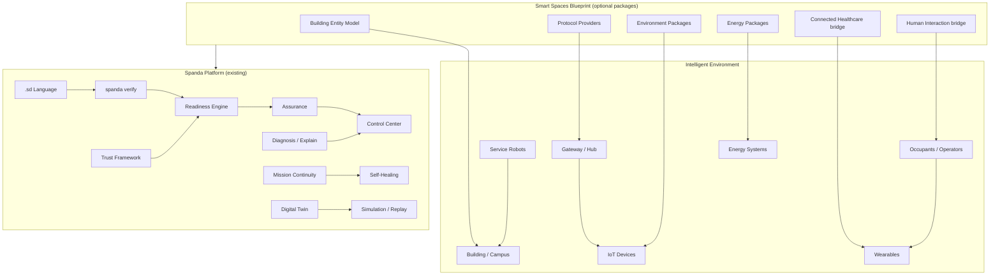

# Smart Spaces & Ambient Intelligence — Solution Blueprint

**Status:** Experimental (scaffold) · **Profile:** `smart_space` · **Path:** `examples/solutions/smart-spaces/`

Official Solution Blueprint for **safety-first verification, orchestration, readiness, assurance, and trust** in intelligent environments — from homes and offices to hospitals, factories, campuses, and cities.

**Spanda is not a home automation platform.** It does not compete with Home Assistant, OpenHAB, Apple Home, Google Home, Amazon Alexa, or SmartThings. Spanda composes above those ecosystems through optional provider packages, adding verified readiness, mission continuity, assurance evidence, and operator trust for environments that combine IoT, robots, wearables, connected healthcare, AI agents, and energy systems.

**Full roadmap entry:** [ROADMAP.md § Smart Spaces & Ambient Intelligence](../../ROADMAP.md#smart-spaces--ambient-intelligence)

---

## Architecture



### Design principles

1. **Lean core** — Building logic lives in `.sd` programs, TOML config, and optional packages; no smart-home keywords in the language.
2. **Safety-first orchestration** — Readiness gates before night mode, lockdown, evacuation, or energy optimization; never silent automation failure.
3. **Unified Entity Model** — Buildings, floors, rooms, zones, occupants, gateways, and devices are entity graph nodes.
4. **Interoperability, not replacement** — Home Assistant, Matter hubs, and BMS systems remain authoritative for device control; Spanda verifies and orchestrates missions across them.
5. **Mission continuity** — Gateway failover, backup lighting controllers, alternate service robots — explicit continuity policies.
6. **Assurance evidence** — Security, readiness, emergency systems, medical devices, and access control produce auditable bundles.
7. **Scale without core bloat** — Home to smart city uses the same pillars; deployment scale changes device tree depth and package selection only.

---

## Positioning

| Spanda provides | Spanda does **not** provide |
|-----------------|----------------------------|
| Readiness before mode changes (night, lockdown, evac) | Primary device pairing UI |
| Assurance evidence for compliance and insurance | Scene editor / automation rule builder |
| Mission continuity across gateway and controller failure | Replacement for Alexa / Google Assistant |
| Trust verification for locks, cameras, medical devices | Full BMS product |
| Orchestration across IoT + robots + wearables + healthcare | Competing with Home Assistant automations |
| Digital twin + simulation for fire, flood, power loss | — |
| Control Center operational dashboards | — |

---

## Applications

Reference architectures for twelve deployment targets. Each reuses the same blueprint with profile-specific readiness thresholds, entity depth, and package sets.

| Application | Scale | Primary missions | Key packages |
|-------------|-------|------------------|--------------|
| [Smart Home](../building-automation.md#smart-home) | 1 dwelling | Night mode, leak response, energy optimize | `spanda-matter`, `spanda-zigbee`, `spanda-energy` |
| Smart Apartment | Multi-unit residential | Access control, occupancy climate | `spanda-matter`, `spanda-smart-locks` |
| [Smart Office](../building-automation.md#smart-office) | Floor / building | Occupancy HVAC, access, cleaning | `spanda-bacnet`, `spanda-environment` |
| Smart Hospital | Clinical wing | Patient monitoring, emergency notify | `spanda-bacnet`, Connected Healthcare bridge |
| Smart Factory | Production floor | Safety zones, predictive maintenance | `spanda-opcua`, `spanda-modbus` |
| Smart Warehouse | Logistics building | AMR + access + environmental | `spanda-mqtt`, `spanda-building` |
| Smart Campus | University / corporate | Multi-building readiness rollup | `spanda-building`, `spanda-energy` |
| [Smart Building](../building-automation.md#smart-building) | Commercial tower | Floor twins, redundancy, lockdown | `spanda-bacnet`, `spanda-knx` |
| Smart Hotel | Hospitality | Guest access, energy, cleaning robots | `spanda-matter`, `spanda-smart-locks` |
| Smart Retail | Store / mall | Occupancy, refrigeration, security | `spanda-environment`, `spanda-mqtt` |
| Smart Airport | Terminal | Evacuation, indoor navigation, asset track | `spanda-building`, `spanda-bacnet` |
| Smart City | District | Multi-site rollup, demand response | `spanda-energy`, `spanda-mqtt` |

---

## Entity model

All smart space components map to the [Unified Entity Model](../entity-model.md). Specialized kinds extend the canonical graph:

| Entity | `entity_kind` | Role |
|--------|---------------|------|
| Building | `facility` | Top-level structure |
| Floor | `zone` | Vertical slice |
| Room | `zone` | Contained space |
| Zone | `zone` | Logical area (lobby, ward, line) |
| Occupant | `human` | Resident, employee, patient |
| Visitor | `human` | Temporary access |
| Operator | `human` | Facilities / security operator |
| Gateway | `device` | Protocol bridge |
| Hub | `device` | Matter / Zigbee coordinator |
| Camera | `device` | Video / doorbell |
| Door Lock | `device` | Access control |
| Window Sensor | `device` | Open/close |
| Smoke / CO Detector | `device` | Life safety |
| Water Leak Sensor | `device` | Flood detection |
| Thermostat / HVAC | `device` | Climate |
| Lighting | `device` | Fixtures, dimmers |
| Smart Plug | `device` | Switched load |
| Robot Vacuum | `robot` | Cleaning |
| Service Robot | `robot` | Delivery, inspection |
| Medical Device | `device` | Clinical equipment |
| Wearable | `wearable` | Health / alert band |
| Solar / Battery / EV Charger | `device` | Energy assets |
| Utility Meter | `device` | Grid measurement |

Device tree guide: [smart-space-device-tree.md](../smart-space-device-tree.md)

---

## Device types

Reference support (via optional packages and provider interfaces):

| Category | Device types |
|----------|--------------|
| Climate | Thermostats, HVAC, humidity sensors |
| Lighting | Fixtures, switches, dimmers |
| Access | Door locks, garage doors, curtains, blinds |
| Safety | Motion, presence, smoke, CO, water leak |
| Environment | Temperature, humidity, air quality, CO₂ |
| Energy | Power meters, solar, battery, EV chargers |
| Appliances | Washers, refrigerators, ovens (Matter / REST) |
| Security | Cameras, doorbells, intercoms |
| Robotics | Vacuum, service, inspection robots |
| Health | Medical devices, wearables |

---

## Connectivity

Provider interfaces ship as **optional packages** — never core dependencies.

| Protocol | Package | Import path |
|----------|---------|-------------|
| Matter | `spanda-matter` | `iot.matter` |
| Thread | `spanda-thread` | `iot.thread` |
| Zigbee | `spanda-zigbee` | `iot.zigbee` |
| Z-Wave | `spanda-zwave` | `iot.zwave` |
| Wi-Fi / BLE | `spanda-wifi`, `spanda-ble` | `connectivity.*` |
| Ethernet | `spanda-discovery-mdns` | discovery |
| MQTT | `spanda-mqtt` | `iot.mqtt` |
| REST / WebSocket | `spanda-mqtt` (bridge) | HTTP providers |
| Modbus | `spanda-modbus` | `iot.modbus` |
| BACnet | `spanda-bacnet` | `iot.bacnet` |
| KNX | `spanda-knx` | `iot.knx` |

Ecosystem bridges (interop only):

| Ecosystem | Package | Role |
|-----------|---------|------|
| Home Assistant | `spanda-home-assistant` | Read state, trigger verified missions |
| OpenHAB | (planned) | REST bridge |
| Apple Home | via Matter package | Device access |
| Google Home / Alexa | (planned) | Voice trigger ingress to Spanda missions |

See [iot.md](../iot.md) · [smart-space-packages.md](../smart-space-packages.md)

---

## Smart space capabilities

Logical capabilities verified before missions activate:

| Capability | Typical devices |
|------------|-----------------|
| `lighting_control` | Dimmers, switches |
| `climate_control` | Thermostat, HVAC |
| `energy_monitoring` | Meters, inverters |
| `access_control` | Locks, readers |
| `occupancy_detection` | PIR, mmWave, cameras |
| `indoor_navigation` | Beacons, robots |
| `environmental_monitoring` | AQ, temp, humidity |
| `robot_assistance` | Service robots |
| `medical_monitoring` | Wearables, bedside (opt-in) |
| `emergency_notification` | Sirens, push, PA |
| `safety_monitoring` | Smoke, CO, leak |
| `asset_tracking` | BLE tags, UWB |
| `predictive_maintenance` | Vibration, power anomaly |

---

## Readiness

Operational go/no-go before mode changes and emergency missions. Profile: `smart_space` in `spanda.readiness.toml`.

| Question | Readiness dimension |
|----------|---------------------|
| Can the building safely enter night mode? | Gateway, locks, critical sensors, redundancy |
| Can emergency evacuation operate? | Fire panel, PA, exit lighting, egress paths |
| Can HVAC automation continue if Wi-Fi fails? | Local controller fallback, BACnet/KNX path |

Full checklist: [smart-space-readiness.md](../smart-space-readiness.md)

```bash
spanda readiness examples/solutions/smart-spaces/smart-home/night_mode.sd \
  --profile smart_space \
  --config examples/solutions/smart-spaces/spanda.toml \
  --json
```

---

## Assurance

Evidence bundles for:

- Security posture (locks, cameras, tamper)
- Readiness snapshots before night mode / lockdown
- Device health and battery quorum
- Emergency systems test records
- Energy system state (solar, battery, grid)
- Medical device connectivity (Connected Healthcare bridge)
- Access control audit trail
- Environmental baseline compliance

```bash
spanda verify examples/solutions/smart-spaces/emergency-response/fire_response.sd \
  --capabilities --traceability \
  --config examples/solutions/smart-spaces/spanda.toml
```

---

## Mission examples

| Mission | Example path | Demonstrates |
|---------|--------------|--------------|
| Night Mode | `smart-home/night_mode.sd` | Locks, lights, HVAC, readiness gate |
| Emergency Evacuation | `emergency-response/fire_response.sd` | Fire sensors, PA, continuity |
| Fire Response | `emergency-response/fire_response.sd` | Alarm escalation, robot assist |
| Water Leak Response | `smart-home/night_mode.sd` (leak hook) | Shutoff, notify, assurance |
| Power Failure | `energy-management/demand_response.sd` | Battery, critical loads |
| Building Lockdown | `smart-building/floor_readiness.sd` | Access deny, camera record |
| Hospital Patient Monitoring | `hospital-at-home/patient_monitoring.sd` | Wearables, fall detection |
| Energy Optimization | `energy-management/demand_response.sd` | Solar, battery, EV schedule |
| Cleaning Mission | `smart-office/occupancy_climate.sd` | Robot vacuum + occupancy |
| Inspection Mission | `smart-building/floor_readiness.sd` | Service robot patrol |

---

## Mission continuity

```text
Primary gateway offline
  → Switch to backup gateway (spanda-mission-continuity)
  → Continue automation on local Matter/Thread path

Lighting controller failure
  → Backup controller
  → Continue emergency lighting (life-safety override)

Service robot unavailable
  → Assign alternate robot from fleet
  → Degrade cleaning mission scope
```

Configured via `continuity_policy` and `recovery_policy` blocks — same primitives as [mission-continuity.md](../mission-continuity.md).

---

## Human interaction

Composes [Spatial Computing](./spatial-computing.md) and [human-interaction.md](../human-interaction.md):

| Modality | Use in smart spaces |
|----------|---------------------|
| Voice control | Mission triggers via `spanda-voice` (ingress only) |
| Wearables | Fall detection, vitals (opt-in) |
| AR guidance | Maintenance, evacuation wayfinding |
| Mobile app | Control Center remote operator |
| Remote operator | Facilities NOC |
| Presence detection | Occupancy-driven climate |
| Emergency assistance | One-tap alert to operator queue |
| Human approval | Lockdown, override, medical alert ack |

---

## Connected healthcare

Integrates [Connected Healthcare](../../ROADMAP.md#connected-healthcare) blueprint — not duplicated here.

| Workflow | Bridge |
|----------|--------|
| Medication reminder | Wearable + occupant entity |
| Fall detection | `spanda-smartwatch`, industrial wearables |
| Vital monitoring | Hospital-at-home example |
| Senior wellness | Home readiness + health opt-in |
| Hospital-at-home | `hospital-at-home/patient_monitoring.sd` |
| Remote patient monitoring | MQTT / BLE providers |
| Emergency alerting | Assurance + operator approval |

Path: [examples/solutions/spatial-computing/wearable-health/](../../examples/solutions/spatial-computing/wearable-health/)

---

## Energy management

Solar, battery storage, EV charging, demand response, and backup power — see [energy-management.md](../energy-management.md).

Package: `spanda-energy` · Example: `energy-management/demand_response.sd`

---

## Security

Identity, certificates, encryption, tamper detection, access control, trust verification, audit logging — see [smart-space-security.md](../smart-space-security.md).

Config: `examples/solutions/smart-spaces/spanda.security.toml`

---

## Control Center

```bash
spanda control-center serve \
  --config examples/solutions/smart-spaces/spanda.toml \
  --program examples/solutions/smart-spaces/smart-building/floor_readiness.sd
```

**Smart Spaces** tab (experimental): buildings, rooms, occupancy, devices, robots, wearables, health, readiness, trust, energy, security, environmental status, emergency status.

See [control-center.md](../control-center.md#smart-spaces-dashboard)

---

## Digital twin

| Twin | Mirrors |
|------|---------|
| Building twin | Structure, systems, readiness rollup |
| Floor / room twin | Occupancy, climate setpoints, devices |
| Energy twin | Generation, storage, loads, grid |
| Occupancy twin | Presence, counts, flow |
| Environment twin | AQ, temperature, humidity baselines |

Simulation scenarios: fire, flood, power failure, network failure, gateway failure, HVAC failure, robot failure, medical emergency, security breach, water leak — via `spanda sim` and fault injection.

---

## Packages

All optional. Full catalog: [smart-space-packages.md](../smart-space-packages.md)

| Package | Role |
|---------|------|
| `spanda-matter` | Matter device bridge |
| `spanda-thread` | Thread border router |
| `spanda-zigbee` | Zigbee coordinator |
| `spanda-zwave` | Z-Wave adapter |
| `spanda-home-assistant` | Home Assistant REST bridge |
| `spanda-bacnet` | BACnet BMS |
| `spanda-knx` | KNX building bus |
| `spanda-energy` | Solar, battery, EV, demand response |
| `spanda-building` | Building entity helpers |
| `spanda-smart-locks` | Lock and access providers |
| `spanda-environment` | AQ and environmental sensors |
| `spanda-mqtt` | Telemetry and command bus |
| `spanda-mission-continuity` | Failover orchestration |

---

## Examples

| Directory | Demonstrates |
|-----------|--------------|
| [`smart-home/`](../../examples/solutions/smart-spaces/smart-home/) | Night mode, leak hooks |
| [`smart-office/`](../../examples/solutions/smart-spaces/smart-office/) | Occupancy climate, cleaning |
| [`smart-building/`](../../examples/solutions/smart-spaces/smart-building/) | Floor readiness, lockdown |
| [`hospital-at-home/`](../../examples/solutions/smart-spaces/hospital-at-home/) | Patient monitoring bridge |
| [`energy-management/`](../../examples/solutions/smart-spaces/energy-management/) | Demand response |
| [`emergency-response/`](../../examples/solutions/smart-spaces/emergency-response/) | Fire response, evacuation |

```bash
cd examples/solutions/smart-spaces
spanda check smart-home/night_mode.sd
spanda verify smart-building/floor_readiness.sd --target SmartSpaceGatewayV1
./scripts/smart_spaces_smoke.sh   # from repo root
```

---

## Documentation

| Guide | Topic |
|-------|-------|
| [building-automation.md](../building-automation.md) | BMS, HVAC, lighting, access |
| [ambient-intelligence.md](../ambient-intelligence.md) | Context, occupancy, adaptive missions |
| [energy-management.md](../energy-management.md) | Solar, storage, EV, grid |
| [smart-space-security.md](../smart-space-security.md) | Locks, trust, audit |
| [smart-space-readiness.md](../smart-space-readiness.md) | Pre-mode and emergency gates |
| [smart-space-device-tree.md](../smart-space-device-tree.md) | Entity hierarchy examples |
| [smart-space-packages.md](../smart-space-packages.md) | Package and integration strategy |
| [iot.md](../iot.md) | IoT provider interfaces |

---

## Related blueprints

- [Spatial Computing & HRI](./spatial-computing.md) — Human, wearable, AR workflows
- [Connected Healthcare](../../ROADMAP.md#connected-healthcare) — Clinical wearables
- [Environmental Monitoring](./environmental-monitoring.md) — Outdoor / mesh sensors
- [Smart Factory](./smart-factory.md) — Industrial floor overlap
- [Warehouse Automation](./warehouse.md) — Logistics building overlap
