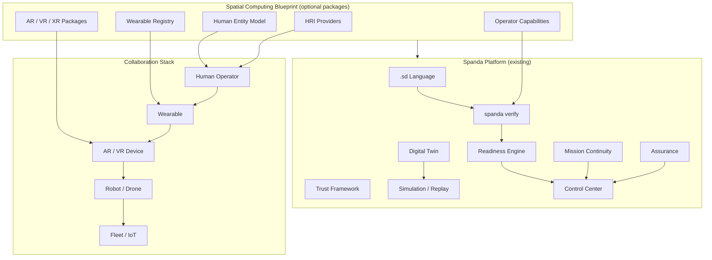

# Spatial Computing & Human-Robot Collaboration — Solution Blueprint

**Status:** **Stable** · **Profile:** `human_collaboration` · **Path:** `examples/solutions/spatial-computing/`

Official Solution Blueprint demonstrating safe collaboration between **humans**, **wearables**, **AR/VR/XR devices**, **robots**, **drones**, **IoT**, **AI agents**, and **fleets** — built entirely on existing platform capabilities. No HRI-specific core language extensions.

---

## Architecture



### Design principles

1. **Lean core** — HRI logic lives in `.sd` programs, TOML config, and optional packages.
2. **Human as first-class entity** — device tree nodes, not language objects.
3. **Operator capability verification** — same traceability as robot capabilities.
4. **Human readiness** — operator, team, and mission gates before collaborative deploy.
5. **Package-only device SDKs** — Vision Pro, HoloLens, ARKit, wearables via providers.
6. **Mission continuity** — human takeover, robot takeover, delegation, approval workflows.
7. **Privacy by default** — health dimensions opt-in per deployment.

---

## Applications

| Application | Key capabilities | Spatial modality |
|-------------|------------------|------------------|
| Warehouse | `forklift_operator`, `operate_robot` | AR picking overlay |
| Manufacturing | `maintenance_technician`, `remote_expert` | AR guided assembly |
| Healthcare | `medical_responder` | Wearable vitals (opt-in) |
| Search & Rescue | `search_rescue_operator` | AR team map + drone overlay |
| Field Service | `remote_expert`, `maintenance_technician` | Remote expert session |
| Utilities | `hazmat_certified`, `operate_robot` | Hazard zone AR warning |
| Construction | `operate_robot`, safety zones | Proximity alerts |
| Defense | `emergency_override`, secure comm | XR mission overlay |
| Emergency Response | `medical_responder`, `search_rescue_operator` | Multi-team coordination |
| Training | `operate_robot` (trainee) | VR sim + replay |

---

## Device tree hierarchy

```
fleet
├── robots
├── drones
├── iot_devices
├── wearables
├── ar_devices
├── vr_devices
├── humans
└── control_center
```

See `spanda.devices.toml` in the blueprint root and [human-interaction.md](../human-interaction.md).

---

## Collaborative workflows

### Remote maintenance

Field technician + AR glasses + live robot camera + remote expert + annotations → guided repair.

Path: [`remote-maintenance/`](../examples/solutions/spatial-computing/remote-maintenance/)

### Warehouse AR

Operator + AR glasses + pick path overlay + AMR coordination.

Path: [`warehouse-ar/`](../examples/solutions/spatial-computing/warehouse-ar/)

### Operator approval

Supervisor approval gate before collaborative mission start.

Path: [`operator-approval/`](../examples/solutions/spatial-computing/operator-approval/)

### Context awareness

```
Operator enters hazard zone → wearable alert → AR warning → robot slows → mission updated
```

Configured via safety zones, geofencing in device tree, and readiness alerts.

---

## Human readiness profile

```toml
[readiness.profiles.human_collaboration]
min_score = 85
require_supervisor_approval = true
health_enabled = false
```

Dimensions: certification, capability, availability, trust, location, permissions, wearable connectivity, optional health.

See [human-readiness.md](../human-readiness.md).

---

## Supported packages

| Package | Role |
|---------|------|
| `spanda-vision-pro` | Apple Vision Pro AR sessions |
| `spanda-hololens` | Microsoft HoloLens |
| `spanda-arkit` / `spanda-arcore` | Mobile AR |
| `spanda-smartwatch` | Wearable telemetry |
| `spanda-industrial-wearables` | Safety vests, helmets |
| `spanda-bodycam` | Body camera streams |
| `spanda-voice` | Voice commands |
| `spanda-gesture` | Gesture recognition |
| `spanda-eye-tracking` | Gaze targeting |
| `spanda-opencv` | Robot camera (existing) |
| `spanda-mission-continuity` | Takeover/delegation (existing) |

Full catalog: [hri-packages.md](../hri-packages.md).

---

## Control Center

Launch with the spatial computing blueprint:

```bash
spanda control-center serve \
  --config examples/solutions/spatial-computing/spanda.toml \
  --program examples/solutions/spatial-computing/warehouse-ar/pick_mission.sd
```

Planned tabs: Human Dashboard, Operator Dashboard, Wearable Inventory, AR Session Viewer, VR Training, Live Collaboration, Operator Readiness, Approval Queue.

See [control-center.md](../control-center.md#human-interaction-dashboard).

---

## Quick start (when H1 ships)

```bash
cd examples/solutions/spatial-computing
spanda install
spanda check warehouse-ar/pick_mission.sd
spanda verify warehouse-ar/pick_mission.sd --capabilities --traceability
spanda readiness warehouse-ar/pick_mission.sd --profile human_collaboration --config spanda.toml
```

Smoke (planned): `./scripts/spatial_computing_smoke.sh`

---

## Examples

| Directory | Demonstrates |
|-----------|--------------|
| [`warehouse-ar/`](../examples/solutions/spatial-computing/warehouse-ar/) | AR picking + robot coordination |
| [`remote-maintenance/`](../examples/solutions/spatial-computing/remote-maintenance/) | Remote expert guided repair |
| [`vr-training/`](../examples/solutions/spatial-computing/vr-training/) | VR operator training + replay |
| [`search-and-rescue-ar/`](../examples/solutions/spatial-computing/search-and-rescue-ar/) | Multi-human SAR + drone |
| [`wearable-health/`](../examples/solutions/spatial-computing/wearable-health/) | Optional health monitoring |
| [`operator-approval/`](../examples/solutions/spatial-computing/operator-approval/) | Supervisor approval workflow |

---

## Documentation

| Guide | Topic |
|-------|-------|
| [human-interaction-spatial-computing-roadmap.md](../human-interaction-spatial-computing-roadmap.md) | Phased roadmap H1–H4 |
| [human-interaction.md](../human-interaction.md) | Human entity model |
| [operator-capabilities.md](../operator-capabilities.md) | Capability verification |
| [wearables.md](../wearables.md) | Wearable device registry |
| [spatial-computing.md](../spatial-computing.md) | Anchors, workspaces, overlays |
| [ar-vr-xr.md](../ar-vr-xr.md) | AR/VR/XR modalities |
| [hri.md](../hri.md) | Voice, gesture, takeover |
| [human-readiness.md](../human-readiness.md) | Operator/team readiness |
| [remote-expert.md](../remote-expert.md) | Remote assist workflows |

---

## Related

- [solutions/adas.md](./adas.md) — Driver takeover and operator monitoring (automotive)
- [mission-continuity.md](../mission-continuity.md) — Takeover and delegation
- [enterprise-operations-roadmap.md](../enterprise-operations-roadmap.md) — Control Center operator workflows
