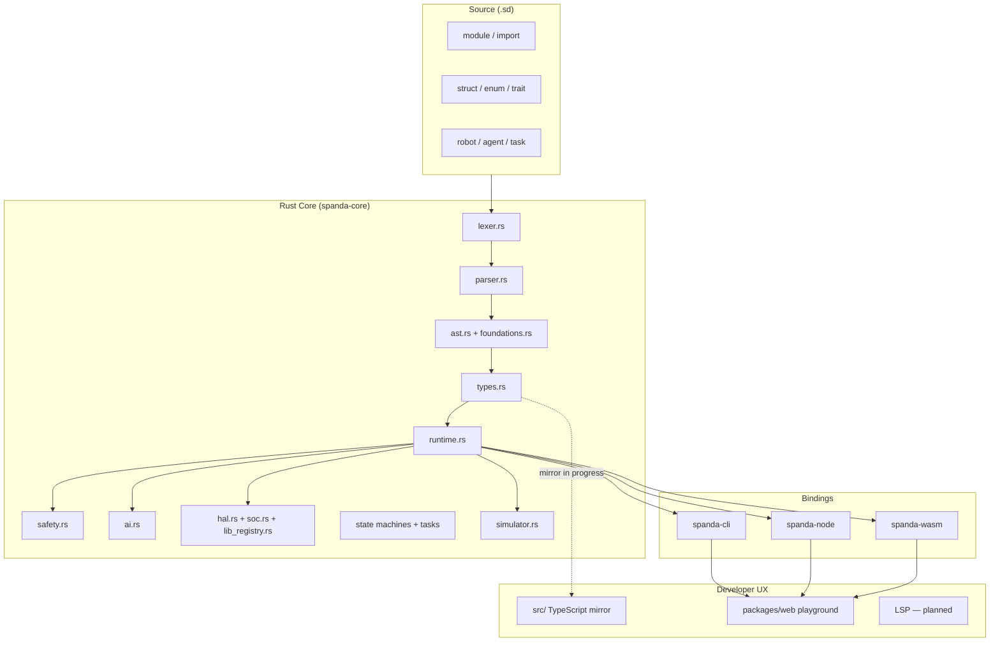

# Spanda Architecture

Spanda is an **AI-native autonomous systems programming language**. The implementation uses a dual-layer architecture: a canonical **Rust core** and a **TypeScript mirror** for developer tooling and tests.

## System diagram



## Language layers

| Layer | Purpose | Status |
|-------|---------|--------|
| **Foundations** | `module`, `struct`, `enum`, `trait`, `match` | Implemented (Rust) |
| **Autonomous primitives** | `robot`, `sensor`, `actuator`, `agent`, `skill`, `goal`, `memory` | Implemented |
| **Scheduling** | `task every Nms`, `behavior`, contracts (`requires` / `ensures`) | Implemented (Rust) |
| **State machines** | `state_machine`, `state`, `transition` | Parsed, validated, logged |
| **Capabilities** | `can [ read(lidar), propose_motion ]` | Type-checked |
| **Events** | `event`, `on Event { }` | Parsed + runtime handlers |
| **Digital twins** | `twin { mirror pose; replay true; }` | Parsed + validated |
| **Safety** | `ActionProposal` → `safety.validate` → `SafeAction` | Enforced at compile + run time |
| **ROS2 surface** | `node`, `topic`, `service`, `action` | Implemented |

## Compiler pipeline

1. **Lex** — tokenize keywords, units, `->`, `=>`
2. **Parse** — build AST (`Program`, `RobotDecl`, foundations)
3. **Type-check** — units, capabilities, state machines, AI safety, SoC/HAL
4. **Run** — interpreter + simulator; tasks scheduled deterministically

## Safety model

AI outputs are **untrusted**. The only allowed motion path:

```spanda
let proposal = planner.reason(...);
let action = safety.validate(proposal);
wheels.execute(action);
```

Direct `planner.drive(...)` or `wheels.execute(proposal)` is rejected by the type checker.

## Self-hosting roadmap

See [roadmap.md](./roadmap.md). Phase 0–2 are in progress in Rust; TypeScript mirror and LSP follow.
