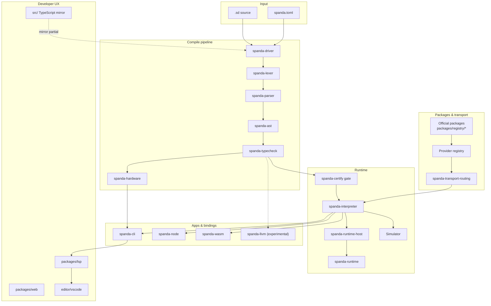

# Spanda Architecture

Spanda is an **AI-native autonomous systems programming language**. The implementation uses a **lean-core, package-first** workspace: focused Rust crates own behavior; `spanda-core` is the stable public facade; a TypeScript mirror in `src/` supports tests and tooling.

For diagrams and crate detail, see [architecture.md](./architecture.md) and [lean-core.md](./lean-core.md).

## System diagram



## Language layers

| Layer | Purpose | Status |
|-------|---------|--------|
| **Foundations** | `module`, `struct`, `enum`, `trait`, `match` | **Stable** |
| **Autonomous primitives** | `robot`, `sensor`, `actuator`, `agent`, `skill`, `goal`, `memory` | **Stable** |
| **Scheduling** | `task every Nms`, `behavior`, `budget { }`, contracts (`requires` / `ensures`) | **Stable** |
| **State machines** | `state_machine`, `state`, `transition`, `enter` | **Stable** |
| **Capabilities** | `can [ read(lidar), propose_motion ]` | Type-checked + runtime enforced |
| **Events & triggers** | `event`, `on` / `every` / `when` / `while` handlers | **Stable** |
| **Digital twins** | `twin { mirror pose; replay true; }` | **Stable** |
| **Behavioral verify** | `verify { robot.velocity().linear <= 2.0 m/s; }` | Type-checked + runtime |
| **Sensor fusion** | `observe { lidar, camera; }`, `fusion.read()` | **Stable** |
| **Hardware compatibility** | `hardware`, `deploy`, `requires_hardware`, `spanda verify` | **Stable** |
| **Health & kill switch** | `health_check`, `health_policy`, `kill_switch` | **Stable** |
| **Safety** | `ActionProposal` → `safety.validate` → `SafeAction` | Enforced at compile + run time |
| **ROS2 surface** | `node`, `topic`, `service`, `action` | **Stable** / live transport **Experimental** |
| **Native codegen** | `spanda compile-native`, `spanda deploy --target native` | **Experimental** |

## Compiler pipeline

1. **Lex** — `spanda-lexer` tokenizes keywords, units, hardware/requirements tokens
2. **Parse** — `spanda-parser` builds AST (`Program`, `RobotDecl`, `HardwareDecl`, foundations)
3. **Type-check** — `spanda-typecheck`: units, capabilities, state machines, AI safety, handler I/O
4. **Verify** (optional) — `spanda-hardware` compatibility against deployment targets; capability, health, and kill-switch gates
5. **Run** — `spanda-driver` → `spanda-certify` → `spanda-interpreter` + simulator; tasks and triggers scheduled deterministically
6. **Codegen** (optional) — AST → SIR → LLVM IR → native binary (`spanda-llvm`, experimental)

## Hardware verification engine

Separate from behavioral `verify { }` blocks. Invoked via `spanda verify` or LSP.

| Check | Source |
|-------|--------|
| Sensors / actuators | Robot declarations vs profile lists |
| `requires_hardware` | Memory, storage, GPU, sensor/actuator mins |
| `requires_network` | Bandwidth, latency |
| Task `budget { }` | CPU, memory, battery, network, storage caps |
| Timing | Task/loop intervals vs `min_period`; aggregate CPU |
| Power | `mission { duration }` vs battery capacity |
| AI models | `memory_required`, `gpu_required` in `ai_model` config |
| Adapters | Logical sensor/actuator → adapter trait mapping |
| Simulation | `simulate_compatibility` fault injection |

Output: `CompatibilityReport` with pass/warning/error items and optional matrix.

See [hardware-compatibility.md](./hardware-compatibility.md).

## Safety model

AI outputs are **untrusted**. The only allowed motion path:

```spanda
let proposal = planner.reason(...);
let action = safety.validate(proposal);
wheels.execute(action);
```

Direct `planner.drive(...)` or `wheels.execute(proposal)` is rejected by the type checker.

## Roadmap

Lean-core Phases 1–35 are complete (language core through verification & DX). Current release line: **v0.4.0**. See [roadmap.md](./roadmap.md) and [lean-core-roadmap.md](./lean-core-roadmap.md).
