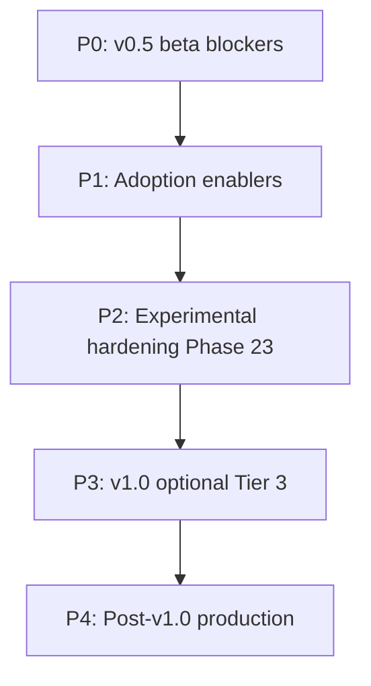

# Tier 3 and release priority plan

Priority-ordered plan to address **v0.5 beta blockers**, **adoption enablers**, **experimental Tier 3 hardening**, and **post-v1.0 production** work. Aligns with [product-strategy.md](./product-strategy.md) and [tier-3-experimental.md](./tier-3-experimental.md).

**Rule:** Tier 1 adoption (safety, verify, sim, ROS2/Python interop) ships first. Tier 3 engineering expands only where it unblocks beta credibility or has a proven golden path.

---

## Priority framework

| Priority | Window | Goal |
|----------|--------|------|
| **P0** | Now → Q4 2026 | Ship **v0.5 beta** (Tier 1 credibility) |
| **P1** | Q4 2026 | Adoption enablers (PyO3, CI verify guide, LSP polish) |
| **P2** | Q4 2026 – Q1 2027 | Harden **experimental** Tier 3 (CI + golden paths) — **Phase 23** |
| **P3** | 2027 | **v1.0 optional** slices of Tier 3 — **Phases 24–25** |
| **P4** | 2028+ | Full production Tier 3 — **Phase 26+** |

---

## P0 — v0.5 beta blockers (do first)

Not Tier 3 — these gate everything else. **Target: Q4 2026 beta.**

| # | Work item | Acceptance criteria |
|---|-----------|---------------------|
| 1 | **Publish VS Code extension** | Marketplace install; LSP `check` + `verify` work out of the box |
| 2 | **Curate killer demo** | `examples/showcase/killer_demo.sd`; [killer-demo.md](./killer-demo.md); CI (`killer-demo-golden-path`) |
| 3 | **One live AI provider path** | `OPENAI_API_KEY` → live call; mock fallback — [live-ai-provider.md](./live-ai-provider.md); CI (`live-ai-golden-path`) |
| 4 | **One ROS2 golden path** | [ros2-golden-path.md](./ros2-golden-path.md); `/cmd_vel` validated; CI (`ros2-golden-path`) |
| 5 | **Remote package registry (minimal)** | `spanda install` from hosted index; 2+ curated packages; CI (`registry-golden-path`) |

See [product-strategy.md](./product-strategy.md) § v0.5 beta — prioritized work items (P0).

---

## P1 — Adoption enablers

**Target: Q4 2026** (parallel with P0 tail).

| # | Work item | Acceptance criteria |
|---|-----------|---------------------|
| 6 | **CI integration guide for `spanda verify`** | [ci-verify.md](./ci-verify.md) — GitHub Actions + GitLab; `--json` gate |
| 7 | **In-process Python FFI (PyO3)** | Document build flags; subprocess remains fallback — [ffi-and-ecosystem.md](./ffi-and-ecosystem.md) |
| 8 | **Hardware profile picker in LSP/VS Code** | Deploy target hints or autocomplete |
| 9 | **Trim showcase to 3 flagship examples** | [examples/showcase/README.md](../examples/showcase/README.md) — safety, verify, sim |
| 10 | **Adoption quickstart** | [adoption-path.md](./adoption-path.md) — 1-sprint Python + ROS2 wrap |

---

## P2 — Experimental Tier 3 hardening (Phase 23)

**When:** After P0 #2–3 are green; complete by **Q1 2027**.

**How (each item):** golden path → CI job → provider/package wiring → [feature-status.md](./feature-status.md) update.

### P2-A — Highest ROI (supports beta demos)

| Item | Steps | Golden path / CI | Target |
|------|-------|------------------|--------|
| **Distributed fleet** | Multi-host test; document 2-agent `fleet orchestrate --remote`; wire `spanda-fleet` package | Extend `examples/robotics/golden_path_deploy.sh` | Q4 2026 |
| **MQTT live** | Mosquitto in CI; `SPANDA_LIVE_MQTT=1` pub/sub test; wire `spanda-mqtt` to live adapter | `examples/communication/mqtt_live.sd` (new) | Q4 2026 |
| **Twin cloud export** | POST replay JSON via `SPANDA_CLOUD_UPLOAD_URL`; twin + cloud integration | `examples/communication/digital_twin_sync.sd` + mock HTTP in CI | Q1 2027 |
| **C++ FFI (`cpp-native`)** | Document build; in-process golden example | CI job (optional `cpp-native` feature) | Q1 2027 |

### P2-B — Medium

| Item | Steps | Target |
|------|-------|--------|
| **LLVM codegen** | `scripts/llvm_golden_path.sh` in CI; 3–5 `compile-native` examples; extend SIR — [compiler-backend-roadmap.md](./compiler-backend-roadmap.md) | Q1 2027 |
| **Ledger / provenance** | Integration test for `spanda-ledger` → `MockLedgerBackend`; scaffold one community package — [future-blockchain-support.md](./future-blockchain-support.md) | Q1 2027 |
| **DDS live** | Document UDP shim limits; optional real middleware spike (separate track) | Q2 2027 |

### P2-C — Long horizon

| Item | Steps | Target |
|------|-------|--------|
| **World models** | Parser `world_model` block; hook `observe`/`fusion`; belief beyond rolling buffer | Q2 2027 |
| **Self-hosting** | Milestone 3: Spanda lexer subset + Rust parity golden tests — [roadmap.md](./roadmap.md) | 2027–2028 |

### Phase 23 checklist (lean-core)

| Step | Status |
|------|--------|
| Fleet multi-host CI + golden path docs | **Complete** |
| MQTT live Mosquitto CI | **Complete** |
| Twin cloud export CI | **Complete** |
| `cpp-native` golden path CI | **Complete** |
| LLVM golden path in CI | **Complete** |
| Ledger community package scaffold | **Complete** |
| World model parser + fusion hook | **Complete** |
| Self-host lexer milestone | **Complete** |
| Update [tier-3-experimental.md](./tier-3-experimental.md) CI status column | **Complete** |

---

## P3 — v1.0 optional Tier 3 (Phases 24–25, 2027)

Per [product-strategy.md](./product-strategy.md), v1.0 **may** include optional Tier 3 — not required for release.

| Item | v1.0 optional scope | Promotion criteria |
|------|---------------------|-------------------|
| **LLVM** | Hot-path `compile-native` for Jetson or Pi | Benchmark vs interpreter; CI on target triple |
| **Fleet** | Multi-robot field-trial example | Remote + mesh stable for N≥3 agents |
| **Twin** | Replay export in incident workflow | JSON export + cloud upload on edge |
| **MQTT** | Live MQTT in robotics reference arch | End-to-end with ROS2/Nav2 example |
| **World models** | `observe` → `world_model` → decision in one showcase | Rust + TS parity |

**Not in v1.0:** LLVM as primary, production blockchain, full knowledge graphs, twin SaaS, OMG DDS, ROS replacement, full self-hosting.

---

## P4 — Post-v1.0 production Tier 3 (Phase 26+, 2028+)

| Item | Production definition | Notes |
|------|----------------------|-------|
| **LLVM primary** | Default deploy = native binary; interpreter for dev/sim | Requires full SIR + `libspanda_rt` scheduler/safety |
| **Blockchain** | Community packages implement `LedgerBackend` | No chain types in core — [future-blockchain-support.md](./future-blockchain-support.md) |
| **World models** | `KnowledgeGraph`, `Belief`, `Policy` runtime | Builds on Phase 23 world-model work |
| **Twin cloud** | Managed or self-hosted telemetry backend | Auth, replay integrity |
| **Fleet** | Planning/consensus beyond round-robin | Certify + OTA + mesh proven in field |
| **DDS** | Real OMG DDS or explicit “use ROS2 bridge” | Architecture decision |
| **Self-hosting** | Roadmap milestones 4–5 (typecheck, codegen in Spanda) | `api-contract.json` stable |
| **ROS replacement** | **Never** | Bridge only |

---

## Single backlog order

Use this sequence for GitHub issues and sprint planning:

1. P0 #1–5 (v0.5 beta)
2. P1 #6–10 (adoption)
3. Fleet CI hardening (P2-A)
4. MQTT live CI (P2-A)
5. PyO3 default path (P1 #7)
6. Twin cloud export CI (P2-A)
7. `cpp-native` golden path (P2-A)
8. LLVM CI expansion (P2-B)
9. Ledger community package scaffold (P2-B)
10. World model parser + fusion hook (P2-C)
11. Self-host lexer milestone (P2-C)
12. v1.0 optional slices (P3) — pick 2–3 from user feedback
13. Post-v1.0 production (P4) — gated on adoption metrics

---

## Progress tracking

| File | Update when |
|------|-------------|
| [lean-core-roadmap.md](./lean-core-roadmap.md) | Phase 23+ starts or completes |
| [tier-3-experimental.md](./tier-3-experimental.md) | CI golden path added per item |
| [feature-status.md](./feature-status.md) | Experimental → Stable promotion |
| [CHANGELOG.md](../CHANGELOG.md) | User-visible capability changes |
| [product-strategy.md](./product-strategy.md) | Release scope shifts |

---

## Related

- [product-strategy.md](./product-strategy.md) — Tier 1–3 classification and v0.5/v1.0 scope
- [tier-3-experimental.md](./tier-3-experimental.md) — Phase 22 experimental foundations (current state)
- [lean-core-roadmap.md](./lean-core-roadmap.md) — Engineering phase history
- [roadmap.md](./roadmap.md) — Language and compiler milestones
- [compiler-backend-roadmap.md](./compiler-backend-roadmap.md) — LLVM / SIR path
- [future-blockchain-support.md](./future-blockchain-support.md) — Ledger package architecture
